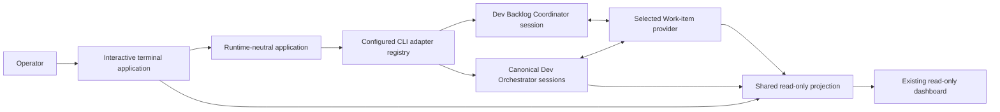
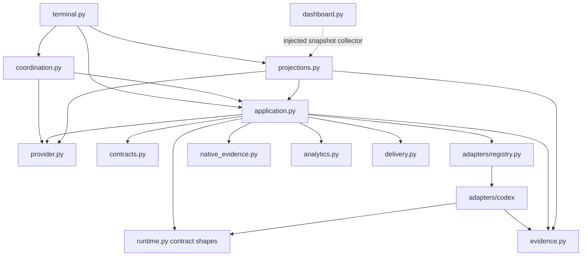
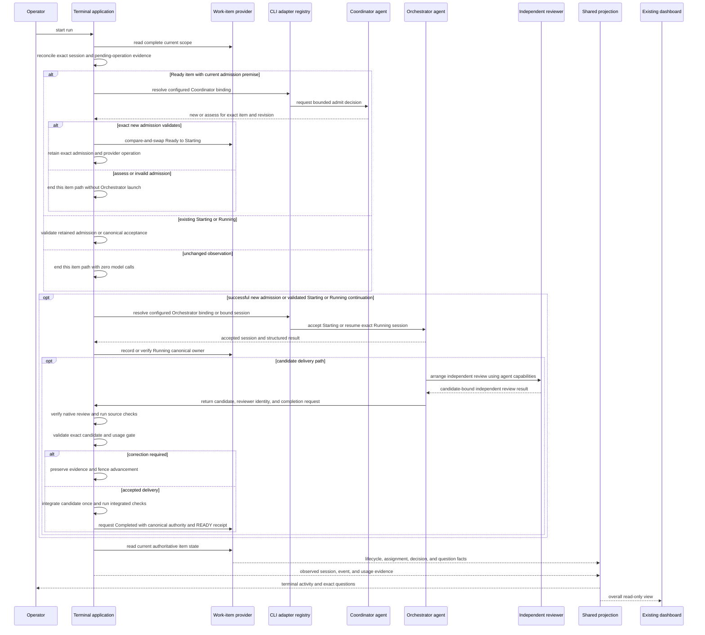
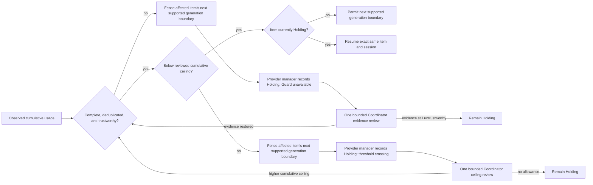
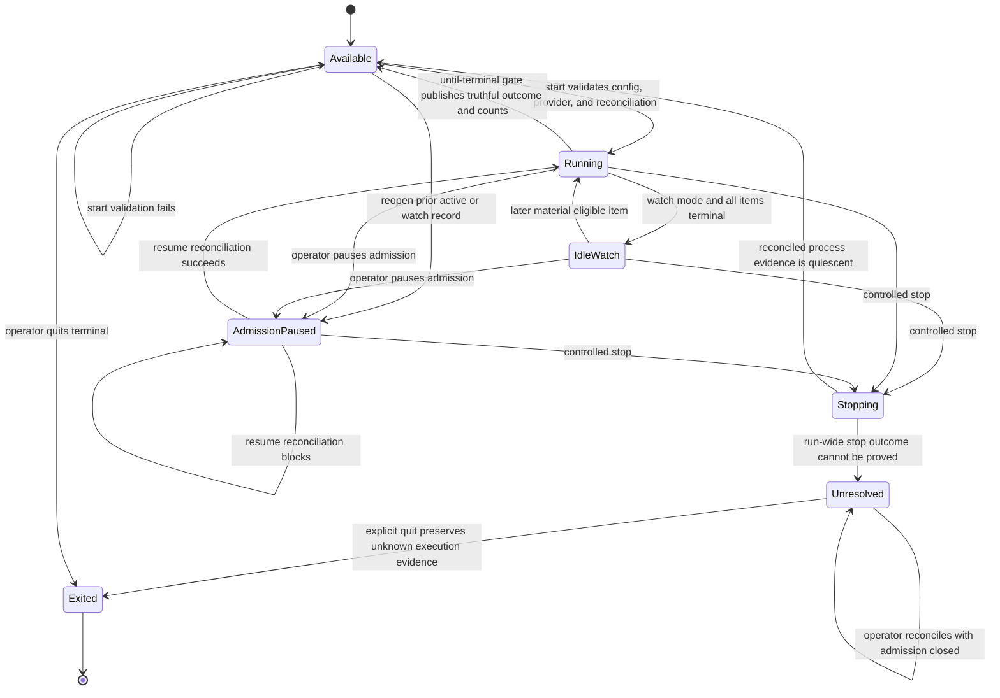
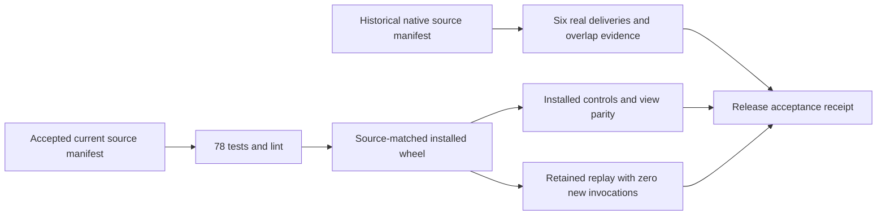

<!--
Copyright (c) 2026 Martin.Bechard@DevConsult.ca
Artifact-ID: 796367dc-5b4e-4b09-b032-ac66681cdf65
Created-Local: 2026-09-29T14:12:02-04:00
Creating-Agent: Dev Documentation Writer
Runtime: Codex
Dispatched-Model: gpt-5.6-sol
Reasoning-Effort: medium
-->

# Agentic Backlog Application Architecture

## Workflow Enforcement And Agent Autonomy

The harness enforces the selected workflow's required transitions and evidence. Agents organize the work within those boundaries and may use their CLI's native delegation capabilities. A custom agent-to-harness delegation transport is not a prerequisite for the first version.

- **Agent responsibility:** choose specialists, delegate, investigate, implement, correct findings, and arrange reviews using available capabilities.
- **Harness responsibility:** enforce admission, required workflow gates, independent-review evidence, usage limits, holds, and completion criteria. A successful launch or an agent saying done is not sufficient evidence.
- **Adapter responsibility:** configure and launch harness-invoked agents, observe results and telemetry, and expose supported controls. Native child calls follow the CLI's own configuration; the harness does not claim it can select a different CLI or reload configuration for each internal child.
- **Workflow definition:** for each required transition, specify the source and target stage, authorized actor, required evidence and candidate identity, and the outcome when evidence is absent or invalid. Reuse the selected methodology's rules instead of inventing a universal fixed delivery sequence.
- **Enforcement point:** validate before authorizing the transition through the existing provider operation boundary. Agent tools must not allow a protected transition to bypass that check. Reuse existing provider management operations where available; inventory alone is insufficient. Do not introduce a new provider framework without a demonstrated gap.
- **Review gate:** verify reviewer independence, the exact candidate reviewed, verdict, and required verification/delivery evidence. Native delegation is permitted; self-attestation alone does not establish independence or acceptance. Missing proof blocks that transition, not all unrelated work.
- **Capacity and usage:** distinguish harness invocation limits from native child concurrency. Configure CLI-native limits where supported and account for child usage without double counting. Report unsupported controls and incomplete evidence honestly; retain the existing usage guard and safe interruption boundaries.

The minimum complete slice runs one item through its required workflow, lets its agent arrange specialist work, and demonstrates that valid evidence permits the next transition while missing or invalid evidence prevents it. Dynamic delegation infrastructure and cross-CLI child routing are optional later capabilities, justified only by an actual workflow need.

## Current Understanding

ARC-002 defines the implemented terminal-first application that coordinates provider-backed Work Items through actual agent sessions. Each harness-issued agent call uses an explicitly configured command-line interface (CLI) binding behind the `AgentCliAdapter` Protocol.

The application has two user surfaces:

- An interactive terminal is the primary operating surface.
- The existing dashboard gives a read-only overall view of the backlog, sessions, events, and usage.

An until-terminal run continues until every in-scope Work Item reaches a terminal provider state. The terminal remains available after the run settles. An optional watch mode continues deterministic polling so later Work Items can be admitted.

The agents remain the center of the design:

- A Dev Backlog Coordinator agent makes bounded scheduling, admission, capacity, and recovery decisions.
- A canonical Dev Orchestrator agent session owns each accepted Work Item through delivery.
- Fresh reviewers remain independent from the producing Orchestrator.

The application presents commands, events, questions, and run controls. It does not replace agent judgment with an application workflow graph.

## Authoritative Sources

The following sources define the portable authority and workflow contracts:

- [Coordinate Work Items](../../../dev-methodology/skills/coordinate-work-items/SKILL.md) defines Coordinator and Orchestrator ownership, capacity, dependencies, recovery, review, and completion.
- [Manage Work Items](../../../dev-methodology/skills/manage-work-items/SKILL.md) defines provider-neutral identity and lifecycle authority.
- [Manage Work Items File](../../../dev-methodology/skills/manage-work-items-file/SKILL.md) defines the current file-provider boundary.
- [Coordinate Codex Tasks](../../../dev-methodology/skills/coordinate-codex-tasks/SKILL.md) defines the identity, resumption, ambiguous creation, and cleanup constraints that the first Codex adapter must preserve.
- [Backlog Dispatcher](../../../dev-methodology/.agents/skills/backlog-dispatcher/SKILL.md) defines shared scheduling, one-use dispatch consumption, and User Action Required behavior.
- [Estimate Agent Work](../../../dev-methodology/skills/estimate-agent-work/SKILL.md) defines the immutable original estimate used by the generation guard.
- [Resolve Backlog Blockage](../../../dev-methodology/skills/resolve-backlog-blockage/SKILL.md) defines crisis recovery and claim-free serial operation.
- [Set SOLO Mode](../../../dev-methodology/skills/set-solo-mode/SKILL.md) defines serial admission without canceling accepted work.

Explicit user requirements and accepted Dev Architect decisions govern this architecture. For current behavior, committed source `8f0e5dc5ed8fee097095178afe48ab152d0c61fd`, its focused tests, and the source-backed module designs take precedence over transferred planning details. The configured methodology skills remain authoritative for agent roles. Provider and workflow validation remain authoritative for lifecycle transitions.

## Related Code

The active implementation is under `src/backlog_harness`:

- [Application control](../../src/backlog_harness/application.py)
- [Run coordination](../../src/backlog_harness/coordination.py)
- [Provider adapter](../../src/backlog_harness/provider.py)
- [Portable runtime contract](../../src/backlog_harness/runtime.py)
- [Codex CLI adapter](../../src/backlog_harness/adapters/codex/adapter.py)
- [Telemetry receiver](../../src/backlog_harness/telemetry.py)
- [Projection](../../src/backlog_harness/projections.py)
- [Terminal](../../src/backlog_harness/terminal.py)
- [Dashboard](../../src/backlog_harness/dashboard.py)

The transferred `dev-methodology/adapters/codex/backlog-harness` package is historical reuse provenance. It does not define active placement or executable contracts.

## Related Tests

The active focused tests are [tests/test_configuration.py](../../tests/test_configuration.py), [tests/test_execution.py](../../tests/test_execution.py), [tests/test_provider_coordination.py](../../tests/test_provider_coordination.py), [tests/test_coordination.py](../../tests/test_coordination.py), [tests/test_evidence.py](../../tests/test_evidence.py), [tests/test_recovery.py](../../tests/test_recovery.py), [tests/test_telemetry.py](../../tests/test_telemetry.py), [tests/test_analytics.py](../../tests/test_analytics.py), [tests/test_native_evidence.py](../../tests/test_native_evidence.py), and [tests/test_views.py](../../tests/test_views.py). The current committed suite contains 78 tests. Retained real and installed receipts remain separate from this deterministic proof.

## Related Backlog Items

[Operate Backlog Harness Unattended](../../../dev-methodology/backlog/feature-backlog/operate-backlog-harness-unattended.md) provides historical motivation for sustained operation, restart reconciliation, and a complete operator workflow. Its lifecycle state does not activate this architecture or authorize dispatch.

## Related Wiki Pages

[HLD-003](../design/high-level/HLD-003-codex-work-item-dispatch-service.md) is the child high-level design for this application. It must conform to ARC-002 and cannot provide normative authority back to the architecture.

[ARC-001](../../../dev-methodology/docs/architecture/ARC-001-codex-cli-backlog-harness.md) remains a separate evaluated design.

## Open Questions

No architecture choice is open. Codex CLI 0.159.2 is the only production adapter. Another CLI requires a separate implemented adapter and verification. The accepted source, rebuilt installation, and installed acceptance are recorded; fresh review of the reconciled documentation remains the release gate.

## Maintenance Notes

Recheck this architecture when any of these contracts change:

- Coordinator or Orchestrator authority.
- Work-item lifecycle or provider behavior.
- Any configured CLI adapter's identity, resume, event, capability, authentication, or interruption behavior.
- Dashboard projection inputs.
- Usage reporting or estimate semantics.
- Terminal interaction requirements.

The last source reconciliation was 2026-09-30 against commit `8f0e5dc5ed8fee097095178afe48ab152d0c61fd`.

## Design Brief

| Concern | Compact content |
| --- | --- |
| Requirements and non-goals | Provide one simple terminal application around actual Coordinator and Orchestrator agents. Keep the existing dashboard read-only. Minimize model calls. Do not add a daemon, local control socket, per-item supervisor process, shadow lifecycle authority, or second dashboard server. The application owns a narrow loopback telemetry receiver. |
| Scenarios | Run until all items are terminal; report successful delivery or settled nondelivery; optionally watch for future items; pause and resume admission; answer an exact agent question; recover after uncertain runtime outcomes; stop a run in a controlled way; quit the terminal separately; hold one item at the generation limit. |
| Scenario-to-operation mapping | Application controls map to observe, coordinate, delegate, start, resume, pause admission, reconcile, answer, stop, and project. Every harness-issued agent operation resolves an explicit role and CLI binding. Skills and the provider define the authoritative workflow behind those operations. |
| Responsibility and authority | The provider owns lifecycle and assignment facts. The Coordinator owns scheduling and recovery decisions. Each Orchestrator owns delivery. The application executes and presents those decisions. The dashboard only observes. |
| Current implementation | `src/backlog_harness` contains application control, coordination, provider, runtime Protocol, closed adapter registry, Codex adapter, telemetry, analytics, projection, terminal, dashboard, evidence, workflow, and delivery modules. |
| Assumptions and unresolved decisions | Codex CLI 0.159.2 and its configured subscription authentication are the only production runtime. Unknown or conflicting runtime and usage evidence remains explicit. No other adapter or custom delegation transport is promised. |

The following sections own the normative detail behind this brief.

## Architecture Identity And Child Designs

The canonical path is docs/architecture/ARC-002-codex-work-item-dispatch-harness.md. Architecture files use ARC-NNN-lowercase-kebab-case.md.

Child HLDs belong in docs/design/high-level and use HLD-NNN-lowercase-kebab-case.md. Child component or module designs belong in docs/design/components.

Authority flows from ARC-002 to its child HLDs and from each HLD to its child designs. Each child references its parent. No parent depends on a child for normative authority.

No fixed structured architecture workflow artifact shares this architecture identity. Runtime events and projections are operational evidence.

## Scope

### Included

- Interactive terminal operation.
- Harness-issued Coordinator and Orchestrator sessions through configurable CLI bindings, with fresh reviewer work delegated through the Orchestrator's native Codex capabilities.
- Deterministic observation and bounded coordination.
- Provider-backed lifecycle and question handling.
- Exact-session resume and uncertainty reconciliation.
- Generation usage guard and review hold.
- Shared provider, session, event, and usage projection.
- Existing read-only dashboard integration.
- Until-terminal and optional watch operation.

### Excluded

- A daemon or background service contract.
- Local control sockets or a network API.
- Persistent per-item supervisor processes.
- A replacement Work-item database.
- An application-owned delivery graph.
- Model-driven polling or progress relays.
- Dashboard mutation or scheduling authority.
- A second dashboard server or evidence store.



## System Context

The operator starts one terminal application for one configured project. The application owns the active run, accepted session handles, bounded coordination requests, admission state, restart reconciliation, and completion checks.

The operator selects configuration explicitly with --config. The application resolves the configuration file location at startup. This architecture does not invent a default configuration file.

Immediately before every harness-issued CLI invocation, the application rereads the applicable configuration as one validated snapshot. Coordinator and Orchestrator starts and resumes, including answer classification, reload their agent, CLI, and profile settings and run a local non-model capability preflight. Read-only reconciliation targets retained evidence. The in-flight invocation keeps its captured snapshot. A later compatible invocation observes later valid edits.

The agent_clis configuration maps each named CLI instance to one registered adapter name, executable, and authentication profile. The agents configuration maps the harness-issued Coordinator and Orchestrator roles to a named CLI instance and role profile. Different roles can select different CLI instances. Every harness-issued Coordinator or Orchestrator start or resume resolves either the refreshed role binding or an existing session's immutable binding. Reviewer work runs as a fresh native child of the canonical Orchestrator and is validated from native evidence.

The application persists the snapshot digest and resolved binding before the request boundary. Invalid or missing applicable configuration blocks the affected invocation. It does not use a stale snapshot, select a fallback, or make a model call merely to validate configuration.

Malformed or removed generation settings block further generation. Control-only provider and retained-evidence inspection remains available without reusing stale generation settings.

The registry maps adapter names to injected factories. It does not scan for adapters, import implementation paths from configuration, or choose an automatic fallback.

The Dev Backlog Coordinator and Dev Orchestrator are real agent roles. Their skills, native tool selection, and permissions are present in configured profiles. The Orchestrator arranges fresh reviewer work through native Codex delegation; the reviewer is not a separate harness role binding.

The selected Work-item provider is the durable authority boundary. Runtime events report session behavior and trigger a fresh provider read. They never become lifecycle authority.

The existing dashboard reads the same projection as the terminal. It remains an overall view and does not control the run.

The adapter isolates process launch, CLI command preparation, authentication-context setup, and normalized event production. The application uses portable request and handle contracts for this launch boundary. The selected Codex route also has native dependencies outside the adapter: application recovery, fresh reviewer validation, and child usage inspect Codex session records through `native_evidence.py`. Implementing the Protocol alone does not make those workflow gates portable to another CLI.

## Technology Stack

### Application Runtime

Python 3.12 or newer is the application runtime declared in [pyproject.toml](../../pyproject.toml).

prompt_toolkit provides the asynchronous terminal prompt. Coordinated output keeps the current input intact while agent activity and questions arrive. A full-screen Textual interface is unnecessary because the dashboard already owns the visual overview.

### Agent CLI Adapters

The Python AgentCliAdapter Protocol is the common runtime boundary. It applies the Adapter pattern: the application is the client, AgentCliAdapter is the target, each concrete CLI adapter translates one CLI executable and protocol as its adaptee. Ordinary composition injects registered adapter factories into the application. No abstract base class or shared adapter framework is required.

The Protocol provides:

- `validate_profile(request)` for a non-model local preflight. The Codex implementation executes `codex --version` and `codex login status` with the configured `CODEX_HOME`; only authenticated `codex-cli 0.159.2` is production-ready.
- prepare_telemetry for invocation-bound exporter settings and destination readiness.
- start_session and resume_session, which return an InvocationHandle created before submission.
- observe_events and reconcile for portable evidence and uncertain outcomes.
- request_interrupt for an adapter-supported interruption request.

A native session identity can be absent while submission is uncertain. The application creates a SessionHandle only after the adapter observes that identity. Portable event, error, usage, and capability records expose only guarantees that the adapter can prove. An adapter does not invent an equivalent guarantee when its CLI lacks one.

Each concrete adapter owns translation in both directions between portable requests and its native CLI protocol. Native process handles remain private and launches go through the adapter. Codex-native session evidence remains an explicit application dependency for recovery, review, and child accounting; it is not a second launch path. The adapter preserves explicit nullness, native failure and uncertainty, invocation and session ownership, event identity, usage units, and capability limits.

The application owns run coordination and capacity. Each adapter owns its native subprocesses, streams, and cleanup. It preserves invocation and session association under concurrency and reports native ordering limits. The common contract does not claim transactional submission or interruption when the CLI cannot provide it.

Deterministic observation and reconciliation remain non-model operations. An adapter cannot turn an unchanged observation into an agent call. The Adapter pattern is required because supported CLIs have incompatible commands, event formats, identity models, authentication, and capabilities; dependency injection alone does not translate those contracts. No Bridge or Facade pattern is selected.

Profile validation does not invoke a model and does not create a capability-proof session. An invalid configuration or failed version or authentication preflight blocks the affected invocation before process submission. The application persists the returned preflight facts in `capability.json` for that invocation; it performs the local preflight again for a later invocation.

The official Codex CLI is the first adapter. Its adapter preserves the current ChatGPT subscription authentication. Another CLI requires its own implemented and verified authentication and capability handling.

An API or SDK runtime requires a separate architecture decision after a concrete CLI capability gap and an explicit user billing and authentication decision.

### Projection And Dashboard

The projection combines current provider facts with observed session, event, usage, run-record, current-blocker, and telemetry evidence. OpenTelemetry spans stored as OTLP JSONL supply dashboard trace evidence. Provider records remain authoritative for lifecycle; invocation records remain authoritative for launch and session correlation. Recorded `run.json` state does not prove process liveness.

No parallel workflow database or second dashboard server is part of this architecture. Reconciliation files under the selected operational root preserve runtime evidence without competing with provider authority.

### OpenTelemetry Preparation And Storage

The Codex adapter prepares telemetry before launching an agent. It binds the invocation to the loopback destination and injects native OTLP/HTTP JSON exporter settings. CLI-specific setup remains inside the adapter; the application and dashboard consume one standard representation.

- **Format:** one OTLP JSON ExportTraceServiceRequest per JSONL line, retaining resourceSpans, instrumentation scopes, spans, and native trace and span identifiers. JSONL is the file framing; OTLP defines the payload. A vendor event stream renamed to spans.jsonl does not meet this contract.
- **Correlation:** separate files for each Work Item and invocation, with application-owned correlation attributes on spans. Run-level Coordinator work has its own files; it is not arbitrarily charged to one item.
- **Codex implementation:** configure the native OTLP/HTTP trace exporter with JSON encoding. The application-owned loopback receiver writes the JSONL files.
- **Lifetime:** the receiver runs inside the foreground application, including when the dashboard is disabled. It accepts telemetry only and supplies no control commands. It is not a separately managed service or collector daemon.
- **Dashboard:** read the standard span files incrementally through the projection. Keep native CLI JSON output only where the adapter needs it for command results or session identity; do not make it the dashboard trace contract.

The small in-process receiver is chosen because Codex can export OTLP but cannot be assumed to write files. A separate OpenTelemetry Collector would add process configuration and lifecycle work. Direct native file export remains suitable for another CLI if its adapter proves the same format, attribution, and flush contract. Scraping proprietary traces would couple the dashboard to each CLI and is rejected.

HLD-003 specifies the Codex configuration, adapter preparation sequence, storage paths, correlation, and failure behavior. The retained Codex 0.159.2 probe observed a deliberately rejected first 512-span batch, no retry of that batch, 1,200 later spans, and matching native and OTLP output usage of 11. Complete flush is not claimed. The application records the export gap and fails closed before affected advancement; current authority does not require another paid probe or a broader retry framework.

## File Organization

```text
agentic-harness/
├── pyproject.toml
├── src/backlog_harness/
│   ├── application.py
│   ├── runtime.py
│   ├── terminal.py
│   ├── projections.py
│   ├── contracts.py
│   ├── provider.py
│   ├── coordination.py
│   ├── analytics.py
│   ├── evidence.py
│   ├── workflow.py
│   ├── delivery.py
│   ├── native_evidence.py
│   ├── telemetry.py
│   ├── dashboard.py
│   ├── cli.py
│   └── adapters/
│       ├── registry.py
│       └── codex/adapter.py
├── tests/
├── docs/architecture/
├── docs/design/
└── .agent-ops/backlog-harness/
```

The `src/backlog_harness` package owns runtime-neutral application code. The adapters directory inside that package owns CLI-specific implementations. The documentation roots own the design chain.

Runtime contract shapes and the registry define the common launch boundary. Application orchestration and projections retain explicit Codex-native evidence dependencies on the selected production route. Existing modules remain only where their behavior fits this architecture.

The application owns new reconciliation evidence under .agent-ops/backlog-harness. It does not automatically move or import evidence from an existing adapter-specific root. The minimum durable evidence covers session references, configuration snapshots, translated event references, and pending operations. HLD-003 owns the exact file names, schemas, and write boundaries.

## Architectural Layers

1. **Terminal interaction.** Accepts run controls and answers. Presents coordinated activity, uncertainty, and exact inline questions.
2. **Application control.** Owns the active run, deterministic observation, bounded coordination, admission, restart reconciliation, and completion.
3. **Configured agent launch.** contracts.py constructs role bindings; application.py orchestrates the selected adapter; runtime.py defines request and handle shapes plus AgentCliAdapter. The adapter starts or resumes processes and persists normalized events. Application recovery also uses Codex-native evidence. The Protocol also exposes `request_interrupt`; the active terminal stop path cancels owned item tasks and relies on Codex invocation cleanup plus reconciliation.
4. **CLI and provider adapters.** Isolate CLI-specific behavior and apply lifecycle contracts through the selected provider.
5. **Read-only projection.** Combines provider facts with observed session, event, and usage evidence for terminal and dashboard consumers.

The diagram uses caller-to-dependency arrows; the dashed dashboard edge denotes its injected snapshot collector, rather than a direct module import. The terminal and dashboard do not mutate provider state directly. CLI adapters do not make scheduling or lifecycle decisions. The projection does not become an authority.



## Key Components

### Terminal

The terminal is the primary operating surface. It provides:

- Run and optional watch controls.
- Pause and resume of new admission.
- Controlled stop.
- Separate terminal quit after no run remains active.
- Current status and item inspection.
- Live agent activity without damaging the prompt input.
- Exact inline questions and answer entry.
- Visible uncertainty and next actions.

### Application

RunController owns foreground run state and active item tasks. Application owns per-item workflow and invocation orchestration. For each eligible Ready item, it requests one bounded Coordinator admission decision against the frozen provider record. It continues Starting or Running only from retained exact evidence, tracks active item tasks, reconciles restart evidence, and evaluates completion.

It does not encode Orchestrator delivery as application states or graph nodes.

### Agent Runtime And Adapter Registry

contracts.py resolves each role through the agents and agent_clis mappings into AgentBinding. application.py obtains that binding and resolves the registry before invoking the adapter. runtime.py supplies data classes and the Protocol, with no execution or persistence. The registry constructs only the explicitly named adapter and supplies it through ordinary composition.

AgentCliAdapter validates a profile, starts or resumes one invocation, observes portable events, reconciles uncertain outcomes, and defines an interruption request operation. Adapters translate native results into the common contracts and report unsupported or uncertain behavior without guessing. The current run controller does not call `request_interrupt`; stop cancels owned item tasks, and the Codex invocation cleanup terminates its owned process group before reconciliation.

The agent owns delegation through its available CLI capabilities. The harness enforces required workflow transitions and validates evidence; no custom delegation transport is required.

### Projection

The projection combines authoritative provider facts with observed runtime facts. It feeds terminal views, the read-only dashboard, current scheduling blockers, trace views, and usage reporting. Both operator surfaces consume the same revisioned dictionary.

## Diagram Authoring Rules

The diagrams expose boundaries, dependencies, ordered agent handoffs, and lifecycle branches. Child designs add detail only when it clarifies a relationship that this architecture intentionally leaves abstract.

## Data Flow

### Application Event Envelope

The Codex adapter persists bounded event dictionaries. Every dictionary contains:

| Field | Meaning |
| --- | --- |
| version | Event contract version. |
| event_id | Immutable event identity that remains stable across replay. |
| invocation_id | Stable invocation identity persisted before runtime dispatch. |
| at | Observation time. |
| type | Native Codex event type. |

Selected type-specific facts are also retained. `thread.started` adds the portable session ID. `turn.completed` adds the native usage mapping. Failure events add bounded error text. Selected completed items add the native item type and bounded result text. Run, operation, and Work-item identities remain in the surrounding durable invocation evidence instead of being copied into each event.

An event can trigger a provider read. It cannot authorize a lifecycle transition by itself.

### Stored Application Evidence

For every CLI invocation, the application reloads and validates the relevant configuration and persists its snapshot digest and resolved binding before the request boundary. For start_session or resume_session, the runtime also creates and persists the operation identity and InvocationHandle before native submission. The call returns that handle. The application then stores only the minimum evidence needed for reconciliation:

- The original adapter name, named CLI instance, configured authentication profile, resolved authentication-context path, and native session identity for each SessionHandle.
- The observed CLI version and role-profile digest used by each invocation.
- The configuration snapshot digest and resolved binding captured for each invocation.
- Event references.
- Pending-operation evidence.

Authentication-context references never contain credentials. For Codex, the reference is the resolved `CODEX_HOME` path. The harness binds that path and the configured authentication profile, and checks successful `codex login status`; it does not record a stable account/principal identifier or detect credential/account changes inside the same home. Authentication credentials and the effective account remain managed by the CLI. A configuration change does not migrate an existing session to a different adapter, authentication-context path, or native identity.

A resume reloads current configuration and compares its identity fields and profile digest with the recorded SessionHandle. A changed adapter, named CLI instance, executable, configured authentication profile, authentication-context path, or role profile remains blocked. The implementation has no successor-session handoff and never passes an old native session identity to a changed binding.

The Codex adapter requires both the binding origin and profile digest to match the recorded SessionHandle. A profile change blocks resume. Identity-preserving profile reconfiguration is not implemented.

An uncertain invocation reconciles its original captured snapshot, binding, and identity. Later configuration edits do not authorize replay or retry.

Lifecycle, questions, decisions, and assignment remain authoritative in the provider. The projection derives views and never becomes another record of authority.

### Dispatch And Delivery



Workflow requests contain the required provider content or exact answer delta. The Codex adapter constructs the effective prompt by adding the configured role and full skill bodies on every harness-issued invocation, including resume. Unchanged polling does not issue a prompt or model call.

Independent Work Items use independent Orchestrator sessions. Independent reviews use fresh reviewer contexts.

The agent owns delegation through its available CLI capabilities. The harness enforces required workflow transitions and validates evidence; no custom delegation transport is required.

## Lifecycle Flow

### Startup And Restart

Startup resolves the explicit configuration path and loads the selected command’s full or control-only configuration. Application construction creates the provider and projection caches; it does not automatically reconcile. Status and dashboard operations capture coherent provider-backed views. Explicit reconcile and run controls inspect retained sessions and pending operations using their recorded identities. Per-invocation reload and adapter version/login preflight remain separate, immediately before a required invocation. The HLD startup flow records these command-specific paths.

A restart never assumes that a prior CLI session stopped. The application reconciles an uncertain invocation against its original captured snapshot and exact identity before any continuation. Current configuration edits never authorize a retry or replacement.

Restart does not reopen admission by itself. A prior Running, AdmissionPaused, or IdleWatch record initializes as AdmissionPaused. Explicit resume reconciles before reopening the retained run mode. IdleWatch occurs only while watch admission is open and all current items are terminal.

### Steady Operation

The application observes provider and runtime evidence deterministically. Each eligible Ready item receives one bounded Coordinator admission request for its frozen revision. Unchanged observations, blocked premises, status, and dashboard refreshes make zero model calls.

Each accepted item continues in its canonical Orchestrator session through questions, corrections, review, and delivery.

The terminal displays the exact provider question. It persists the operator answer against the question identity, question revision, and canonical session before runtime resume. The answer-resume reloads current configuration, validates it against the recorded SessionHandle, and resumes that exact session with the provider answer reference only when the binding still matches. The application does not interpret the answer.

Ambiguous authority or cross-item decisions return to the Coordinator.

### Run Controls

- Pause closes new admission only. Accepted sessions continue and remain observable.
- Resume reconciles current evidence before it opens admission.
- Controlled stop closes admission, cancels owned active item tasks, waits for them, and reconciles retained invocation evidence. It reports Available only when no reconciled invocation is nonquiescent; otherwise it reports Unresolved.
- An item-level uncertain invocation preserves that item's reservation or occupancy and isolates the item, conflicting operations, and conflicting capacity. Unrelated work continues only when provider and capacity evidence prove it is safe.
- The run enters Unresolved only when a run-wide authority, inventory, or reconciliation failure prevents safe operation.
- A controlled stop enters Unresolved only when its run-wide outcome cannot be proved.
- Quit normally exits the terminal only when no run remains active. It is separate from controlled stop.
- From Unresolved, an explicit quit is allowed only with admission closed and all unknown execution evidence preserved. It does not claim that interruption succeeded or that the run resolved.

### Completion And Watch

Until-terminal mode settles only after a complete provider read proves that every in-scope item is terminal and no pending operation remains unresolved.

| Final provider scope | Run outcome | Required presentation |
| --- | --- | --- |
| Every in-scope item is Completed | Successful delivery | Report total and Completed count. |
| Every in-scope item is terminal and one or more are Failed or Abandoned | Settled with nondelivery | Report Completed, Failed, and Abandoned counts. Do not report success. |
| Any in-scope item is nonterminal | Continue | Show lifecycle counts and the next observable condition. |
| Provider scope or reconciliation evidence is incomplete | Unproved | Remain active or report an explicit unresolved error. Do not report settlement. |

The terminal and dashboard derive these counts from the same projection. A settled run returns the terminal to its available state; it does not force the application to quit.

Watch mode reaches an idle state after the same gate. It continues deterministic polling and can admit later eligible items.

### Generation Guard

The guard compares cumulative implementation generated tokens with the immutable original high estimate. The default threshold is 2.0 times that estimate.

At the threshold, the application prevents the affected item's next supported generation step. Under the Coordinator-owned guard policy, the provider manager records that item as Holding at a safe boundary.

One bounded Coordinator review can authorize a higher cumulative ceiling. The same item and session then resume without resetting the original estimate or prior usage.

The hold is a Work-item lifecycle outcome, not an application run state. Unrelated accepted sessions and eligible admission continue when ordinary capacity and dependency rules allow them.

Unknown, partial, conflicting, or delayed telemetry remains explicit. An opaque request can overshoot before its usage event arrives. The next supported generation boundary still fences further work.

Incomplete, conflicting, or untrustworthy usage creates one Guard unavailable incident for the affected item. Unrelated work continues only when provider and capacity evidence prove it is safe.

A Guard unavailable review restores complete trustworthy evidence. It cannot authorize resumption by raising the ceiling around unknown usage. The exact item and session resume only after usage is trustworthy and below an authorized cumulative ceiling.





## Cross-Cutting Concerns

### Authority

- The provider owns lifecycle, assignment, durable questions, and decisions.
- The Coordinator owns scheduling, capacity, recovery, and cleanup decisions.
- Each Orchestrator owns its accepted Work Item delivery.
- The application executes and presents authority. It does not acquire it.
The agent owns delegation through its available CLI capabilities. The harness enforces required workflow transitions and validates evidence; no custom delegation transport is required.
- Native delegation is permitted; protected workflow transitions still require validated evidence and authorized provider operations.

### Token Efficiency

- Unchanged observation, status, and dashboard refresh make zero model calls.
- Each eligible Ready item receives one bounded Coordinator request bound to its frozen provider revision and content.
- Each Work Item uses one canonical Orchestrator session whenever exact resume is available.
- Workflow requests are bounded to the current item or control decision. The adapter injects configured role and skill bodies on each invocation; skill delivery is not cached or passed only by reference.

### Identity And Recovery

- A SessionHandle exists only after an adapter observes native session identity.
- The handle fixes the adapter, named CLI instance, configured authentication profile, native identity, and authentication-context path for the session lifetime; it does not bind an unexposed account principal. It retains historical CLI-version and profile-digest evidence for each invocation.
- Every CLI invocation captures and persists one validated applicable configuration snapshot and resolved binding before its request boundary.
- Resume requires the refreshed binding origin and profile digest to equal the SessionHandle binding. A mismatch blocks and never passes the old native identity to a different captured binding origin.
- Codex resume requires the recorded binding origin and profile digest. Changed model, effort, skills, tools, or permissions change that digest and block resume.
- Every uncertain start, resume, answer, or completion is reconciled before another effect.
- Uncertain work reconciles the snapshot and binding captured by the original invocation. Later edits do not authorize replay.
- Runtime silence never proves that a session stopped.
- The current implementation has no successor-session or replacement procedure. A binding mismatch remains blocked with the original evidence preserved.
- Item-level uncertainty preserves the affected item's reservation or occupancy and isolates its conflicting operations and capacity. Unrelated work continues only when provider and capacity evidence prove it is safe.

### Security And Authentication

The Codex adapter preserves ChatGPT subscription authentication. Any separately authorized future adapter must implement and verify its own authentication method. Durable application evidence stores only an authentication-context reference and never stores credentials. Provider authority stays outside runtime evidence. The dashboard remains read-only.

### Observability

The terminal and dashboard use one shared projection. Unknown session, provider, or usage facts remain unknown. Event IDs prevent duplicate presentation and usage counting.

## Design Principles

- Put agents and their skills at the center of the runtime.
- Keep the application small and deterministic around agent judgment.
- Keep the application independent of a particular agent CLI.
- Select every adapter and role binding explicitly.
- Reload the relevant configuration before each CLI invocation.
- Use one authority for each fact.
- Resume exact identity only when its binding origin and profile digest still match.
- Reconcile uncertainty before another effect.
- Make unchanged observation free of model calls.
- Keep the terminal useful for operation and the dashboard useful for overview.
- Add no server, store, or protocol without a demonstrated boundary.

## Invariants

- One canonical Orchestrator session owns each accepted Work Item. The current implementation does not replace that session.
- Every harness-issued Coordinator or Orchestrator invocation resolves an explicit agents and agent_clis binding through a registered adapter factory.
- Adapter discovery, configuration-driven implementation imports, and automatic CLI fallback are forbidden.
- Every invocation persists its validated applicable configuration digest and resolved binding before the request boundary.
- Invalid or missing applicable configuration blocks the affected invocation without stale fallback or a model validation call.
- Invalid generation settings cannot authorize generation and do not prevent control-only provider or retained-evidence inspection.
- An existing session retains its original adapter, named CLI instance, configured authentication profile, native identity, authentication-context path, and role-profile digest. The current implementation has no successor-session procedure.
- Historical versions and profile digests remain evidence. Identity-preserving profile reconfiguration is not implemented.
- A different captured adapter or authentication-context binding never receives an existing native session identity. Account changes inside an unchanged context are not a harness-enforced control.
The agent owns delegation through its available CLI capabilities. The harness enforces required workflow transitions and validates evidence; no custom delegation transport is required.
- The provider remains the sole lifecycle and assignment authority.
- The application does not mutate source before the provider records Running for the canonical session.
- A lifecycle transition is never inferred from a runtime event alone.
- A pending or uncertain operation is never replayed blindly.
- Pause closes admission without stopping accepted work. Controlled stop and restart reconciliation remain separate operations.
- Clear user answers return to the exact canonical session.
- Independent review and Commit delivery remain separate gates.
- The original estimate, cumulative usage, crossings, and reviewed ceilings are not reset by retry or re-estimation.
- No unchanged poll, status read, or dashboard refresh calls a model.
- Until-terminal settlement requires a complete fresh provider scope and no unresolved pending operation. Success additionally requires that every item is Completed.

## Risks And Trade-Offs

### Runtime Capability

Codex CLI 0.159.2 is the only production adapter. Each call runs a local, non-model version and authentication preflight. A failed preflight blocks submission. Native multi-agent execution is enabled for the launched Codex process, but the harness does not implement a custom delegation transport or claim control over each child configuration reload.

### Projection Adaptation

The terminal and dashboard consume the implemented shared projection. It exposes provider snapshot identity, recorded run and admission state, current premise-bound blockers, invocation identities, telemetry receipt binding, and uncertainty. A cold trace cache rejects a saved receipt whose count or content fingerprint differs from current spans.

### Runtime Uncertainty

Any CLI start, resume, or cancelled invocation can be uncertain across a crash. InvocationHandle evidence exists before submission, while SessionHandle evidence exists only after native identity is observed. Reconciliation reduces duplicate work, but unresolved outcomes can delay admission.

### Usage Timing

Usage can arrive after an opaque model request completes. The 2.0-times guard is a warning and next-step fence, not a hard token cap.

### Terminal Lifetime

The application is a foreground terminal program. Closing its host can interrupt observation. Restart reconciliation preserves truth without introducing a daemon or per-item supervisor architecture.

## Documentation Acceptance

ACCEPTED for independent review. This architecture records the current package boundary, authority model, Codex adapter, native delegation boundary, and fail-closed telemetry behavior at commit `8f0e5dc5ed8fee097095178afe48ab152d0c61fd`. It does not claim independent review approval.

## Implementation Readiness

READY for bounded maintenance of the implemented system. Source commit `8f0e5dc5ed8fee097095178afe48ab152d0c61fd` passed independent source review, 78 tests, lint, a source-matched wheel installation, retained SOLO and MULTITASK replay, installed control checks, terminal checks, and dashboard verification. Release readiness remains blocked on fresh review of the reconciled documentation. The missing native 512-span batch remains an accepted fail-closed limitation, not a complete-flush claim.

## Verification

Current deterministic evidence is the 78-test suite under `tests/` and `uv run ruff check src tests scripts`. [release-acceptance.json](../verification/release-acceptance.json) binds the accepted source tree to the rebuilt wheel, installed controls, terminal checks, dashboard verification, and retained replays. [final-source-review.json](../verification/final-source-review.json) records the accepted independent source review. The module designs and [requirements matrix](../verification/requirements-matrix.md) map focused test names, retained six-item acceptance, installed replays, projection checks, and the native exporter observation.

Retained real evidence proves six Completed Work Items, SOLO overlap 1, MULTITASK overlap 2, and replay with zero new invocations. Those six deliveries predate the final source; current deterministic checks and installed replays cover the corrections. The Codex 0.159.2 probe proves the bounded exporter observation described above. Legacy Completed telemetry receipts remain count-only and cannot authorize a new protected transition.



Remaining release verification is fresh independent review of the reconciled documentation. Historical review artifacts retain their original scope and do not certify this revision.

## Project Transfer

Application ownership moved to the independent agentic-harness repository on 2026-09-29 under the implementation plan. Creation provenance above is preserved. Historical review files retain their original hashes and do not certify this revision. Methodology is selected by explicit configuration; relative source links document provenance only. No operational data migration is authorized.
