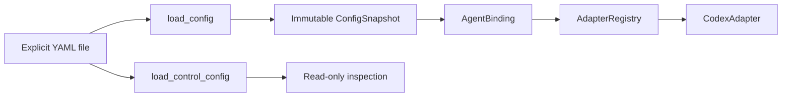
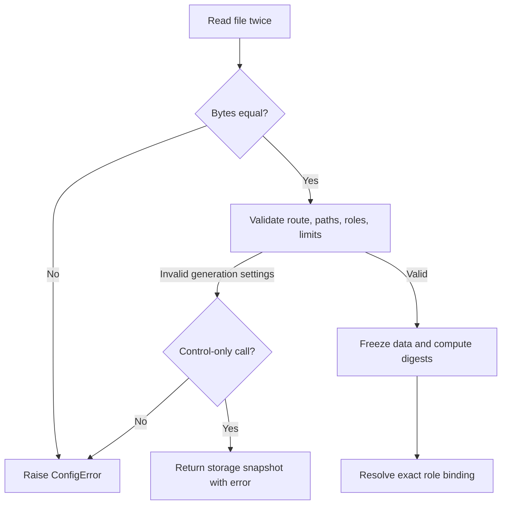

<!--
Copyright (c) 2026 Martin.Bechard@DevConsult.ca
Artifact-ID: 186db77f-3de6-475b-9193-6b19c779497b
Created-Local: 2026-09-29T23:35:55.488247-04:00
Creating-Agent: Northstar
Runtime: Codex
-->

# Configuration and adapter contracts

## Current Understanding

This module validates one explicit YAML configuration and freezes an immutable snapshot for each harness invocation. Its primary responsibility is to bind each managed role to one configured CLI, profile, executable, authentication context, and adapter implementation.

Design mode: **EXISTING_IMPLEMENTATION**. Configuration is reloaded at each generation boundary. A separate control-only load keeps provider and evidence inspection available when generation settings are invalid.

## Authoritative Sources

Current behavior comes from [contracts.py](../../../src/backlog_harness/contracts.py), [runtime.py](../../../src/backlog_harness/runtime.py), [registry.py](../../../src/backlog_harness/adapters/registry.py), and [test_configuration.py](../../../tests/test_configuration.py). [The implementation plan](../../../IMPLEMENTATION-PLAN.md), [ARC-002](../../architecture/ARC-002-codex-work-item-dispatch-harness.md), and [HLD-003](../high-level/HLD-003-codex-work-item-dispatch-service.md) define the accepted boundary.

Executable source wins for current behavior. The parent designs govern intended constraints. An operation-specific source rule wins over general design prose unless the sources conflict.

## Related Code

- [contracts.py](../../../src/backlog_harness/contracts.py) owns parsing, validation, immutable snapshots, binding digests, and control-only loading.
- [runtime.py](../../../src/backlog_harness/runtime.py) owns the portable adapter request, session, invocation, and protocol shapes.
- [registry.py](../../../src/backlog_harness/adapters/registry.py) owns the closed adapter registry.
- [application.py](../../../src/backlog_harness/application.py) reloads configuration before invocations and freezes accepted per-item workflow settings.

## Related Tests

[test_configuration.py](../../../tests/test_configuration.py) exercises reload immutability, validation failures, skill and authentication binding, protected paths, control-only inspection, and frozen workflow scope. [test_coordination.py](../../../tests/test_coordination.py) exercises invalid-configuration admission fencing.

## Related Backlog Items

No separate file-provider Work Item is identified. The authorized scope is [the implementation plan](../../../IMPLEMENTATION-PLAN.md).

## Related Wiki Pages

The project has no wiki. Parent context is in [ARC-002](../../architecture/ARC-002-codex-work-item-dispatch-harness.md), [HLD-003](../high-level/HLD-003-codex-work-item-dispatch-service.md), and the [requirements matrix](../../verification/requirements-matrix.md).

## Open Questions

No module-contract question is open. Current source review, rebuilt installation, and installed acceptance are bound in the [release receipt](../../verification/release-acceptance.json). Independent documentation review remains the release gate.

## Maintenance Notes

Recheck this design when configuration keys, supported adapters, role permissions, authentication context, candidate storage, or adapter protocol methods change. The last source reconciliation was 2026-09-30.

## Requirements Coverage

| Requirement source and ID | Claim mode | Required outcome | Satisfying contract | Status | Out-of-scope authority, rationale, and owning artifact | Verification |
| --- | --- | --- | --- | --- | --- | --- |
| Plan: configuration and adapter contracts | CURRENT_BEHAVIOR | Reload applicable configuration before each CLI invocation and keep in-flight values immutable. | `load_config`, `ConfigSnapshot`, and `Application._invoke` | DEFINED | Not applicable | `test_reload_is_deeply_immutable`; `test_accepted_workflow_remains_frozen_and_changed_scope_blocks_invocation` |
| Plan: configurable bindings | CURRENT_BEHAVIOR | Bind every role through a common interface; support Codex first. | `AgentBinding` and `AdapterRegistry.resolve` | DEFINED | Additional production adapters are outside version 1. | `test_duplicate_keys_and_unsupported_adapter`; `test_effective_authentication_context_is_bound_to_session` |
| Plan: read-only inspection | CURRENT_BEHAVIOR | Keep provider and evidence inspection available when generation configuration is invalid. | `load_control_config` and `Application(config_path, control_only=True)` | DEFINED | Control loading cannot authorize generation. | `test_control_storage_remains_inspectable_when_generation_profile_is_missing`; `test_long_lived_view_observes_invalid_configuration_without_reusing_generation_settings` |
| Selected file/main route | CURRENT_BEHAVIOR | Require file persistence, main-branch completion, agent-owned resource coordination, and SOLO or approved MULTITASK. | `load_config` validates the harness route; `FileProvider.policy` validates `PROJECT.yaml`. | DEFINED | Agents use the configured claim helper; no provider framework or claim transport is added. | `test_agent_owned_claim_policy_is_preserved`; selected-mode tests |

## Runtime Path

```text
src/backlog_harness/
├── application.py
├── contracts.py
├── runtime.py
└── adapters/
    └── registry.py
tests/
├── test_configuration.py
└── test_coordination.py
docs/design/components/
└── MOD-001-configuration.md
```

Symbol and placement ledger:

| Leaf | Complete public symbol or signature | Responsibility |
| --- | --- | --- |
| `contracts.py` | `class ConfigError(ValueError)` | Reports configuration that cannot authorize an operation. |
| `contracts.py` | `AgentBinding(role: str, cli_name: str, adapter: str, executable: str, executable_digest: str, auth_profile: str, profile_name: str, profile_digest: str, relevant_digest: str, auth_context: str = "")` | Immutable effective role binding; `origin` identifies resume compatibility. |
| `contracts.py` | `ConfigSnapshot(path: Path, file_digest: str, loaded_at: str, data: Mapping)` | Immutable full configuration with `repository`, `operational_root`, and `binding(role: str) -> AgentBinding`. |
| `contracts.py` | `load_config(path: Path, *, adapters=frozenset({"codex"})) -> ConfigSnapshot` | Validates a generation-authorizing snapshot. |
| `contracts.py` | `load_control_config(path: Path) -> ConfigSnapshot` | Resolves provider and evidence storage for read-only control when generation validation fails. |
| `runtime.py` | `SessionHandle(session_id: str, native_session_id: str, binding: AgentBinding)` | Binds portable and native session identity to the originating binding. |
| `runtime.py` | `AgentRequest(operation_id: str, invocation_id: str, snapshot: ConfigSnapshot, binding: AgentBinding, prompt: str, evidence_path: Path, telemetry: TelemetryDestination, timeout_seconds: float = 90, capability_probe: bool = False, read_only: bool = True)` | Supplies one immutable adapter request. |
| `runtime.py` | `InvocationHandle(invocation_id: str, evidence_path: Path, session: SessionHandle | None = None, outcome: str = "requested", events: list[dict] = field(default_factory=list))` | Carries normalized adapter observations. |
| `adapters/registry.py` | `AdapterRegistry.resolve` | Checks the seven callable adapter operations listed under Public Contracts. |
| `registry.py` | `AdapterRegistry(factories=None)`; `resolve(name)` | Instantiates only registered adapters and verifies every protocol method is callable. |

## Parent Context

[HLD-003](../high-level/HLD-003-codex-work-item-dispatch-service.md) requires explicit per-role bindings and immutable per-invocation snapshots. The current implementation narrows the route to Codex CLI 0.159.2, file persistence, main-branch completion, agent-owned resource coordination, and SOLO or approved MULTITASK.



## Responsibilities

- Reject duplicate, missing, unstable, nonfinite, unsupported, or unsafe configuration before an affected launch.
- Validate disjoint provider, evidence, and writable candidate paths.
- Freeze nested mappings and lists for one invocation.
- Include executable bytes, skills, profile, CLI options, authentication context, and storage identity in binding digests.
- Resolve only registered adapters. The registry performs no plugin discovery or configured imports.

## Callers

- `Application.__init__`, `Application._invoke`, `Application.capacity_slot`, and `RunController.run` load snapshots.
- `CodexAdapter` consumes `AgentRequest`, `SessionHandle`, and `InvocationHandle`.
- `cli.main` uses `load_config` for generation commands and `load_control_config` for inspection commands.
- Tests inject adapter factories through `AdapterRegistry(factories=None)` or an explicit factory mapping.

## Dependencies

- PyYAML parses the explicit YAML file with `UniqueLoader`.
- Python mappings, tuples, dataclasses, SHA-256, and filesystem checks create immutable local contracts.
- `TelemetryDestination` from [telemetry.py](../../../src/backlog_harness/telemetry.py) is part of `AgentRequest`.
- The configured methodology root supplies named `SKILL.md` bytes for binding digests.

## Public Contracts

`load_config` reads the same file bytes twice. It launches nothing when the bytes differ. It validates the version, provider, workflow, candidate isolation, checks, timing, capacity, guard settings, call budgets, CLI definitions, profiles, skills, tools, permissions, and required Coordinator and Orchestrator roles.

`ConfigSnapshot.binding(role: str) -> AgentBinding` resolves the role, configured CLI, profile, executable digest, skill digests, and effective Codex home. A missing binding raises `ConfigError`.

`load_control_config(path: Path) -> ConfigSnapshot` first attempts full validation. If generation configuration is invalid, it validates only the file-provider storage identity and records `generation_configuration_error`. The returned snapshot is read-only evidence context and cannot authorize generation.

`AdapterRegistry.resolve` checks these required callable methods:

```python
def validate_profile(self, request: AgentRequest) -> dict
async def prepare_telemetry(self, request: AgentRequest) -> dict
async def start_session(self, request: AgentRequest) -> InvocationHandle
async def resume_session(self, session: SessionHandle, request: AgentRequest) -> InvocationHandle
def observe_events(self, invocation: InvocationHandle) -> AsyncIterator[dict]
async def reconcile(self, invocation: InvocationHandle) -> dict
async def request_interrupt(self, invocation: InvocationHandle) -> dict
```

## External And Asynchronous Effect Phases

| Effect and phase | Trigger | State already committed | Initiator | Submission owner | Executor or delivery owner | Response visibility and failure outcome | Retry or compensation | Completion evidence | Source and claim mode |
| --- | --- | --- | --- | --- | --- | --- | --- | --- | --- |
| Generation load | A CLI invocation reaches `_invoke`. | Accepted item workflow may already exist. | `Application` | Not applicable | `contracts.py` | Invalid configuration blocks before adapter submission. | Correct configuration; do not reuse stale generation settings. | Immutable `ConfigSnapshot` and `AgentBinding` | `application.py`, CURRENT_BEHAVIOR |
| Control load | Status, dashboard, app, reconcile, or provider recovery starts. | Provider and evidence data may exist. | `cli.main` or `snapshot` | Not applicable | `contracts.py` | Storage remains inspectable; the snapshot exposes the generation error. | Correct generation configuration before a paid call. | `generation_configuration_error` | `cli.py`, `projections.py`, CURRENT_BEHAVIOR |

## Trust And Identity Boundaries

| Operation or data flow | Actor and authentication source | Authorization, ownership, tenancy, and data filtering | Selector and mismatch behavior | Validation owner | Success response and disclosure | State owner and transition | Failure timing and side effects | Sensitive data and logging |
| --- | --- | --- | --- | --- | --- | --- | --- | --- |
| Role binding | Configured operator input; `auth_profile` and effective `codex_home` select authentication context. | Profile permissions allow `read` or `workspace-write`; only Orchestrator may receive write permission. | Role selects one named agent, CLI, and profile. Missing or changed identities block. | `contracts.py` | Returns digests and path references, not credentials. | Configuration file owns the current selection; the invocation owns its frozen snapshot. | Validation fails before launch. | Tokens are not stored. The authentication context is a path reference. |

## Internal Data And State

`ConfigSnapshot.data` is recursively frozen. `file_digest` identifies the complete file. `AgentBinding.relevant_digest` identifies executable bytes and the effective role dependencies. `AgentBinding.origin` binds adapter, named CLI, executable, authentication profile, and authentication context for resume checks.

## Processing Rules

1. Read the configured file twice and require identical bytes.
2. Parse mappings with unique string keys.
3. Validate the selected version 1 route and every required value.
4. Resolve and hash each executable and configured skill.
5. Freeze the parsed structure and return one snapshot.
6. Resolve the requested role only from the closed adapter registry.

## Processing Diagram



## Invariants

- The application never launches an affected CLI from invalid or unstable generation configuration.
- In-flight snapshots remain immutable.
- Writable candidate storage is disjoint from provider and operational evidence.
- Agents apply configured resource coordination. Execution mode is validated against project fields when present and source-bound Coordinator authority; MULTITASK requires project concurrency approval.
- Unknown adapters and unsupported tool filtering fail closed.
- A control-only snapshot cannot authorize generation.

## Configuration

The root file requires version 1, absolute repository, methodology, workspace, and optional operational paths, file provider, selected workflow, checks, polling and staleness intervals, capacity, generation guard settings, call budgets, CLI instances, profiles, and role bindings. MULTITASK also requires `candidate_root` and explicit per-item scopes.

## External Interfaces

The external input is the operator-selected YAML file. The adapter interface is enforced by `AdapterRegistry.resolve`; the unused parallel protocol declaration was removed. No network configuration service, dynamic adapter import, or environment-discovered project route exists.

## UI And Notification Behavior

`validate` returns a configuration digest and resolved bindings. Inspection views expose `generation_configuration_error` and set item generation to unavailable when only control loading succeeds.

## Error Handling

`ConfigError` reports invalid or unsupported configuration. `AdapterRegistry.resolve` raises `ValueError` for an unknown adapter and `TypeError` for a factory that does not satisfy the protocol surface. These failures occur before an adapter effect.

## Documentation Acceptance

ACCEPTED for independent review. This artifact records the current executable contracts and current focused tests. It does not claim final artifact review or release approval.

## Implementation Readiness

READY for bounded maintenance of the implemented configuration and adapter-contract module. Current source is independently accepted; the [release receipt](../../verification/release-acceptance.json) binds the rebuilt installation and installed acceptance. Independent documentation review is tracked separately.

## Verification

The durable [recovery and control receipt](../../verification/recovery-control-evidence.json) records a 63-test baseline, but current source changed after that receipt. Current focused test identities are listed above and in the [requirements matrix](../../verification/requirements-matrix.md). The [current release receipt](../../verification/release-acceptance.json) records 78 passing tests, lint, accepted source review, matching rebuilt installation, installed controls, and retained workflow replay. These completed checks do not require repetition for documentation changes; independent documentation review remains pending.

## Agent-mediated provider configuration

`provider_interaction` defaults to `agent`; `direct` must be selected explicitly for historical fixture replay. Agent management requires workspace-write for the executing Coordinator or Orchestrator, while observation invocations remain read-only. Applicable management and claim skills can be loaded by reference from `methodology_root`; their file digests participate in binding identity.

`adapter_options.load_user_config` defaults to false. Opting in loads native Codex configuration from the effective `codex_home`; the harness records a digest, not its contents. Explicit model, permissions and telemetry overrides remain applied. Native tool availability is separately observed, and active project policy still governs permission to use those tools. See the [operator guide](../../operator-guide.md) for the validation/observation handoff.
