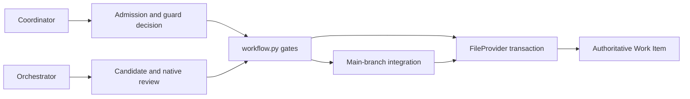
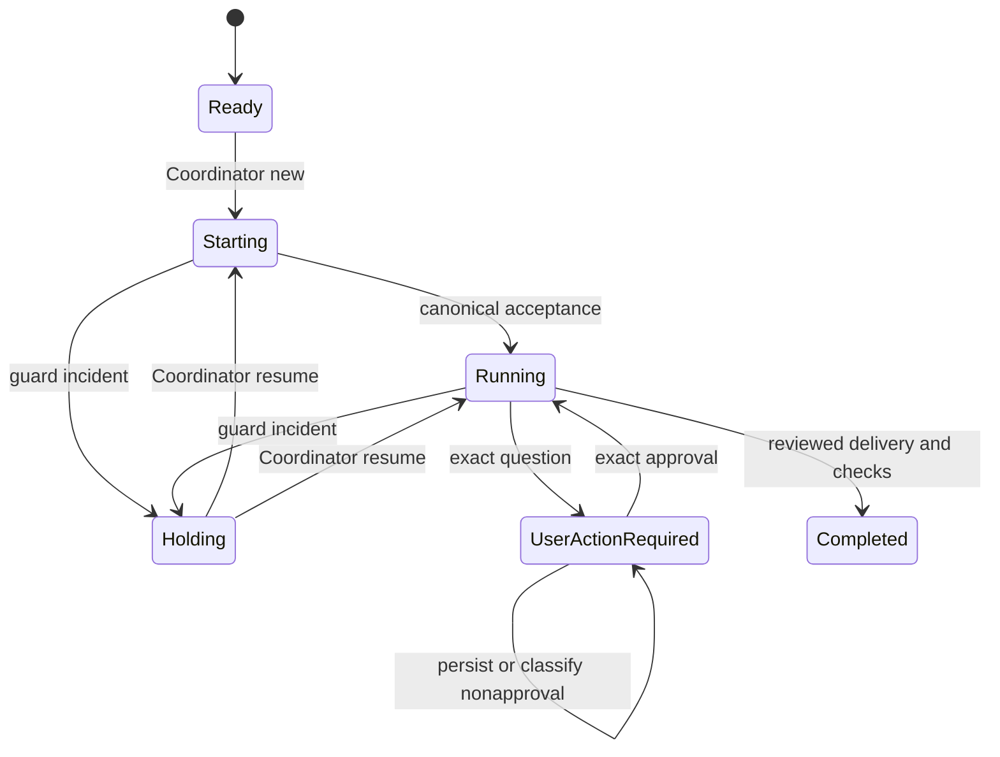

<!--
Copyright (c) 2026 Martin.Bechard@DevConsult.ca
Artifact-ID: f138a4e5-348d-4e3d-b4c4-058fb9e09d54
Created-Local: 2026-09-29T23:35:55.488943-04:00
Creating-Agent: Northstar
Runtime: Codex
-->

# Provider and coordination

## Current Understanding

This module applies agent decisions to one selected file-provider, main-branch workflow. Its primary responsibility is to gate lifecycle transitions, schedule eligible items, serialize provider and integration transactions, and deliver reviewed candidates without creating shadow lifecycle authority.

Design mode: **EXISTING_IMPLEMENTATION**, with the agent-mediated source implemented and real-project acceptance still pending. Agents organize implementation, native specialist review, and configured resource claims. The harness validates every protected transition and candidate receipt. Resource-claim policy selection is supported; execution mode remains explicit SOLO or approved MULTITASK.

### Agent-mediated provider integration contract

The clarified integration uses the existing Coordinator and canonical Orchestrator to interact with the selected provider through their management skills. It does not add a provider role, delegation transport, or provider framework. The direct Markdown mutation path described later remains the explicit historical fixture implementation, not the default live-project route.

1. The responsible agent observes the authoritative provider and returns exact item identity, current revision, lifecycle state, owner, content, dependencies, and available estimate evidence. Missing historical estimates remain unknown. Group records and archive debt are classified by the selected management procedure.
2. The harness validates the requesting actor and evidence required for the particular transition. Admission and acceptance do not require completion review; completion requires independently verified review of the exact candidate and delivery evidence.
3. Before a mutation invocation, the harness durably records a stable operation identity, expected provider revision, requested transition, actor identity, and evidence references. The responsible agent rechecks the revision through the selected management operation at its write boundary and manages any required claims itself.
4. The operation result binds that identity to the observed before/after revisions, state, owner, and supporting provider receipt. A CLI exit or an agent saying done is insufficient. Missing or invalid evidence prevents advancement. An uncertain mutation is reconciled under the same operation identity; it is never automatically submitted again.
5. Provider observations are cached for deterministic status and dashboard reads. Agent refresh occurs at startup, material changes, explicit refresh, or bounded configured discovery, never on every UI poll.

Reuse the configured CLI invocation/result mechanism, per-invocation reload, attribution, limits, and durable recovery. Provider operations must run against the authoritative project workspace rather than being redirected to a candidate clone. Candidate implementation remains confined to its declared paths.

An existing desktop task ID is not a proven resumable CLI session ID. Preserve its canonical ownership and recover through its actual supported runtime mechanism. Existing-runtime recovery must not be reported as harness CLI delivery. A new harness execution requires lawful Coordinator selection after capacity is available.

## Authoritative Sources

Current behavior comes from [provider.py](../../../src/backlog_harness/provider.py), [workflow.py](../../../src/backlog_harness/workflow.py), [coordination.py](../../../src/backlog_harness/coordination.py), [delivery.py](../../../src/backlog_harness/delivery.py), and [application.py](../../../src/backlog_harness/application.py). Focused evidence comes from [test_provider_coordination.py](../../../tests/test_provider_coordination.py), [test_coordination.py](../../../tests/test_coordination.py), and [test_recovery.py](../../../tests/test_recovery.py).

[The implementation plan](../../../IMPLEMENTATION-PLAN.md), [ARC-002](../../architecture/ARC-002-codex-work-item-dispatch-harness.md), and [HLD-003](../high-level/HLD-003-codex-work-item-dispatch-service.md) define authority. Executable source wins for current behavior.

## Related Code

- [provider.py](../../../src/backlog_harness/provider.py) owns file inventory, project route validation, exact Git transactions, questions, receipts, and recovery.
- [workflow.py](../../../src/backlog_harness/workflow.py) owns transition and candidate gates.
- [coordination.py](../../../src/backlog_harness/coordination.py) owns until-terminal/watch scheduling, dependency checks, admission, pause, resume, and stop.
- [delivery.py](../../../src/backlog_harness/delivery.py) owns reviewed-candidate main-branch integration and integrated checks.
- [application.py](../../../src/backlog_harness/application.py) maps Coordinator and Orchestrator results to these gates.

## Related Tests

[test_provider_coordination.py](../../../tests/test_provider_coordination.py) covers actor authority, stale revisions, resource policy, review binding, holds, and exact answers. [test_coordination.py](../../../tests/test_coordination.py) covers SOLO/MULTITASK overlap, idle watch, capacity, locks, and invalid-configuration admission. [test_recovery.py](../../../tests/test_recovery.py) covers provider and delivery crash boundaries.

## Related Backlog Items

No separate file-provider Work Item is identified. The selected workflow is authorized by [the implementation plan](../../../IMPLEMENTATION-PLAN.md).

## Related Wiki Pages

The project has no wiki. See [ARC-002](../../architecture/ARC-002-codex-work-item-dispatch-harness.md), [HLD-003](../high-level/HLD-003-codex-work-item-dispatch-service.md), and the [requirements matrix](../../verification/requirements-matrix.md).

## Open Questions

The agent-mediated provider route is implemented; installation and real-project verification remain incomplete. Agents use the configured resource-claim helper. Existing canonical runtime recovery and lawful next-item selection remain with the project Coordinator.

## Maintenance Notes

Recheck this design when provider headers, lifecycle states, `PROJECT.yaml` workflow selection, transition rules, item scopes, delivery proof, or scheduler modes change. The last source reconciliation was 2026-09-30.

## Requirements Coverage

| Requirement source and ID | Claim mode | Required outcome | Satisfying contract | Status | Out-of-scope authority, rationale, and owning artifact | Verification |
| --- | --- | --- | --- | --- | --- | --- |
| Plan: authority split | CURRENT_BEHAVIOR | Provider owns lifecycle and assignment; Coordinator owns admission and guard decisions; canonical Orchestrator owns acceptance, questions, and delivery requests. | `validate_transition` and `FileProvider.transition` | DEFINED | Agent task organization remains inside the CLI. | `test_valid_admission_and_reject_missing_actor_stale_revision`; question and hold tests |
| Plan: workflow gates | CURRENT_BEHAVIOR | Missing review, wrong candidate, stale evidence, or unauthorized actor blocks only the affected transition. | `validate_candidate` and `validate_transition` | DEFINED | No universal delivery graph is introduced. | `test_candidate_bound_independent_review`; six-item acceptance |
| Plan: run modes | CURRENT_BEHAVIOR | Until-terminal settles; watch discovers later work without idle model calls. | `RunController.run` | DEFINED | Agents manage configured resource claims. | `test_watch_unchanged_scope_does_not_dispatch_and_pause_stop_work`; selected-mode tests |
| Plan: concurrent work | CURRENT_BEHAVIOR | SOLO admits one item. MULTITASK admits up to configured capacity with disjoint explicit item scopes. | `RunController.run`, `Application.run_item`, `FileProvider.policy` | DEFINED | MULTITASK requires project approval and independent candidate clones. | Unit overlap 1/2; real acceptance overlap 1/2 |
| Plan: main-branch delivery | CURRENT_BEHAVIOR | Integrate only exact reviewed candidate bytes, run source and integrated checks, then request provider completion. | `integrate` and Running-to-Completed gate | DEFINED | Publication is not required by this route. | delivery crash-boundary tests; six completed real items |

## Runtime Path

```text
src/backlog_harness/
├── application.py
├── coordination.py
├── delivery.py
├── provider.py
└── workflow.py
tests/
├── test_coordination.py
├── test_provider_coordination.py
└── test_recovery.py
docs/design/components/
└── MOD-003-provider-coordination.md
```

Symbol and placement ledger:

| Leaf | Complete public symbol or signature | Responsibility |
| --- | --- | --- |
| `provider.py` | `Item(item_id: str, path: str, revision: str, state: str, owner: str, original_high: int | None, content: str)` | Immutable observed provider item. |
| `provider.py` | `parse_item(path, content)` | Validates identity, provider, state, owner, estimate, and revision digest. |
| `provider.py` | `FileProvider(repository: Path, evidence_root: Path)` | Owns `snapshot`, `item`, `question`, `policy`, `transaction`, `transition`, `recover_prepared`, and `reconcile_operation`. |
| `workflow.py` | `validate_transition(item, target, authority)` | Applies actor, identity, state, evidence, and delivery gates. |
| `workflow.py` | `validate_candidate(repository, candidate, base, allowed_paths, producer, review, checks)` | Binds clean candidate, scope, independent review, and checks. |
| `coordination.py` | `dependencies(item)` | Parses the provider dependency header. |
| `coordination.py` | `RunController(app, publish=None)` | Exposes `record`, `pause`, `resume`, `stop`, `eligible`, `execute`, and `run`. |
| `delivery.py` | `integrate(app, item_id, candidate_repo, candidate, base, review, checks)` | Creates or reconciles one verified main-branch merge and integrated-check receipt. |
| `application.py` | `async run_item(self, item_id)` | Applies execution-mode locks and scope-overlap gates before item execution. |

## Parent Context

The module is the enforcement layer between agent decisions and provider or Git effects. It does not decide the work package. It proves whether the requested provider transition or delivery effect is authorized.



## Responsibilities

- Read a complete, stable file-provider inventory and reject ambiguous identity.
- Validate the selected file/main route against `PROJECT.yaml` and attached Git state.
- Admit only eligible items with current Coordinator evidence.
- Preserve canonical owner through questions and holds.
- Require candidate-bound independent review, passing checks, and scope compliance.
- Integrate one reviewed candidate under the provider transaction lock.
- Reconcile uncertain provider and delivery effects without blind repetition.

## Callers

- `Application._run_item` calls provider, workflow, scheduling, and delivery operations.
- `RunController` calls `Application.run_item` and reads provider snapshots.
- Terminal and CLI commands call run controls and explicit recovery operations.
- Projection code reads provider snapshots and questions without mutation.

## Dependencies

- Git supplies immutable blobs, first-parent history, candidate identity, and merge proof.
- PyYAML reads `PROJECT.yaml` route selection.
- [MOD-004](MOD-004-evidence.md) supplies atomic receipts and operation locks.
- [MOD-002](MOD-002-execution.md) supplies observed agent authority and native review proof.
- [MOD-005](MOD-005-telemetry.md) supplies the usage view that can request an item-local hold.

## Public Contracts

`FileProvider.snapshot()` returns sorted, parsed Work Items after two identical inventory reads. It excludes non-item root index files and `future-ideas`.

`FileProvider.policy()` requires:

- resource coordination policy is preserved; agents manage any configured claims;
- `execution_mode: SOLO` or `MULTITASK`;
- `project_setup.concurrent_tasking` equal to whether the mode is MULTITASK;
- file persistence and main-branch completion with no folder overrides;
- the configured `main` or `master` branch attached in the primary worktree.

`FileProvider.transition(item_id, expected_revision, target, authority, *, validate)` validates the current revision, exact actor evidence, clean primary checkout, intended bytes, exact paths, parent commit, and immutable blob. Completed items move into the matching completed-backlog group.

Protected transitions are:

| Transition | Required actor and gate |
| --- | --- |
| Ready -> Starting | Coordinator `operation=new` for the exact item. |
| Starting -> Running | Orchestrator accepted with portable and native session IDs. |
| Starting or Running -> Holding | Coordinator with `usage_unknown` or `usage_limit`. |
| Running -> User Action Required | Canonical Orchestrator with exact question identity and text. |
| User Action Required -> Running | Canonical Orchestrator classifies the exact persisted answer as `approve`. |
| Holding -> Starting or Running | Coordinator `operation=resume`, retained owner, and known below-ceiling usage. |
| Running -> Completed | Canonical Orchestrator plus verified READY delivery, review, source checks, integrated checks, and main commit. |

`RunController.run(mode)` accepts only `until-terminal` or `watch`. SOLO uses item concurrency 1. MULTITASK uses `max_active_invocations`. Unchanged watch polls call no model. Paused admission remains `AdmissionPaused` across polls, including when the scope is terminal; later Ready items stay excluded until explicit resume.

Before admission, `assignment.json` freezes the provider revision, path, content, original estimate, and selected workflow. Ready reuse requires the same revision, content, and original estimate before any Coordinator invocation. Starting continuation validates the retained admission result and its telemetry, then verifies the exact provider operation and the pre-transition Git blob against the frozen assignment. Missing or mismatched proof blocks acceptance without another invocation.

## External And Asynchronous Effect Phases

| Effect and phase | Trigger | State already committed | Initiator | Submission owner | Executor or delivery owner | Response visibility and failure outcome | Retry or compensation | Completion evidence | Source and claim mode |
| --- | --- | --- | --- | --- | --- | --- | --- | --- | --- |
| Provider prepare | A validated actor requests a transition. | Agent invocation evidence exists. | `Application` | `FileProvider` | Git primary checkout | `requested.json` binds exact before state and intended bytes. | Explicit `recover_prepared`; never automatic replay. | Provider operation request | Source, CURRENT_BEHAVIOR |
| Provider commit | Prepared bytes pass clean-checkout and revision gates. | Provider request is durable. | `FileProvider` | Git commit | Git primary checkout | Exact-path commit succeeds or outcome remains uncertain. | Reconcile by parent, paths, and blob bytes. | `receipt.json` | Source, CURRENT_BEHAVIOR |
| Candidate integration | Native review and source checks accept exact candidate. | Delivery REQUESTED receipt exists. | Canonical Orchestrator through harness | `integrate` | Git primary checkout | Unique merge and integrated checks yield READY; ambiguity blocks. | Reconcile unique first-parent merge; never repeat a proven merge. | Delivery JSON and integrated-check receipt | Source, CURRENT_BEHAVIOR |
| Provider completion | READY delivery is available. | Main commit and checks are durable. | Canonical Orchestrator | `FileProvider` | File provider | Completed receipt or explicit provider uncertainty. | Reconcile provider operation. | Archived item plus provider receipt | Source, CURRENT_BEHAVIOR |

## Trust And Identity Boundaries

| Operation or data flow | Actor and authentication source | Authorization, ownership, tenancy, and data filtering | Selector and mismatch behavior | Validation owner | Success response and disclosure | State owner and transition | Failure timing and side effects | Sensitive data and logging |
| --- | --- | --- | --- | --- | --- | --- | --- | --- | --- |
| Lifecycle transition | Observed Coordinator, canonical Orchestrator, or explicit operator answer. | Role, item, canonical owner, operation, and evidence vary by transition. | Item ID plus expected revision; mismatch blocks before mutation. | `validate_transition` | Receipt includes state, commit, path, revision, and operation. | File provider owns lifecycle and assignment. | Validation failure has no provider effect; uncertain prepared or committed effects retain records. | Authority JSON is appended to the Work Item; callers must not include secrets. |
| Candidate delivery | Canonical Orchestrator and distinct native reviewer. | Allowed paths, clean candidate, exact base, ACCEPT verdict, no findings, and passing checks. | Candidate SHA, base SHA, producer session, reviewer session; mismatch blocks. | `validate_candidate` and `integrate` | READY receipt names candidate, main commit, review, checks, and changed paths. | Git owns source delivery; provider completion follows separately. | Ambiguous merge or advanced source blocks without another merge. | Check output is stored locally; no credentials are required. |

## Internal Data And State

Provider item revision is SHA-256 of path plus exact bytes. Provider operation identity hashes item, revision, target, and authority. `RunController` stores admission state, active items, and premise-bound scheduling blocks. Candidate and delivery receipts bind exact Git identities.

## Processing Rules

1. Read current provider items and validate the selected project route.
2. Exclude terminal, dependency-blocked, active, or premise-blocked items.
3. Ask the Coordinator for admission only at a material eligible boundary.
4. Record Starting before the Orchestrator accepts Running.
5. Let the canonical Orchestrator organize candidate work and native review.
6. Validate candidate scope, review independence, and source checks.
7. Merge once, run integrated checks, and record READY.
8. Request provider completion with the complete delivery receipt.

## Processing Diagram



The following diagram shows the separate effect boundaries described above. Failed or ambiguous proof retains evidence and prevents advancement.

```mermaid
sequenceDiagram
    participant A as Application
    participant P as File provider
    participant G as Primary Git
    participant D as Delivery module
    A->>P: authorized exact-revision transition
    P->>P: persist requested before state and intended bytes
    P->>G: apply exact paths and commit
    G-->>P: exact commit proof
    P->>P: persist provider receipt
    Note over A,D: candidate and native review are already returned
    A->>A: verify review, source checks, scope, candidate and usage
    A->>D: integrate exact candidate
    D->>D: persist REQUESTED identity
    D->>G: merge once
    G-->>D: unique main commit
    D->>D: integrated checks and READY receipt
    D-->>A: READY evidence
    A->>P: canonical completion authority and READY receipt
    P->>G: commit exact Completed archive transition
    Note over A,G: invalid proof fences before effect; uncertain effect reconciles before repetition
```

## Invariants

- Provider state and owner are authoritative.
- Runtime events and projections never authorize lifecycle.
- SOLO serializes item execution. MULTITASK requires explicit disjoint scopes and independent clones.
- Provider and integration transactions are serialized even in MULTITASK.
- Candidate review and checks bind the exact candidate SHA.
- A provider or merge effect with uncertain outcome is reconciled before any repetition.
- A Starting or Running reservation without its retained assignment, admission, and canonical acceptance evidence cannot launch a replacement agent.
- One held or waiting item does not block an independent eligible item.

## Configuration

Harness configuration selects file provider, main-branch completion, primary branch, mode, allowed paths, checks, capacity, and optional item overrides. `PROJECT.yaml` independently confirms file/main defaults, execution mode, and concurrent-tasking approval. Resource-claim policy is preserved and managed by agents.

## External Interfaces

External interfaces are file-backed Work Items, `PROJECT.yaml`, Git commands, candidate repositories, and the operator's explicit run controls. No provider-neutral plugin framework or claim-helper abstraction is implemented.

## UI And Notification Behavior

The run controller publishes state, item result, wait, interruption, blocker, and configuration-error events. Pause closes admission. Stop cancels owned item tasks and reports Available or Unresolved from reconciliation evidence.

## Error Handling

`TransitionBlocked` rejects stale revisions, unsupported transitions, invalid actors, dirty checkouts, route mismatch, overlapping scopes, stale review, failed checks, missing retained reservation evidence, and ambiguous recovery. Provider and delivery records preserve uncertain effects for explicit reconciliation.

## Documentation Acceptance

ACCEPTED for independent review. This artifact records the implemented selected route and its focused evidence. It does not claim review approval or general provider-framework support.

## Implementation Readiness

READY for bounded maintenance of the selected file/main workflow. Current source is independently accepted and its rebuilt installed package passes the checks in the [release receipt](../../verification/release-acceptance.json). Independent documentation review is tracked separately. Other coordination or provider routes require separate design authority.

## Verification

[six-item-acceptance.json](../../verification/six-item-acceptance.json) records three SOLO and three MULTITASK items in Completed, with maximum simultaneous harness invocation counts of 1 and 2. Both installed replays created zero new invocations. Those real runs retain their historical source identity; the [current release receipt](../../verification/release-acceptance.json) records current-source review, rebuilt installation, and zero-invocation replay. The [requirements matrix](../../verification/requirements-matrix.md) records focused tests and remaining gaps.
