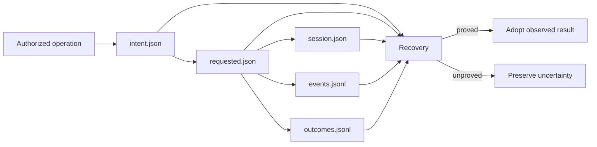
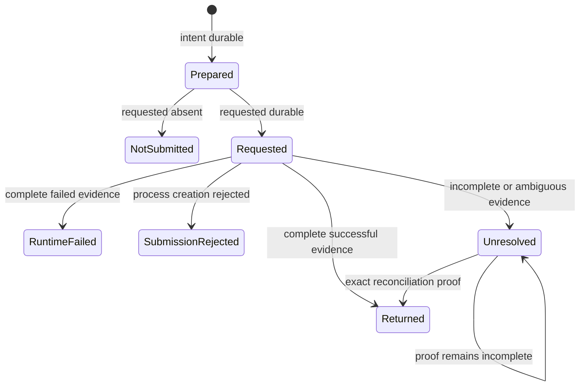
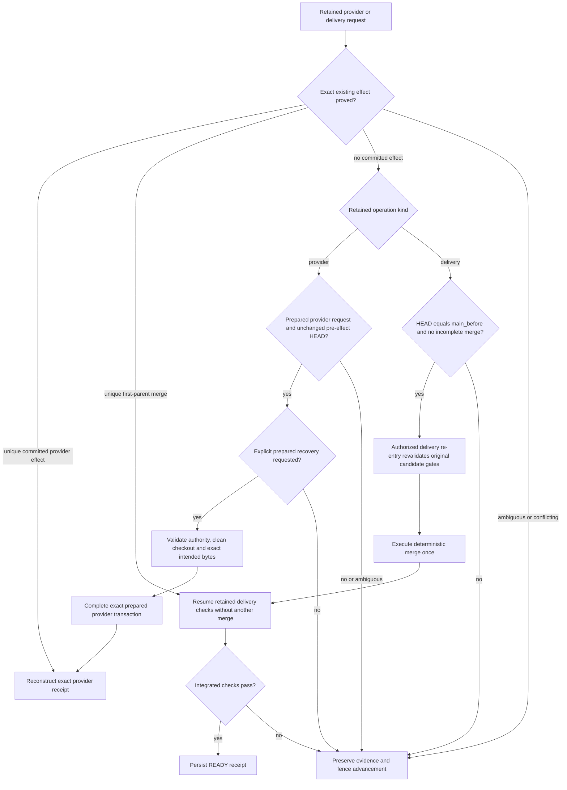

<!--
Copyright (c) 2026 Martin.Bechard@DevConsult.ca
Artifact-ID: 85a1aad7-f83e-4cfe-9d34-df7c22f20b6c
Created-Local: 2026-09-29T23:35:55.489237-04:00
Creating-Agent: Northstar
Runtime: Codex
-->

# Runtime evidence and recovery

## Current Understanding

This module records invocation intent, submission, session, events, outcomes, and recovery facts in durable local files. Its primary responsibility is to prevent duplicate effects across crashes without treating runtime evidence as provider authority.

Design mode: **EXISTING_IMPLEMENTATION**. The module distinguishes not submitted, requested and unresolved, returned, runtime failed, and submission rejected outcomes. Recovery adopts proved observations or preserves uncertainty.

## Authoritative Sources

Current behavior comes from [evidence.py](../../../src/backlog_harness/evidence.py), [application.py](../../../src/backlog_harness/application.py), [native_evidence.py](../../../src/backlog_harness/native_evidence.py), [provider.py](../../../src/backlog_harness/provider.py), and [delivery.py](../../../src/backlog_harness/delivery.py). Focused evidence comes from [test_evidence.py](../../../tests/test_evidence.py) and [test_recovery.py](../../../tests/test_recovery.py).

[The implementation plan](../../../IMPLEMENTATION-PLAN.md), [ARC-002](../../architecture/ARC-002-codex-work-item-dispatch-harness.md), and [HLD-003](../high-level/HLD-003-codex-work-item-dispatch-service.md) define the no-duplicate-effect requirement. Source and retained evidence win for current behavior.

## Related Code

- [evidence.py](../../../src/backlog_harness/evidence.py) owns locks, atomic JSON, append-only JSONL, incremental reads, and invocation evidence paths.
- [application.py](../../../src/backlog_harness/application.py) owns stage recovery, process reconciliation, provider recovery entry points, and answer-operation recovery.
- [provider.py](../../../src/backlog_harness/provider.py) owns prepared and committed provider-effect recovery.
- [delivery.py](../../../src/backlog_harness/delivery.py) owns merge-effect recovery.
- [native_evidence.py](../../../src/backlog_harness/native_evidence.py) supplies exact native terminal evidence.

## Related Tests

- [test_evidence.py](../../../tests/test_evidence.py): `test_intent_requested_and_uncertain_are_not_replayed`; `test_partial_line_is_not_published_or_overwritten`.
- [test_recovery.py](../../../tests/test_recovery.py): provider receipt recovery, unobserved submission fencing, stage reconstruction, delivery crash boundaries, exact answer recovery, prepared provider recovery, telemetry receipt binding, and frozen hold review.
- [test_coordination.py](../../../tests/test_coordination.py): uncertain capacity occupancy and transient operation locks.

## Related Backlog Items

No separate file-provider Work Item is identified. Recovery work is part of [the implementation plan](../../../IMPLEMENTATION-PLAN.md).

## Related Wiki Pages

The project has no wiki. See [ARC-002](../../architecture/ARC-002-codex-work-item-dispatch-harness.md), [HLD-003](../high-level/HLD-003-codex-work-item-dispatch-service.md), and the [requirements matrix](../../verification/requirements-matrix.md).

## Open Questions

No module-contract question is open. A specific unresolved effect can still require operator repair or explicit provider recovery. That operational uncertainty is preserved as evidence, not treated as a design gap.

## Maintenance Notes

Recheck this design when evidence versions, path identities, process observation, event normalization, provider transactions, delivery transactions, or recovery commands change. The last source reconciliation was 2026-09-30.

## Requirements Coverage

| Requirement source and ID | Claim mode | Required outcome | Satisfying contract | Status | Out-of-scope authority, rationale, and owning artifact | Verification |
| --- | --- | --- | --- | --- | --- | --- |
| Plan: recovery without duplicate dispatch | CURRENT_BEHAVIOR | Never replace requested or unresolved CLI effects from absence alone. | `EvidenceStore.reconcile`, `Application._invoke`, `recover_invocation` | DEFINED | Manual repair may be required when proof is incomplete. | `test_submitted_unobserved_invocation_is_not_relaunched`; `test_returned_observations_rebuild_missing_stage` |
| Plan: durable writes | CURRENT_BEHAVIOR | Fsync atomic JSON and complete JSONL lines; expose partial tails. | `atomic_json`, `JsonlWriter.append`, `read_jsonl` | DEFINED | Filesystem durability beyond successful fsync is platform-owned. | `test_partial_line_is_not_published_or_overwritten` |
| Plan: provider and delivery recovery | CURRENT_BEHAVIOR | Reconcile exact prepared or committed provider and merge effects once. | `FileProvider.recover_prepared`, `reconcile_operation`, `integrate` | DEFINED | Conflicting bytes require operator correction. | provider and delivery crash-boundary tests |
| Plan: exact answer recovery | CURRENT_BEHAVIOR | Persist answer identity before resume and recover the same operation after a crash. | `Application.answer` and `resume_answer` | DEFINED | Nonapproval retains User Action Required. | `test_crash_after_answer_commit_resumes_exact_operation` |
| Plan: unknown telemetry | CURRENT_BEHAVIOR | Reject a saved result when telemetry is missing, rejected, or differs from its content-bound receipt. | `validate_invocation_result` | DEFINED | Missing native spans are not reconstructed. | bad telemetry, missing file, and changed-content tests |
| Plan: canonical reservation recovery | CURRENT_BEHAVIOR | Never launch a replacement for Starting or Running when retained assignment, admission, or acceptance evidence is absent. | `Application._run_item` retained-evidence gates | DEFINED | An operator must restore or reconcile original evidence. | `test_existing_reservation_without_retained_session_evidence_never_relaunches` |

## Runtime Path

```text
src/backlog_harness/
├── application.py
├── delivery.py
├── evidence.py
├── native_evidence.py
└── provider.py
tests/
├── test_coordination.py
├── test_evidence.py
└── test_recovery.py
docs/design/components/
└── MOD-004-evidence.md
```

Symbol and placement ledger:

| Leaf | Complete public symbol or signature | Responsibility |
| --- | --- | --- |
| `evidence.py` | `class EvidenceError(RuntimeError)` | Reports evidence and reconciliation failures. |
| `evidence.py` | `operation_lock(path)`; `async_operation_lock(path)` | Serializes exact local operations across processes or coroutines. |
| `evidence.py` | `component(identity: str) -> str` | Produces a lowercase SHA-256 path component. |
| `evidence.py` | `fsync_directory(path: Path)`; `atomic_json(path: Path, value, *, exclusive=False)` | Persists atomic JSON and directory metadata. |
| `evidence.py` | `JsonlWriter(path: Path)`; `append(value)` | Appends one complete, fsynced JSONL record. |
| `evidence.py` | `read_jsonl(path: Path, offset=0)` | Returns `(records, next_offset, partial_tail)` for incremental reads. |
| `evidence.py` | `EvidenceStore(root: Path, run_id: str)` | Exposes `begin`, `requested`, `session`, `outcome`, and `reconcile`. |
| `application.py` | `process_stopped(path)` | Classifies process quiescence from durable outcome and exact process start identity. |
| `application.py` | `recover_invocation(self, path)` | Reconstructs one returned stage without a replacement call. |
| `application.py` | `reconcile(self)` | Reconciles all known invocation and provider operation records. |
| `application.py` | `async answer(self, item_id, question_id, expected_revision, text)`; `async resume_answer(self, item_id)` | Persists and resumes one exact answer operation. |
| `application.py` | `recover_provider(self, operation_id)` | Explicitly completes one unique prepared provider operation. |

## Parent Context

Runtime evidence proves what the harness observed. It never replaces provider lifecycle, agent authority, or Git source identity. Provider and delivery recovery use separate exact effect proofs.



## Responsibilities

- Create stable hashed paths while retaining original identities inside records.
- Persist intent before an effect and requested state at the submission boundary.
- Append normalized events and outcomes without overwriting prior uncertainty.
- Reject incomplete final lines and evidence identity mismatches.
- Reconstruct proved returned stages after restart.
- Preserve uncertain process, provider, merge, answer, telemetry, and capacity state.

## Callers

- `Application`, `CodexAdapter`, `TelemetryReceiver`, `RunController`, `FileProvider`, and `integrate` write or reconcile evidence.
- Projection code reads intent, events, outcomes, and telemetry incrementally.
- Operator commands invoke application reconciliation and explicit prepared-provider recovery.

## Dependencies

- Local filesystem operations provide links, atomic rename, file locks, fsync, and append-only files.
- SHA-256 binds identities and output bytes.
- `ps` verifies whether an exact recorded PID start identity remains active.
- Native Codex session evidence can confirm terminal completion after an uncertain local outcome.

## Public Contracts

`EvidenceStore.begin(operation_id, invocation_id, snapshot, binding, *, action, item_id=None, request_digest=None)` creates exclusive `config.json` and `intent.json` under hashed run, operation, and invocation path components.

`EvidenceStore.requested(path)` creates exclusive `requested.json`. Intent without requested is `not_submitted`. Requested without a complete terminal outcome is `unresolved`.

`EvidenceStore.session(path, value)` creates exclusive `session.json`. `EvidenceStore.outcome(path, classification, **facts)` appends to `outcomes.jsonl`.

`EvidenceStore.reconcile(path)` verifies invocation, operation, and run identity hashes. It returns intent fields plus `outcome` and `partial`.

`Application.recover_invocation(path)` returns a saved-stage result only when durable events, session, stopped process, native completion when needed, positive unrejected telemetry, and telemetry content are present. Otherwise it returns `None` or raises a gate error.

## External And Asynchronous Effect Phases

| Effect and phase | Trigger | State already committed | Initiator | Submission owner | Executor or delivery owner | Response visibility and failure outcome | Retry or compensation | Completion evidence | Source and claim mode |
| --- | --- | --- | --- | --- | --- | --- | --- | --- | --- |
| Prepare invocation | Application selects one stage. | Accepted workflow and request digest exist. | `Application` | `EvidenceStore` | Not applicable | Exclusive intent failure means no adapter call. | Reconcile the same identity. | `config.json`, `intent.json` | Source, CURRENT_BEHAVIOR |
| Mark requested | Adapter is about to create the process. | Intent is durable. | `CodexAdapter` | `EvidenceStore` | Codex process | Requested state means submission may have occurred. | Do not replace from this state. | `requested.json` | Source, CURRENT_BEHAVIOR |
| Observe result | Process emits session, events, and exit. | Requested state exists. | `CodexAdapter` | `JsonlWriter` | Codex process | Complete evidence gives a classification; partial evidence stays uncertain. | Reconcile native terminal and stopped process when possible. | Session, events, outcomes, telemetry | Source, CURRENT_BEHAVIOR |
| Recover provider or delivery | Restart finds a durable requested effect without final receipt. | Exact intended bytes or merge identities exist. | Operator or application reconciliation | Provider or delivery module | Git | Unique proof yields receipt; ambiguity blocks without mutation repetition. | Explicit prepared-provider recovery only when pre-effect HEAD remains. | Provider or delivery receipt | Source, CURRENT_BEHAVIOR |

## Trust And Identity Boundaries

| Operation or data flow | Actor and authentication source | Authorization, ownership, tenancy, and data filtering | Selector and mismatch behavior | Validation owner | Success response and disclosure | State owner and transition | Failure timing and side effects | Sensitive data and logging |
| --- | --- | --- | --- | --- | --- | --- | --- | --- | --- |
| Invocation evidence | Harness-generated opaque IDs and immutable binding. | Evidence authorizes no provider transition by itself. | Original IDs must hash to their path components. | `EvidenceStore.reconcile` | Returns bounded intent and outcome facts. | Application owns operation evidence; provider owns Work Item state. | Identity, version, partial-line, or parse failure blocks adoption. | Config records contain references and digests, not arbitrary adapter options or tokens. |
| Native review evidence | Producer native session and fresh child session. | Child must be distinct, fresh, candidate-bound, complete, and accepting. | Exact session ID or producer-scoped child task path. | `verify_native_review` | Returns bounded verdict and evidence hashes. | Canonical agent owns delegation; harness owns gate verification. | Missing or ambiguous evidence blocks completion. | Native files stay local; prompts are not copied into harness evidence. |

## Internal Data And State

Evidence paths are derived from `component(identity)`. JSON records are atomic snapshots. JSONL records preserve observation order. Incremental readers retain byte offsets and expose partial tails. Stage files cache only results that still pass current telemetry and request-digest validation.

`assignment.json` retains `provider_revision`, `provider_path`, exact `content`, immutable `original_high`, accepted `workflow`, `candidate_root`, and `workspace`. Ready admission requires the frozen provider revision and content to remain current. Starting recovery joins `admit.json` to that source revision, the provider operation authority, its reconciled commit, and the exact pre-transition blob. A changed Ready record, unbound admission, or altered frozen content cannot launch acceptance. Running continuation separately requires acceptance evidence matching the canonical owner.

## Processing Rules

1. Create exclusive intent and sanitized configuration records.
2. Create exclusive requested evidence immediately before submission.
3. Record session identity and append normalized events and outcomes.
4. Fsync file and parent directory at each durable boundary.
5. On restart, validate path identities and classify current evidence.
6. Adopt only an exact proved result.
7. Preserve unresolved evidence and block replacement execution.

## Processing Diagram



The following diagram shows the separate effect boundaries described above. Failed or ambiguous proof retains evidence and prevents advancement.



## Invariants

- Intent without requested is known not submitted.
- Requested evidence alone never proves acceptance or completion.
- A requested or unresolved effect is never replaced implicitly.
- Partial JSONL tails are not published or overwritten.
- Recovery keeps original operation, invocation, session, candidate, provider revision, and byte identities.
- Starting and Running cannot reconstruct a missing canonical assignment or acceptance by launching another agent.
- Runtime evidence never becomes provider lifecycle authority.
- Cached telemetry must still exist and match its saved span count and content digest.

## Configuration

The operational root is absolute and disjoint from writable candidate storage. Evidence versions are currently `1`. The application stores invocation evidence under hashed runs and workflow-stage evidence under hashed item paths.

## External Interfaces

The module uses local files, OS locks, process observation, Git evidence, and native Codex session JSONL. It exposes no daemon, control socket, or remote evidence API.

## UI And Notification Behavior

Reconciliation returns structured invocation or provider-operation facts. Errors name the unresolved boundary. The terminal never reports successful stop, resume, or recovery from missing proof.

## Error Handling

`EvidenceError` reports lock conflicts, incomplete lines, shrinking files, invalid complete records, and identity mismatch. `TransitionBlocked` reports unproved or conflicting provider, delivery, telemetry, answer, and native-review evidence. Recovery preserves the original files for inspection.

## Documentation Acceptance

ACCEPTED for independent review. This artifact records current evidence and recovery behavior. It does not convert preserved uncertainty into release acceptance.

## Implementation Readiness

READY for bounded maintenance of the implemented evidence module. Current source is independently accepted; the [release receipt](../../verification/release-acceptance.json) binds the rebuilt installation and zero-invocation recovery replays. Independent documentation review is tracked separately.

## Verification

The durable [recovery-control receipt](../../verification/recovery-control-evidence.json) records 63 passing tests and successful no-new-invocation replays for SOLO and MULTITASK. Current source and tests add later telemetry receipt and projection work, so the receipt is a baseline rather than final proof. See the [requirements matrix](../../verification/requirements-matrix.md).
