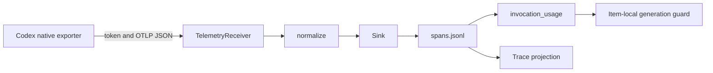
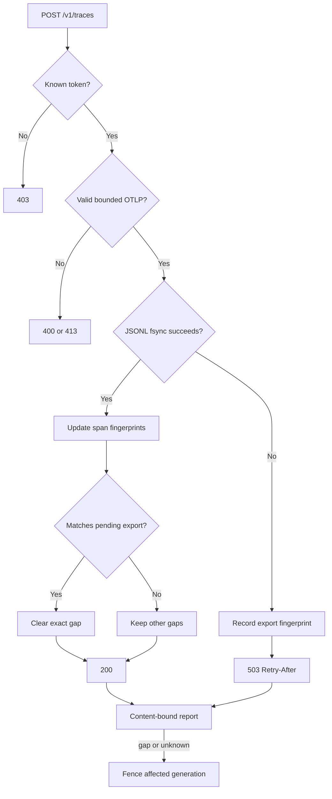
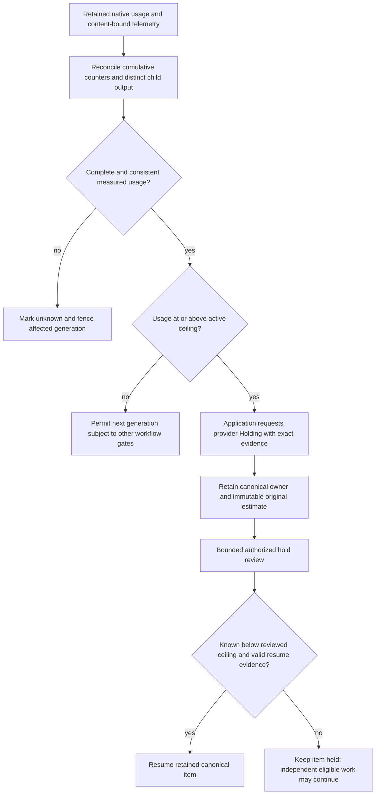

<!--
Copyright (c) 2026 Martin.Bechard@DevConsult.ca
Artifact-ID: c809cea0-28d1-4347-8396-6b2f66807074
Created-Local: 2026-09-29T23:35:55.489453-04:00
Creating-Agent: Northstar
Runtime: Codex
-->

# OpenTelemetry and usage

## Current Understanding

This module receives invocation-authenticated OTLP/HTTP JSON, preserves native trace structure, adds trusted harness correlation, and derives conservative usage evidence. Its primary responsibility is to make telemetry durable and attributable without converting missing evidence into zero usage.

Design mode: **EXISTING_IMPLEMENTATION**. The receiver tracks failed export payload fingerprints until the exact export becomes durable. A missing native batch remains an explicit gap and fences the affected next generation boundary.

## Authoritative Sources

Current behavior comes from [telemetry.py](../../../src/backlog_harness/telemetry.py), [analytics.py](../../../src/backlog_harness/analytics.py), [application.py](../../../src/backlog_harness/application.py), [test_telemetry.py](../../../tests/test_telemetry.py), [test_analytics.py](../../../tests/test_analytics.py), and telemetry cases in [test_recovery.py](../../../tests/test_recovery.py). The bounded native observation is [native-exporter-evidence.json](../../verification/native-exporter-evidence.json).

[The implementation plan](../../../IMPLEMENTATION-PLAN.md), [ARC-002](../../architecture/ARC-002-codex-work-item-dispatch-harness.md), and [HLD-003](../high-level/HLD-003-codex-work-item-dispatch-service.md) define intent. Source and retained runtime evidence win for current behavior.

## Related Code

- [telemetry.py](../../../src/backlog_harness/telemetry.py) owns validation, trusted correlation, deduplication, durable exports, retry-gap tracking, and the loopback receiver.
- [analytics.py](../../../src/backlog_harness/analytics.py) owns event accounting, cumulative-to-delta conversion, guard views, and invocation/native reconciliation.
- [application.py](../../../src/backlog_harness/application.py) registers destinations, waits for exporter drain, saves content-bound reports, validates results, and applies the item-local guard.
- [native_evidence.py](../../../src/backlog_harness/native_evidence.py) provides native-child usage totals.

## Related Tests

- [test_telemetry.py](../../../tests/test_telemetry.py): HTTP attribution and gzip; invalid, conflicting, oversized, and storage-failure inputs; exact export retry closure; partial-batch retry fencing.
- [test_analytics.py](../../../tests/test_analytics.py): unknown evidence, deduplication, cumulative counters, crossing, and reviewed ceiling.
- [test_recovery.py](../../../tests/test_recovery.py): bad telemetry, frozen estimate, missing telemetry file, changed content at equal span count, and hold-review recovery.

## Related Backlog Items

No separate file-provider Work Item is identified. Telemetry and usage are part of [the implementation plan](../../../IMPLEMENTATION-PLAN.md).

## Related Wiki Pages

The project has no wiki. See [ARC-002](../../architecture/ARC-002-codex-work-item-dispatch-harness.md), [HLD-003](../high-level/HLD-003-codex-work-item-dispatch-service.md), and the [requirements matrix](../../verification/requirements-matrix.md).

## Open Questions

No additional paid probe or retry framework is required. Codex CLI 0.159.2 did not retry the deliberately rejected first 512-span batch. Complete shutdown flush remains unproved because that batch is missing. Current policy preserves the gap and blocks affected generation.

## Maintenance Notes

Revalidate OTLP fields, usage attributes, exporter batching, retry behavior, drain timing, and shutdown behavior when the supported CLI changes. Recheck content fingerprints when resource or scope metadata handling changes. The last source reconciliation was 2026-09-30.

## Requirements Coverage

| Requirement source and ID | Claim mode | Required outcome | Satisfying contract | Status | Out-of-scope authority, rationale, and owning artifact | Verification |
| --- | --- | --- | --- | --- | --- | --- |
| Plan: standard OTLP JSONL | CURRENT_BEHAVIOR | Preserve standard OTLP export framing and native relationships while adding trusted Work Item and invocation correlation. | `normalize`, `Sink.write`, `TelemetryReceiver.register` | DEFINED | External parent-trace injection is not claimed. | `test_http_attribution_retry_and_gzip`; six-item traces |
| Plan: retry and durability | CURRENT_BEHAVIOR | Acknowledge only durable exports; retain an unresolved fingerprint after 503 until the exact export is durable. | `Sink.pending_exports`, `TelemetryReceiver.report` | DEFINED | Native retry is not guaranteed. | `test_storage_failure_remains_fenced_until_same_export_is_durable`; `test_partial_export_retry_does_not_clear_whole_batch_gap` |
| Plan: usage guard | CURRENT_BEHAVIOR | Attribute generated output once, preserve unknown data, and hold at the configured threshold. | `invocation_usage`, `UsageLedger.guard`, `Application.usage_view`, `guard` | DEFINED | Unknown usage cannot receive an allowance. | analytics test; call-budget, estimate, and hold-review recovery tests |
| Telemetry gate: Codex 0.159.2 | CURRENT_LIMITATION | Record observed fields, usage, retry, and drain behavior without claiming complete flush. | Native exporter receipt and fail-closed validation | DEFINED | Another paid probe is not required. | First 512 spans rejected with 503; no retry observed; 1,200 later spans and 11 output tokens persisted. |
| Plan: content-bound receipts | CURRENT_BEHAVIOR | A saved report must bind current unique native spans and their resource, scope, and span content. | `Sink.entries`, `evidence_digest`, `Application.validate_invocation_result` | DEFINED | Missing native data is not synthesized. | `test_cached_telemetry_same_span_count_with_changed_content_is_rejected` |

## Runtime Path

```text
src/backlog_harness/
├── analytics.py
├── application.py
├── native_evidence.py
└── telemetry.py
tests/
├── test_analytics.py
├── test_recovery.py
└── test_telemetry.py
docs/verification/
└── native-exporter-evidence.json
```

Symbol and placement ledger:

| Leaf | Complete public symbol or signature | Responsibility |
| --- | --- | --- |
| `telemetry.py` | `TelemetryDestination(invocation_id: str, endpoint: str, token: str, path: Path)` | Carries one transient authenticated receiver destination. |
| `telemetry.py` | `normalize(payload, correlation)` | Validates an OTLP trace request and adds trusted reserved attributes. |
| `telemetry.py` | `spans(payload)` | Iterates resource, scope, and span triples. |
| `telemetry.py` | `Sink(path, correlation)`; `entries(payload)`; `evidence_digest()`; `write(payload)` | Persists, fingerprints, deduplicates, and fences trace exports. |
| `telemetry.py` | `TelemetryReceiver(root: Path)`; `register(*, run_id, invocation_id, role, adapter, item_id=None, provider_id=None)`; `report(destination)` | Hosts the loopback OTLP endpoint and produces a content-bound report. |
| `analytics.py` | `UsageEvidence(event_id: str, item_id: str, scope: str, generated_tokens: int | None, form: str = "delta", trustworthy: bool = True)` | Represents one normalized usage observation. |
| `analytics.py` | `UsageLedger()`; `add(event: UsageEvidence)`; `guard(item_id, original_high, *, multiplier=2.0, reviewed_ceiling=None, complete=False)` | Deduplicates usage and produces fail-closed guard state. |
| `analytics.py` | `invocation_usage(result, previous_session_output=0, *, child_outputs=0)` | Reconciles cumulative turn output, per-response OTLP usage, and native child output. |
| `application.py` | `usage_view(self, item_id, *, observed_item=None)`; `guard(self, item_id)`; `async review_hold(self, item_id, *, requested_ceiling=None, reference=None)` | Applies content validation, immutable estimate, hold, and reviewed allowance. |

## Parent Context

The receiver runs inside each foreground invocation boundary even when the dashboard is disabled. The application adds correlation after authenticating the destination token. Provider state and invocation records remain authoritative for lifecycle and joins.



## Responsibilities

- Bind to loopback on an ephemeral port.
- Authenticate each invocation with a private token.
- Enforce JSON, body-size, gzip, OTLP tree, identifier, and reserved-attribute rules.
- Preserve resource, scope, trace, parent, and native span fields.
- Persist one complete normalized export per JSONL line.
- Deduplicate identical overlapping spans and reject conflicting native identity.
- Keep failed export fingerprints unresolved until the exact payload becomes durable.
- Reconcile native output counters without double-counting child spans.

## Callers

- `Application._invoke` creates the receiver, registers one destination, and saves its report.
- `CodexAdapter.prepare_telemetry` sends endpoint and token through process-local overrides.
- `Application.validate_invocation_result` reconstructs `Sink` state from disk.
- Projection and analytics code read stored OTLP JSONL.

## Dependencies

- [MOD-004](MOD-004-evidence.md) supplies `JsonlWriter`, `read_jsonl`, and evidence errors.
- The Python HTTP server, gzip decoder, secrets, locks, and SHA-256 support the receiver.
- Native Codex OTLP spans supply `gen_ai.usage.output_tokens`.
- Provider items supply immutable original-high estimates and authoritative hold state.

## Public Contracts

`TelemetryReceiver.register` returns a destination with a loopback `/v1/traces` endpoint, random token, and hashed run-or-item path. Item telemetry requires a provider identity.

`POST /v1/traces` requires one valid token, `Content-Length`, `application/json`, and identity or gzip content encoding. It returns 200 only after durable write, 400 for invalid data or conflicts, 403 for an unknown token, 404 for another path, 413 for an oversized body, and 503 with `Retry-After: 1` for storage failure.

`Sink.write(payload)` fingerprints the complete normalized export and each unique `(traceId, spanId)` with resource, scope, and span content. An identical overlap is idempotent. A conflicting identity is invalid. A failed persistence adds the export fingerprint to `pending_exports`. Only durable receipt of the exact export removes that fingerprint.

`TelemetryReceiver.report(destination)` returns `span_count`, `evidence_sha256`, `rejected_exports`, `storage_failures`, `unresolved_retries`, and coverage.

`invocation_usage` accepts only complete, unrejected telemetry whose per-response output sum equals the cumulative session delta plus completed child output. Otherwise it returns `None`.

## External And Asynchronous Effect Phases

| Effect and phase | Trigger | State already committed | Initiator | Submission owner | Executor or delivery owner | Response visibility and failure outcome | Retry or compensation | Completion evidence | Source and claim mode |
| --- | --- | --- | --- | --- | --- | --- | --- | --- | --- |
| Register | Application opens an invocation receiver. | Invocation identity exists. | `Application` | `TelemetryReceiver` | In-process HTTP server | Returns transient endpoint and token. | Re-register only within the same unsubmitted invocation boundary. | `TelemetryDestination` | Source, CURRENT_BEHAVIOR |
| Export validate | Native exporter posts a batch. | Destination is registered. | Codex exporter | HTTP handler | `normalize` | 400, 403, 413, or 503 exposes failure to exporter. | Exporter may retry; harness makes no retry guarantee. | HTTP response | Source, CURRENT_BEHAVIOR |
| Persist | Valid normalized batch reaches `Sink.write`. | No new spans from this batch are durable yet. | HTTP handler | `Sink` | `JsonlWriter` | 200 follows fsync. Storage failure records the exact export fingerprint and returns 503. | Only the same durable export closes its gap. | JSONL line plus sink state | Source, CURRENT_BEHAVIOR |
| Report and gate | Invocation receiver closes after a two-second drain wait. | All observed exports are fixed on disk. | `Application` | `TelemetryReceiver` | Application guard | Any pending export or missing spans sets rejected/unknown and fences generation. | Preserve the incident; do not invent spans. | Content-bound report | Source and probe, CURRENT_BEHAVIOR |

## Trust And Identity Boundaries

| Operation or data flow | Actor and authentication source | Authorization, ownership, tenancy, and data filtering | Selector and mismatch behavior | Validation owner | Success response and disclosure | State owner and transition | Failure timing and side effects | Sensitive data and logging |
| --- | --- | --- | --- | --- | --- | --- | --- | --- | --- |
| OTLP export | Codex process presents the per-invocation random token. | Token selects one sink and trusted correlation set. | Header token; unknown token returns 403. Reserved attribute mismatch returns 400. | `TelemetryReceiver` and `normalize` | Empty JSON response; no token disclosure. | Sink owns telemetry durability; provider owns Work Item lifecycle. | Rejection occurs before or during persistence; failed exports remain visible in report. | Token is transient, excluded from path and JSONL, and hidden from dataclass repr. |

## Internal Data And State

Each sink keeps `seen` identity-to-content fingerprints, failure counts, storage failure count, and `pending_exports`. `UsageLedger` keeps event fingerprints, cumulative counters, item totals, and unknown item IDs. The application keeps the original estimate from frozen assignment evidence and optional reviewed allowance.

## Processing Rules

1. Authenticate the invocation token and bound the request body.
2. Decode JSON or gzip and validate the OTLP tree.
3. Add only trusted missing harness attributes.
4. Fingerprint the complete export and every native span with resource and scope metadata.
5. Reject conflicts, skip fully durable duplicates, or fsync the complete export.
6. Report unresolved export fingerprints and a content digest.
7. Reconcile native usage sources. Unknown or conflicting evidence blocks generation.
8. At or above the active ceiling, request provider Holding for that item only.

## Processing Diagram



The following diagram shows the separate effect boundaries described above. Failed or ambiguous proof retains evidence and prevents advancement.



## Invariants

- Missing, rejected, conflicting, or incomplete telemetry is never counted as zero.
- Reserved harness attributes come from receiver registration.
- Native trace relationships and resource/scope metadata remain intact.
- Span identity includes content fingerprint checking.
- A different or partial retry cannot clear a failed export fingerprint.
- Cumulative counters cannot decrease.
- Native child and parent output are counted once.
- The guard uses the immutable original high estimate and holds only the affected item.

## Configuration

`generation_guard_multiplier` defaults to 2.0. Another value requires an exact approval record. `administrative_review_limits` bounds hold review. The receiver body limit is 8 MiB compressed input and 8 MiB decoded output.

## External Interfaces

The external interface is invocation-local OTLP/HTTP JSON on loopback. Stored files remain standard OTLP export JSONL with trusted span attributes. No dashboard dependency or separate telemetry daemon exists.

## UI And Notification Behavior

Views show generated tokens, original baseline, ceiling, overshoot, and whether generation may continue. Unknown evidence stays `unknown`. A hold review requires measured usage and an operator reference for a higher ceiling.

## Error Handling

`InvalidPayload`, `TooLarge`, and `StorageFailure` map to explicit HTTP responses. A report with zero spans, rejected exports, missing file, changed span content, unknown child usage, or inconsistent counters blocks the affected next generation boundary.

## Documentation Acceptance

ACCEPTED for independent review. This artifact records implemented telemetry, focused tests, and bounded native limitations. It does not claim complete native flush or release acceptance.

## Implementation Readiness

READY for bounded maintenance of the implemented fail-closed telemetry and usage module. Current authority accepts the documented native retry gap without another paid probe or broader framework. The [release receipt](../../verification/release-acceptance.json) records accepted current source, 78 tests, the rebuilt installation, and installed acceptance. Independent documentation review remains pending.

## Verification

[native-exporter-evidence.json](../../verification/native-exporter-evidence.json) is the real 0.159.2 receipt. It records one deliberately rejected 512-span batch, no observed retry, 1,200 later spans, and matching native/OTLP output usage of 11. The report explicitly does not prove complete flush. The deterministic 63-test receipt predates the newest fingerprint and content-binding cases; the [requirements matrix](../../verification/requirements-matrix.md) distinguishes baseline and current checks.
