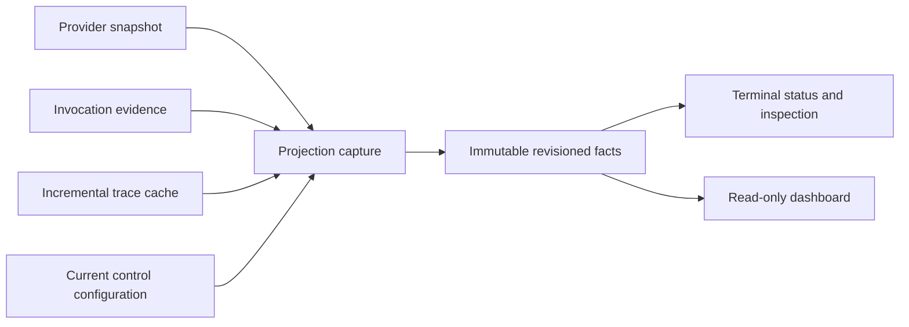
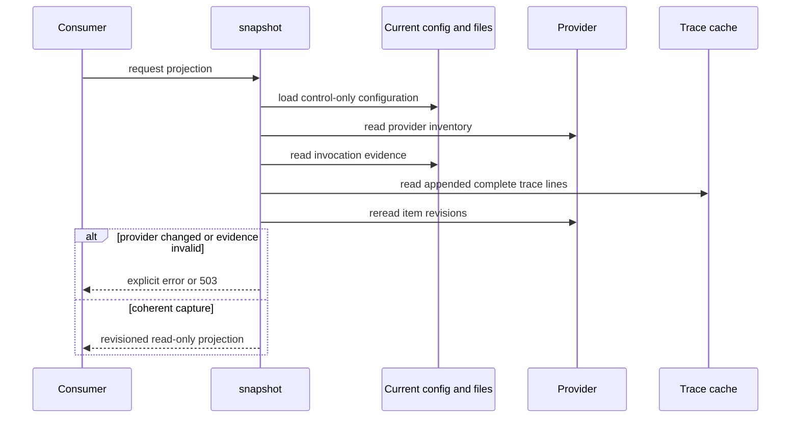

<!--
Copyright (c) 2026 Martin.Bechard@DevConsult.ca
Artifact-ID: 763fe676-1e26-4d36-8f69-71796f062312
Created-Local: 2026-09-29T23:35:55.489671-04:00
Creating-Agent: Northstar
Runtime: Codex
-->

# Terminal and dashboard projections

## Current Understanding

This module presents one read-only evidence projection through the installed CLI, asynchronous terminal, and loopback dashboard. Its primary responsibility is to keep provider, invocation, usage, question, and trace facts coherent for one projection revision.

Design mode: **EXISTING_IMPLEMENTATION**. Each snapshot reloads the current configuration in control-only mode. Trace projection reads only appended complete JSONL records and preserves explicit uncertainty.

## Authoritative Sources

Current behavior comes from [projections.py](../../../src/backlog_harness/projections.py), [terminal.py](../../../src/backlog_harness/terminal.py), [dashboard.py](../../../src/backlog_harness/dashboard.py), [cli.py](../../../src/backlog_harness/cli.py), static dashboard assets, and [test_views.py](../../../tests/test_views.py). [The implementation plan](../../../IMPLEMENTATION-PLAN.md), [ARC-002](../../architecture/ARC-002-codex-work-item-dispatch-harness.md), and [HLD-003](../high-level/HLD-003-codex-work-item-dispatch-service.md) define intent.

Executable source wins for current behavior. Provider records remain lifecycle authority. A projection is a read-only observation.

## Related Code

- [projections.py](../../../src/backlog_harness/projections.py) owns current-config capture, coherent provider reads, recorded run and blocker observations, invocation summaries, trace cache, freshness, uncertainty, and revision.
- [terminal.py](../../../src/backlog_harness/terminal.py) owns interactive commands and prompt-safe output.
- [dashboard.py](../../../src/backlog_harness/dashboard.py) owns the read-only loopback HTTP surface.
- [cli.py](../../../src/backlog_harness/cli.py) owns installed command parsing and control-only routing.
- [static](../../../src/backlog_harness/static/index.html) owns the existing browser presentation.

## Related Tests

[test_views.py](../../../tests/test_views.py) covers exact dashboard projection, mutation and Host rejection, incremental trace reads, time ordering, partial tails, provider-change rejection, and current invalid-configuration inspection. [test_coordination.py](../../../tests/test_coordination.py) covers watch, pause, resume, and stop controls.

## Related Backlog Items

No separate file-provider Work Item is identified. Terminal and dashboard work are part of [the implementation plan](../../../IMPLEMENTATION-PLAN.md).

## Related Wiki Pages

The project has no wiki. See [ARC-002](../../architecture/ARC-002-codex-work-item-dispatch-harness.md), [HLD-003](../high-level/HLD-003-codex-work-item-dispatch-service.md), the [operator guide](../../operator-guide.md), and the [requirements matrix](../../verification/requirements-matrix.md).

## Open Questions

No module-contract question is open. Older already-Completed acceptance receipts can be displayed as `legacy_count_only`. They cannot authorize new advancement. The [release receipt](../../verification/release-acceptance.json) binds accepted current source to its rebuilt installation, populated views, control checks, and retained replays. Independent documentation review remains pending.

## Maintenance Notes

Recheck this design when projection fields, trace storage layout, freshness rules, terminal commands, dashboard endpoints, or control-only configuration rules change. The last source reconciliation was 2026-09-30.

## Requirements Coverage

| Requirement source and ID | Claim mode | Required outcome | Satisfying contract | Status | Out-of-scope authority, rationale, and owning artifact | Verification |
| --- | --- | --- | --- | --- | --- | --- |
| Plan: terminal-first application | CURRENT_BEHAVIOR | Provide interactive and noninteractive run, control, inspection, answer, recovery, and hold-review commands. | `cli.main` and `terminal` | DEFINED | The dashboard remains secondary and read-only. | installed terminal receipt; coordination and view tests |
| Plan: read-only dashboard | CURRENT_BEHAVIOR | Serve one shared projection and reject mutation. | `create_dashboard_server` and `snapshot` | DEFINED | No second store or dashboard server is introduced. | `test_dashboard_serves_exact_projection_and_rejects_mutation`; installed visual receipt |
| Plan: consistent views | CURRENT_BEHAVIOR | Derive terminal and dashboard facts from one projection contract and revision. | `snapshot` and `capture` | DEFINED | Provider changes during capture cause rejection, not a mixed view. Recorded run state is evidence, not a liveness claim. | `test_projection_rejects_provider_change_instead_of_mixing_counts`; dashboard projection test |
| Plan: incremental traces | CURRENT_BEHAVIOR | Read only appended complete JSONL records; deduplicate, order, cap detail, and expose partial tails. | `trace_snapshot` and `Application.trace_cache` | DEFINED | Rewrites and shrink require reconciliation. | `test_trace_projection_reads_only_appended_complete_lines_and_orders_by_time` |
| Plan: zero-call inspection | CURRENT_BEHAVIOR | Status and dashboard refresh make no model calls and use current control configuration. | `load_control_config`, `snapshot`, and CLI command routing | DEFINED | Invalid generation configuration cannot authorize work. | `test_long_lived_view_observes_invalid_configuration_without_reusing_generation_settings`; replays with zero new invocations |

## Runtime Path

```text
src/backlog_harness/
├── cli.py
├── dashboard.py
├── projections.py
├── terminal.py
└── static/
    ├── dashboard.css
    ├── dashboard.js
    └── index.html
tests/
├── test_coordination.py
└── test_views.py
docs/
├── operator-guide.md
└── design/components/
    └── MOD-006-views.md
```

Symbol and placement ledger:

| Leaf | Complete public symbol or signature | Responsibility |
| --- | --- | --- |
| `projections.py` | `trace_snapshot(app)` | Incrementally reads, fingerprints, orders, and bounds trace rows. |
| `projections.py` | `snapshot(app)` | Reloads current control configuration, preserves trace cache, and captures one view. |
| `projections.py` | `capture(app)` | Joins provider identity, recorded run and blockers, invocation, usage, question, freshness, and trace facts into a revisioned projection. |
| `terminal.py` | `async terminal(app)` | Runs the prompt-toolkit operator interface. |
| `dashboard.py` | `create_dashboard_server(collector, host="127.0.0.1", port=0)` | Returns a read-only loopback `ThreadingHTTPServer`. |
| `cli.py` | `main(argv=None)` | Parses the installed command surface and returns process status 0 or 2. |

## Parent Context

Terminal and dashboard are consumers of evidence. They do not own lifecycle, delivery, scheduling, or telemetry. The terminal may request authorized operations through the application. The dashboard exposes no mutation operation.



## Responsibilities

- Reload current control configuration for each snapshot.
- Read a stable provider inventory before and after projection work.
- Join invocation outcomes, usage, questions, traces, and uncertainty.
- Publish provider snapshot identity and observation time, recorded run and admission state, and only current premise-bound scheduling blockers.
- Publish portable and native session identity, adapter, CLI, profile, configuration digest, and recent event IDs for each invocation.
- Track trace file identity, offset, complete rows, partial tails, and content fingerprints.
- Compute runtime freshness and a canonical projection revision.
- Preserve prompt input while rendering asynchronous terminal output.
- Bind the dashboard to loopback and reject mutation or untrusted request context.

## Callers

- `cli.main` calls `snapshot`, `terminal`, and `create_dashboard_server`.
- `terminal` calls application run controls, item operations, answer, hold review, reconciliation, and recovery.
- The browser calls dashboard assets, `/api/snapshot`, and `/api/health`.
- Tests call projection and server functions directly.

## Dependencies

- [MOD-003](MOD-003-provider-coordination.md) supplies provider records, questions, and run controls.
- [MOD-004](MOD-004-evidence.md) supplies invocation records and incremental JSONL reads.
- [MOD-005](MOD-005-telemetry.md) supplies trace spans, content fingerprints, and usage views.
- `prompt_toolkit` owns asynchronous prompt input and coordinated output.

## Public Contracts

`snapshot(app)` creates a new control-only `Application` from the current config file. It rejects a changed repository or evidence root. It reuses only the prior trace cache, then calls `capture`.

`capture(app)` returns a dictionary with `revision`, `version`, `as_of`, `read_only`, `provider_snapshot`, `run_observation`, `capability_blockers`, `generation_configuration_error`, `items`, `counts`, `invocations`, `runtime_observed_at`, `runtime_freshness`, `trace_span_count`, `telemetry_receipt_binding`, `traces`, and `uncertainty`. `provider_snapshot` contains the current item-and-revision identity and observation time. `run_observation` reports the persisted process and admission record; it does not prove that a process is live. `capability_blockers` includes only non-Completed items whose saved blocker premise matches the current item revision and configuration digest. Each invocation reports its canonical portable and native session IDs when present, adapter, CLI, profile, configuration digest, and recent event IDs. Capture rereads the provider and rejects changed item revisions.

`trace_snapshot(app)` returns `(total_unique_span_count, last_200_rows, uncertainty)`. Rows sort by numeric end time, trace ID, and span ID. File replacement resets that file's cache. Shrink, same-size rewrite, or conflicting span content raises `EvidenceError`. A partial final line remains uncertainty. `capture` compares returned-invocation telemetry receipts with the complete cached file content and marks trace rows as `content_verified` or `legacy_count_only`. Legacy count-only receipts support display of already-Completed historical runs only; they do not authorize another transition.

`create_dashboard_server` serves only loopback. It exposes GET/HEAD for `/`, static assets, `/api/snapshot`, and `/api/health`. It validates Host, Origin, fetch site, and URL shape. POST, PUT, PATCH, and DELETE return 405.

The installed CLI commands are `validate`, `status`, `app`, `reconcile`, `run --until-terminal`, `run --watch`, `review-hold`, `resume-answer`, `recover-provider`, `dashboard`, and `run-item`.

## External And Asynchronous Effect Phases

| Effect and phase | Trigger | State already committed | Initiator | Submission owner | Executor or delivery owner | Response visibility and failure outcome | Retry or compensation | Completion evidence | Source and claim mode |
| --- | --- | --- | --- | --- | --- | --- | --- | --- | --- |
| Snapshot | Status, dashboard refresh, or terminal status. | Provider and evidence records already exist. | Operator or browser | `snapshot` | Local projection code | Returns one revision or a 503/actionable error; no model call. | Refresh after evidence or configuration repair. | Projection dictionary | Source, CURRENT_BEHAVIOR |
| Trace increment | Snapshot sees a changed telemetry file signature. | Prior cache offset and rows exist. | `trace_snapshot` | `read_jsonl` | Local filesystem | Complete appended lines extend the cache; partial tail adds uncertainty. | Later append can complete only from the retained offset; rewrite/shrink requires reconciliation. | Updated trace cache | Source, CURRENT_BEHAVIOR |
| Terminal command | Operator submits parsed input. | Current provider/evidence state exists. | Operator | `terminal` or `cli.main` | Application or run controller | Structured result or actionable error. | Operator chooses a later explicit command. | Printed JSON/result | Source, CURRENT_BEHAVIOR |

## Trust And Identity Boundaries

| Operation or data flow | Actor and authentication source | Authorization, ownership, tenancy, and data filtering | Selector and mismatch behavior | Validation owner | Success response and disclosure | State owner and transition | Failure timing and side effects | Sensitive data and logging |
| --- | --- | --- | --- | --- | --- | --- | --- | --- | --- |
| Dashboard read | Local browser; no application authentication. | Loopback, exact Host, same-origin when present, and same-site request context. Read-only data only. | URL path; query, scheme, or authority components are rejected. | `dashboard.py` | JSON projection, health, or local static asset. | Projection owns no lifecycle state. | Invalid context returns 403/404; collector failure returns 503. | Security headers prevent external content and referrers. |
| Terminal item or session command | Local operator at the foreground terminal. | Exact command and IDs select application operations. Provider/application gates authorize effects. | Item, question, session, or provider operation identity must match current evidence. | Terminal parser plus application/provider gates | Structured bounded result. | Provider or application owns any resulting transition. | Stale or absent identity fails before unintended mutation. | Session inspection shows bounded local events; no telemetry token is exposed. |

## Internal Data And State

`Application.trace_cache` maps telemetry paths to file identity, byte offset, unique span rows, partial-tail state, and last file signature. Each snapshot uses a fresh control-only application for current configuration and storage access while carrying forward only this cache. `run.json` and `scheduling-blocks.json` are recorded observations; they do not replace provider authority or prove current process liveness. Projection revision hashes the complete returned facts, including `as_of`.

## Processing Rules

1. Reload current configuration through `load_control_config`.
2. Require unchanged repository and operational root identity.
3. Read provider items and current invocation evidence.
4. Incrementally read changed trace files and retain explicit uncertainty.
5. Join item usage and exact questions.
6. Read recorded process and admission state and select blockers that still match the current premise.
7. Reread provider identity and reject a mixed capture.
8. Compute freshness, facts, and projection revision.
9. Return the same projection contract to terminal or dashboard.

## Processing Diagram



## Invariants

- Status, inspection, configuration validation, and dashboard refresh make no model calls.
- A snapshot uses current control configuration and never stale generation authority.
- Provider changes during capture cause rejection.
- Terminal and dashboard consume the same projection shape.
- Recorded process and admission state never assert current runtime liveness.
- A scheduling blocker appears only while its item revision and configuration digest match the saved premise.
- Invocation identity fields come from retained session, binding, configuration, and event evidence.
- Trace rows come from standard OTLP JSONL and are deduplicated by native identity plus content.
- A returned invocation's trace file must match its saved span count and available content digest before publication.
- Legacy count-only telemetry is labeled and cannot authorize new advancement.
- The dashboard binds only to `127.0.0.1` and rejects mutation.
- Unknown and stale facts remain explicit.

## Configuration

The CLI requires `--config`. `runtime_observation_stale_seconds` controls freshness when generation configuration is valid; control-only loading uses 30 seconds for display. Dashboard port defaults to 8767, and port 0 selects an ephemeral port.

## External Interfaces

External interfaces are the installed `agentic-harness` command, interactive terminal, loopback dashboard HTTP endpoints, and browser assets. There is no daemon or public control API.

## UI And Notification Behavior

The terminal displays JSON command results and preserves active input with `patch_stdout`. The full projection, returned by noninteractive CLI `status` and dashboard `/api/snapshot`, includes provider snapshot and invocation records. Interactive `status` selects exactly 11 fields: `revision`, `as_of`, `counts`, `run_observation`, `capability_blockers`, `telemetry_receipt_binding`, `items`, `runtime_freshness`, `trace_span_count`, `uncertainty`, and `generation_configuration_error`. Interactive `session show SESSION_ID` separately inspects invocation and session evidence. The dashboard labels the process and admission values as recorded facts, shows current blockers and legacy count-only receipt status, and never mutates them.

## Error Handling

The CLI writes structured errors to stderr and returns 2. The terminal catches command errors without ending the prompt. The dashboard returns a generic 503 when evidence is unavailable. Projection code rejects shrink, rewrite, conflicting spans, changed storage identity, and provider changes during capture.

## Documentation Acceptance

ACCEPTED for independent review. This artifact records current terminal, dashboard, and projection behavior. It does not claim final visual or release approval for current source.

## Implementation Readiness

READY for bounded maintenance of the implemented view module. Current source is independently accepted; the [release receipt](../../verification/release-acceptance.json) binds the rebuilt installation, populated views, and installed controls. Independent documentation review is tracked separately.

## Verification

[six-item-acceptance.json](../../verification/six-item-acceptance.json) records a visually verified installed dashboard with three Completed items, 39,220 trace spans, and zero unresolved observations, plus installed terminal controls. The receipt predates current projection and control-only inspection changes. The current [release receipt](../../verification/release-acceptance.json) records matching rebuilt bytes, installed view parity and controls, and retained replay. The [requirements matrix](../../verification/requirements-matrix.md) distinguishes these checks from the historical native deliveries.
