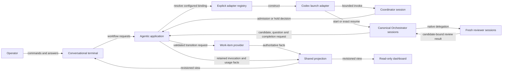
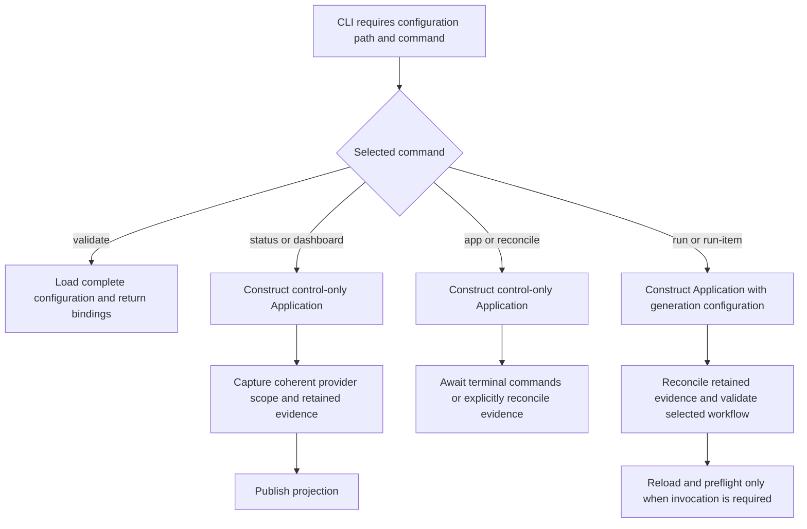
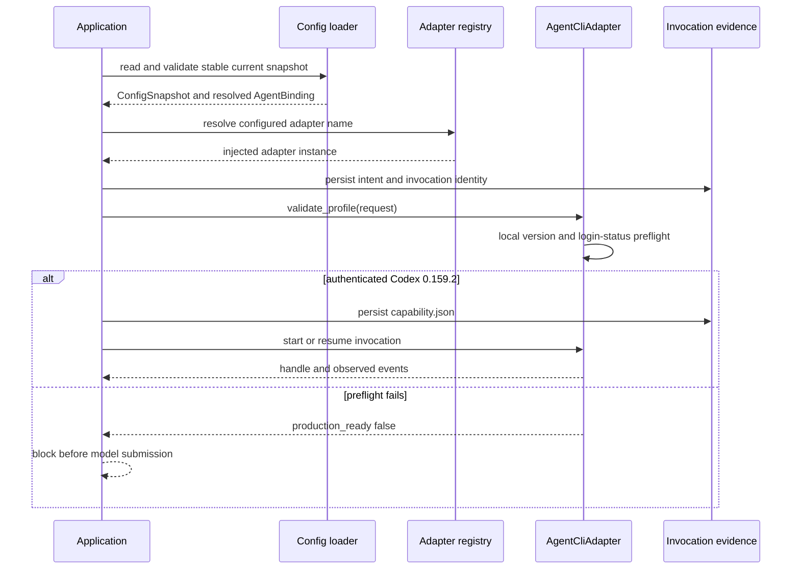
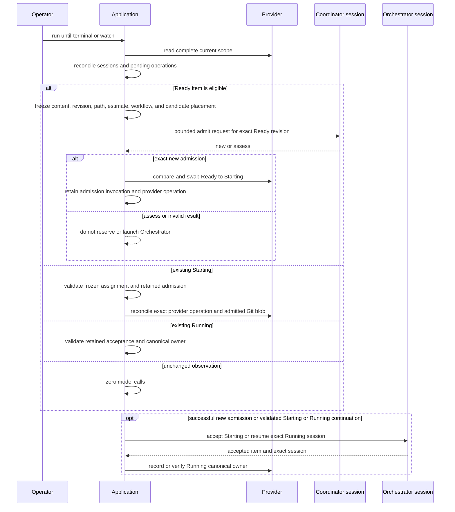
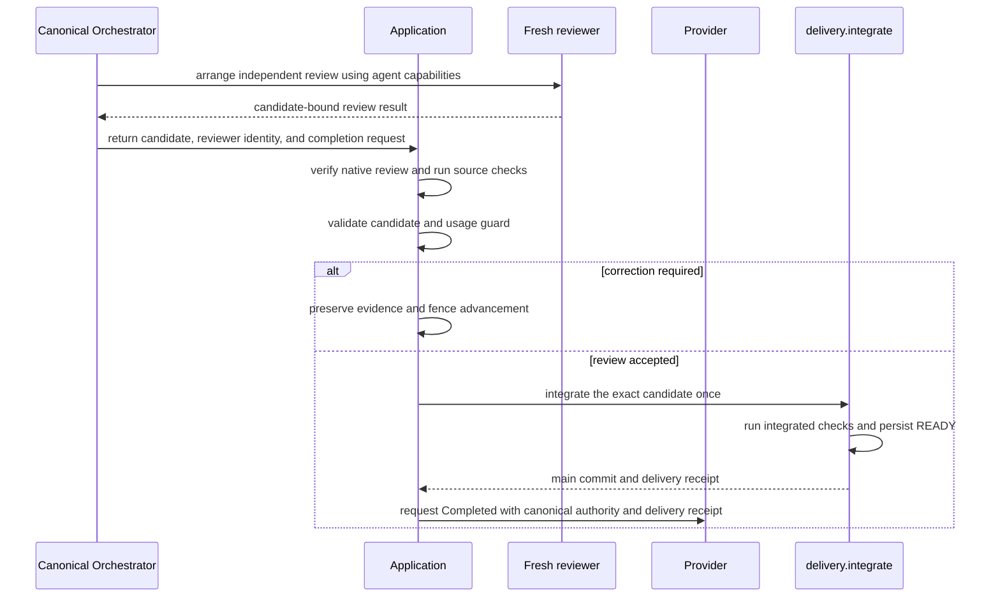
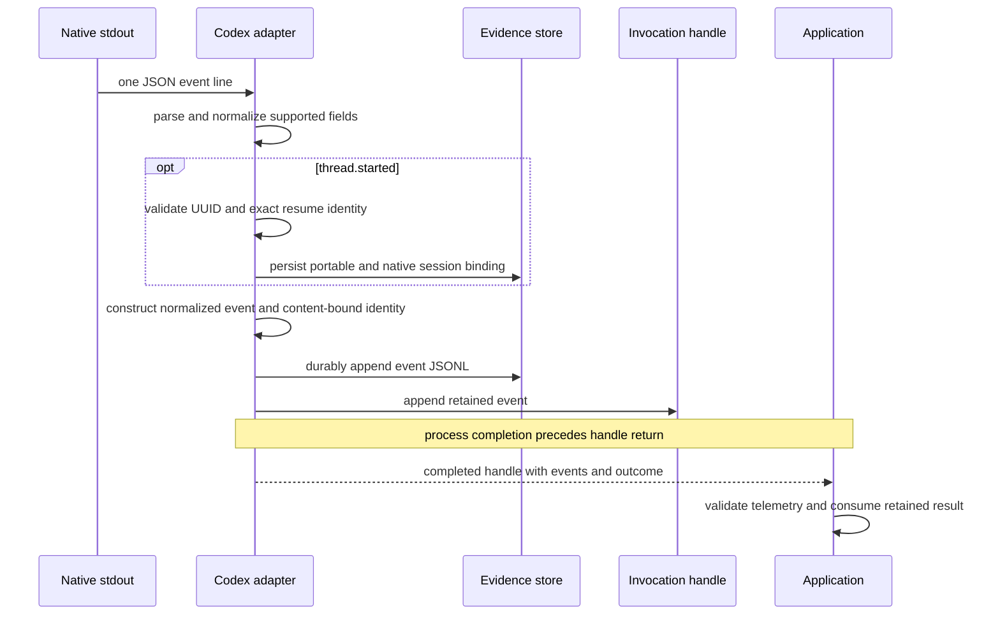
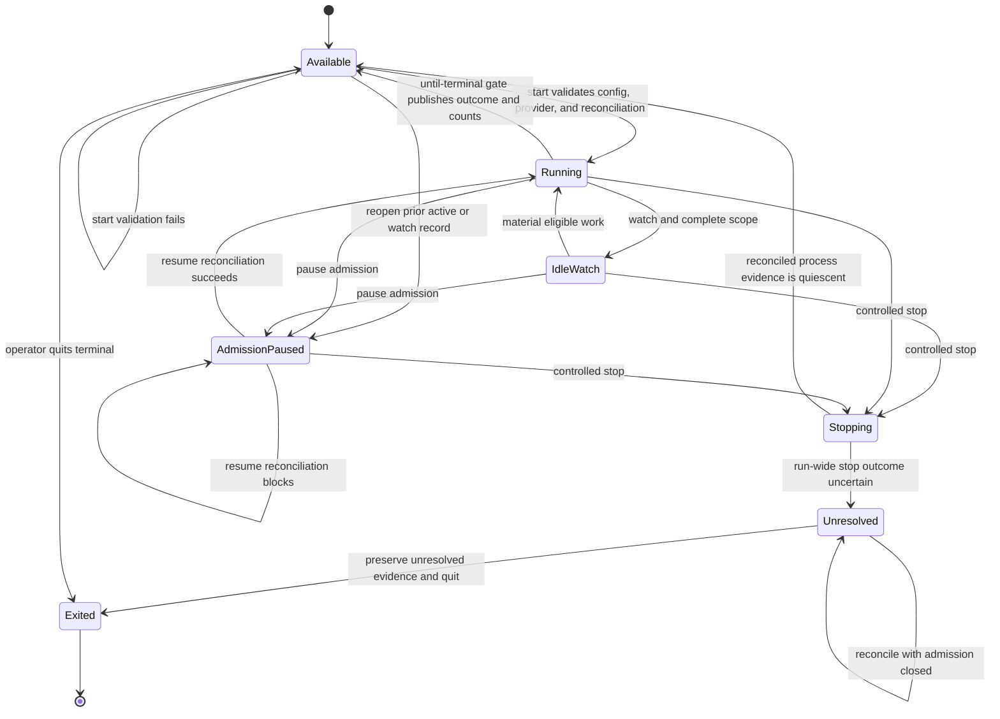
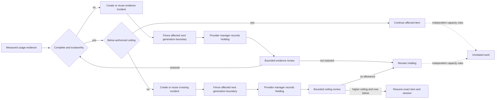
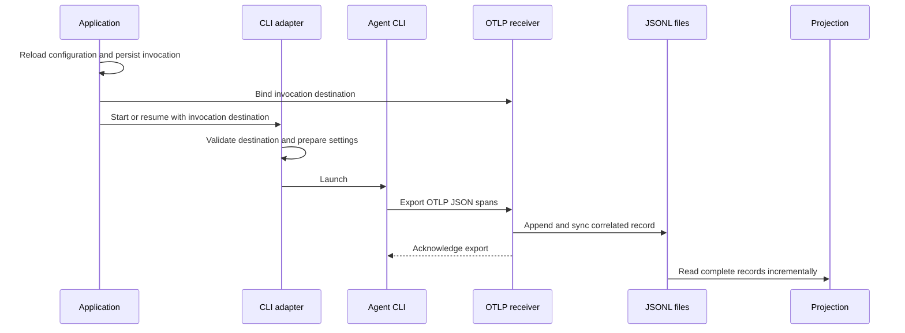
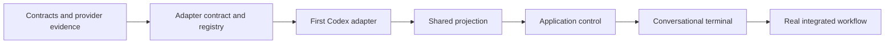

<!--
Copyright (c) 2026 Martin.Bechard@DevConsult.ca
Artifact-ID: b9bfd55f-8133-4d6b-9d67-4d67aea1d4e3
Created-Local: 2026-09-29T18:42:47.341249-04:00
Creating-Agent: Dev Documentation Writer
Runtime: Codex
Dispatched-Model: gpt-5.6-sol
Reasoning-Effort: medium
-->

# Agentic Backlog Application High-Level Design

## Workflow Enforcement And Agent Autonomy

The harness enforces the selected workflow's required transitions and evidence. Agents organize the work within those boundaries and may use their CLI's native delegation capabilities. A custom agent-to-harness delegation transport is not a prerequisite for the first version.

- **Agent responsibility:** choose specialists, delegate, investigate, implement, correct findings, and arrange reviews using available capabilities.
- **Harness responsibility:** enforce admission, required workflow gates, independent-review evidence, usage limits, holds, and completion criteria. A successful launch or an agent saying done is not sufficient evidence.
- **Adapter responsibility:** configure and launch harness-invoked agents, observe results and telemetry, and expose supported controls. Native child calls follow the CLI's own configuration; the harness does not claim it can select a different CLI or reload configuration for each internal child.
- **Workflow definition:** for each required transition, specify the source and target stage, authorized actor, required evidence and candidate identity, and the outcome when evidence is absent or invalid. Reuse the selected methodology's rules instead of inventing a universal fixed delivery sequence.
- **Enforcement point:** validate before authorizing the transition through the existing provider operation boundary. Agent tools must not allow a protected transition to bypass that check. Reuse existing provider management operations where available; inventory alone is insufficient. Do not introduce a new provider framework without a demonstrated gap.
- **Review gate:** verify reviewer independence, the exact candidate reviewed, verdict, and required verification/delivery evidence. Native delegation is permitted; self-attestation alone does not establish independence or acceptance. Missing proof blocks that transition, not all unrelated work.
- **Capacity and usage:** distinguish harness invocation limits from native child concurrency. Configure CLI-native limits where supported and account for child usage without double counting. Report unsupported controls and incomplete evidence honestly; retain the existing usage guard and safe interruption boundaries.

The minimum complete slice runs one item through its required workflow, lets its agent arrange specialist work, and demonstrates that valid evidence permits the next transition while missing or invalid evidence prevents it. Dynamic delegation infrastructure and cross-CLI child routing are optional later capabilities, justified only by an actual workflow need.

## Current Understanding

This HLD defines the application boundary below [ARC-002](../../architecture/ARC-002-codex-work-item-dispatch-harness.md).

The subsystem is a foreground agentic application:

- The interactive terminal is the primary operating surface.
- A Dev Backlog Coordinator agent makes bounded queue and recovery decisions.
- One canonical Dev Orchestrator agent session owns each accepted Work Item.
- Every managed agent call resolves a current named CLI instance and profile through one neutral adapter contract.
- The existing dashboard remains the read-only overall view.
- The selected Work-item provider remains the lifecycle and assignment authority.

The application runs until every in-scope provider record is terminal. Optional watch mode keeps observing for later work. Deterministic observation, projection, status, and idle watch use zero model calls when authoritative evidence is unchanged.

The design mode is **EXISTING_IMPLEMENTATION**. Current behavior is derived from committed source `8f0e5dc5ed8fee097095178afe48ab152d0c61fd`, focused tests, source-backed module designs, and retained runtime evidence. Independent source review and installed controls passed; fresh review of the reconciled documentation remains pending.

## Authoritative Sources

### Source Set

- [ARC-002](../../architecture/ARC-002-codex-work-item-dispatch-harness.md) is the parent design authority.
- [The implementation plan](../../../IMPLEMENTATION-PLAN.md) defines required outcomes, scenarios, and remaining release gates.
- [The source package](../../../src/backlog_harness) and [focused tests](../../../tests) define executable current behavior at commit `8f0e5dc5ed8fee097095178afe48ab152d0c61fd`.
- [The six module designs](../components/MOD-001-configuration.md) through [MOD-006](../components/MOD-006-views.md) provide source-backed component contracts. The [requirements matrix](../../verification/requirements-matrix.md) separates current tests, retained acceptance, and pending release proof.
- [Project guidance](../../../../dev-methodology/AGENTS.md) governs claims, file-provider worktree constraints, technology routing, and document provenance.
- [Project taxonomy](../../../../dev-methodology/docs/project-taxonomy.md) at SHA-256 0d8bf22329aa1596d7154876ffd1fe3d887f7324330c1b06dce6caa55e890264 defines harness as the portable core and adapters/runtime as runtime-specific integration.
- [Coordinate Work Items](../../../../dev-methodology/skills/coordinate-work-items/SKILL.md) and [Manage Work Items](../../../../dev-methodology/skills/manage-work-items/SKILL.md) retain role and lifecycle authority. [Coordinate Codex Tasks](../../../../dev-methodology/skills/coordinate-codex-tasks/SKILL.md) governs the first Codex adapter where the parent architecture specializes its runtime mapping.
- [Backlog Dispatcher](../../../../dev-methodology/.agents/skills/backlog-dispatcher/SKILL.md) defines shared scheduling consumption and User Action Required behavior.
- [Estimate Agent Work](../../../../dev-methodology/skills/estimate-agent-work/SKILL.md) defines the immutable estimate and usage categories for the generation guard.
- [prompt_toolkit asynchronous input guidance](https://python-prompt-toolkit.readthedocs.io/en/master/pages/asking_for_input.html) documents the selected terminal interaction mechanism.
- [Python typing.Protocol](https://docs.python.org/3.12/library/typing.html#typing.Protocol) documents the structural interface mechanism. Type annotations do not provide runtime conformance enforcement.

### Source Precedence

Apply these sources in order for current behavior:

1. ARC-002 defines the application shape and accepted architectural constraints.
2. The implementation plan and user authority define required outcomes and scope.
3. Committed source and focused tests define executable interfaces and behavior.
4. Source-backed module designs and retained receipts explain those behaviors and their evidence limits.
5. Current skills define agent roles; provider and workflow validation define lifecycle authority.

No separate functional specification or project wiki is identified.

### HLD Propositions And Reasons

These subsystem choices are implemented. The source passed independent review; the reconciled design remains subject to fresh artifact review.

#### Asynchronous Conversational Terminal

- **Requirement:** Keep commands, agent events, and exact questions usable while the operator is entering text.
- **Selected choice:** terminal.py uses prompt_toolkit prompt_async with coordinated output.
- **Reason:** A basic blocking input loop cannot safely preserve an active prompt while asynchronous session events arrive. Textual would add a second full-screen overview while the existing dashboard already serves that purpose.
- **Trade-off:** prompt_toolkit adds one dependency and terminal-specific tests.
- **Owner:** terminal.py.

#### Four Application Modules

- **Requirement:** Separate application coordination, runtime adaptation, interaction, and read-only projection without recreating methodology as a workflow engine.
- **Selected choice:** `application.py`, `runtime.py`, `terminal.py`, and `projections.py` own the central application boundaries; `coordination.py`, `provider.py`, `telemetry.py`, `evidence.py`, `analytics.py`, `workflow.py`, `delivery.py`, and `native_evidence.py` own supporting responsibilities.
- **Reason:** Each module owns one observed change boundary without creating a second workflow authority.
- **Smaller alternative:** Adding all behavior to cli.py would couple prompting, session recovery, provider effects, and dashboard data into one module.
- **Trade-off:** Four interfaces require focused contract tests. Further splitting requires demonstrated implementation complexity.
- **Owner:** this HLD defines the split; each module owns its contract below.

#### Minimal Reconciliation Evidence

- **Requirement:** Recover exact session identity and uncertain paid effects after process loss without creating a second lifecycle database.
- **Selected choice:** store run identity, immutable invocation intent, session references, translated event envelopes, and terminal or unresolved outcomes under .agent-ops/backlog-harness.
- **Reason:** The provider cannot prove whether an external runtime invocation started or returned. These records preserve only the runtime facts needed to reconcile that boundary.
- **Smaller alternative:** Memory-only tracking cannot distinguish a never-sent invocation from a sent invocation after a crash.
- **Trade-off:** Implementation uses atomic and append-only writes, validates digest paths, and reconciles incomplete records at explicit reconcile and run boundaries.
- **Owner:** application.py owns operation orchestration. runtime.py defines request, invocation, and session contract shapes. The adapter and evidence module persist session and event records. Provider records remain authoritative for lifecycle.

#### Shared Projection

- **Requirement:** The terminal and dashboard must show the same provider, session, question, event, and usage facts.
- **Selected choice:** projections.py produces one revisioned read-only dictionary for both surfaces.
- **Reason:** The implemented dashboard server accepts one projection collector and returns that capture for each snapshot request. This keeps both surfaces on one contract without another store or server.
- **Trade-off:** The collector rereads authoritative and retained evidence for every capture. Unknown attribution remains visible.
- **Owner:** projections.py owns the view shape. Provider and runtime modules retain fact ownership.

#### Selectable Agent CLI Runtime

- **Requirement:** Select a configured CLI adapter and profile for every harness-issued Coordinator and Orchestrator invocation.
- **Selected choice:** runtime.py defines one typed AgentCliAdapter Protocol and uses object composition and dependency injection. adapters/registry.py resolves configured adapter names to injected implementations. adapters/codex/ supplies the first implementation.
- **Reason:** Existing CLI contracts differ in commands, native identity, event shapes, usage, errors, authentication, and lifecycle evidence. The Adapter pattern isolates launch and process translation. The selected Codex workflow still uses native session layouts and records in application recovery, review verification, and child accounting through native_evidence.py; these gates are not portable solely by implementing the launch Protocol. The Protocol makes the caller contract statically visible; explicit conformance and capability validation supplies the runtime check that type annotations do not.
- **Pattern boundary:** Dependency injection supplies an implementation but cannot translate incompatible CLI contracts, so ordinary delegation alone is insufficient. Bridge is unnecessary because the application does not expose independently varying abstraction hierarchies. Facade is unnecessary because AgentCliAdapter must preserve rather than conceal identity, uncertainty, usage, and lifecycle limits.
- **Smaller alternative:** Conditional CLI branches in application.py would couple core control to adapter-specific commands and make mixed-CLI delegation inconsistent.
- **Trade-off:** Each adapter must preserve values, errors, identity, ownership, asynchronous timing, interruption, usage, and authentication semantics. Unsupported capability remains explicit; the registry does not expose a native escape hatch, emulate support, or select a fallback.
- **Owner:** runtime.py owns the Protocol and normalized contracts. adapters/registry.py owns explicit construction. Each adapter package owns CLI-specific plans and evidence translation.

## Related Code

The active package is [src/backlog_harness](../../../src/backlog_harness). `coordination.py` owns run scheduling and admission concurrency; no active `scheduling.py` or separate one-use scheduling receipt exists. `application.py` retains the exact Coordinator admission result, provider transition evidence, canonical acceptance, review, checks, and delivery stages.

The closed adapter registry contains only the Codex implementation. Native multi-agent execution is enabled for that process, and the canonical Orchestrator arranges fresh child review through the CLI's native delegation. The harness verifies native parent-child identity, fresh context, candidate binding, and the accepted verdict. It does not provide a custom delegation transport or cross-CLI child routing.

## Related Tests

The active 78-test suite is in [tests](../../../tests). Configuration, execution, provider coordination, run coordination, evidence, recovery, telemetry, analytics, native review evidence, and views each have focused modules. Tests prove deterministic committed-source behavior; the release receipt separately records installed controls, and fresh design review remains pending.

## Related Backlog Items

[Operate Backlog Harness Unattended](../../../../dev-methodology/backlog/feature-backlog/operate-backlog-harness-unattended.md) is historical outcome evidence for sustained progress, restart reconciliation, and a supported operator path. Its lifecycle does not activate work through this HLD.

## Related Wiki Pages

No project wiki page governs this subsystem. ARC-002 is the parent authority.

## Open Questions

No HLD contract question remains open. Codex CLI 0.159.2 is the only production adapter. Complete native exporter retry and flush remain unproved; the implemented response preserves the observed gap and fails closed. Another adapter, broader provider framework, or custom delegation transport requires separate authority and implementation.

## Maintenance Notes

Recheck this HLD when any of these contracts change:

- ARC-002;
- Coordinator or Orchestrator authority;
- provider lifecycle or revision semantics;
- any registered CLI adapter's role, session, event, authentication, interruption, or usage behavior;
- prompt_toolkit asynchronous interaction behavior; or
- dashboard projection inputs.

The last source reconciliation was 2026-09-30 against commit `8f0e5dc5ed8fee097095178afe48ab152d0c61fd`.

## Design Brief

### Required Outcomes And Non-Goals

The implementation provides one terminal-first application around actual agent sessions. It keeps the provider authoritative and uses the existing dashboard for overview.

Do not add a daemon, control socket, network API, persistent per-item supervisor, second dashboard, second evidence store, or application-owned delivery graph.

### Representative Scenarios

The application supports:

- run until all in-scope records are terminal;
- optional watch for later eligible work;
- live agent activity beside an intact prompt;
- exact inline questions and same-session answers;
- pause and resume of admission;
- controlled stop with cancelled-task cleanup and reconciled quiescence;
- restart reconciliation;
- per-role CLI and profile selection for harness-issued Coordinator and Orchestrator calls, with reviewer work delegated natively by the Orchestrator;
- independent progress while another item waits or holds; and
- the immutable-estimate generation guard.

### Scenario-To-Operation Mapping

- terminal.py maps operator input to application commands and renders JSON results, run publications, and normalized event dictionaries.
- application.py observes, coordinates, admits, reconciles, pauses, resumes, stops, and evaluates completion.
- contracts.py constructs each role binding; application.py resolves the registered adapter and invokes it. runtime.py defines the exchanged contract shapes and Protocol.
The agent owns delegation through its available CLI capabilities. The harness enforces required workflow transitions and validates evidence; no custom delegation transport is required.
- projections.py supplies consistent terminal and dashboard views.
- provider.py and coordination.py apply the selected persistence and dispatch contracts.

### Responsibility And Authority

- The provider owns Work-item identity, lifecycle, assignment, durable questions, and decisions.
- The Coordinator owns scheduling, capacity, cross-item recovery, and cleanup decisions.
- Each canonical Orchestrator owns its Work Item methodology and delivery.
- Commit owns source delivery.
- The application executes authorized operations and presents evidence.
- Runtime events and projections never become lifecycle authority.

### Existing Implementation

The application is implemented under `src/backlog_harness`. CLI process integration is under `src/backlog_harness/adapters`; Codex is the only production implementation. `native_evidence.py` and its application callers additionally use Codex-specific session evidence for review, child usage, and recovery. The terminal is the primary application surface, and the loopback dashboard is the read-only overview.

### Assumptions And Resolved Decisions

Version 1 runs as a foreground terminal application on the supported Python runtime. The operator selects a configuration file with --config, and startup resolves the path and loads the selected command’s full or control-only configuration. Application construction initializes the provider and caches; projection, explicit reconcile, and run operations perform their respective reads and recovery work. Current agent settings reload before every CLI operation. Each managed role maps to one named CLI instance and one named profile. Authentication belongs to that CLI instance; the Codex adapter retains subscription authentication. An API or SDK runtime requires a demonstrated capability gap and a separate user decision about authentication and billing.

## Requirements Coverage

Status values are DEFINED, OPEN, and OUT_OF_SCOPE. No requirement is OPEN in this HLD.

| Requirement | Status | Current behavior | Owning contract, state, error, or check |
| --- | --- | --- | --- |
| Agentic harness | DEFINED | Coordinator admission and canonical Orchestrator execution use actual configured Codex sessions. | `Application._run_item`, retained stage evidence, real workflow receipt |
| Per-agent CLI selection | DEFINED | Each role resolves a named CLI and profile; the closed production registry contains Codex only. | [ApplicationConfig](#applicationconfig), [AgentCliAdapter](#agentcliadapter), adapter-binding tests |
| Current configuration per call | DEFINED | A stable immutable snapshot is loaded immediately before every harness-issued CLI invocation. | [Per-invocation configuration and dispatch](#per-invocation-configuration-and-dispatch), reload and invalid-config tests |
| Workflow enforcement | DEFINED | Agent-owned delegation; harness validates required transition evidence | Workflow Enforcement And Agent Autonomy |
| Simple primary interface | DEFINED | The installed terminal is primary and the loopback dashboard is read-only. | [Terminal commands](#terminal-commands), dashboard tests |
| Sustained backlog operation | DEFINED | `until-terminal` settles and `watch` polls deterministically for later work. | [Completion gate](#completion-gate), coordination tests |
| Low token waste | DEFINED | Unchanged polling, status, validation, and dashboard refresh make no model calls. | Coordination, configuration, and view tests |
| Independent progress | DEFINED | SOLO runs one item; approved MULTITASK runs disjoint assignments up to configured capacity. | `RunController`, overlap receipt |
| Provider authority | DEFINED | File-provider records are the sole lifecycle and assignment authority. | [Application and provider](#application-and-provider), conflict tests |
| No duplicate effect | DEFINED | Intent, requested, outcome, stage, and provider records fence replacement launches. | [PendingOperation](#pendingoperation), recovery tests |
| Exact questions and answers | DEFINED | Provider-bound answers resume the canonical exact session once. | [Question and independent progress](#question-and-independent-progress), answer tests |
| Operational controls | DEFINED | Foreground run, pause, resume, stop, status, answer, hold review, and recovery commands are implemented. | [Application run state](#application-run-state), [Terminal commands](#terminal-commands) |
| Restart evidence | DEFINED | Hashed invocation records and retained stages support fail-closed reconciliation. | [Operational evidence paths](#operational-evidence-paths), recovery tests |
| Usage warning | DEFINED | The item-local 2.0-times original-high guard records Holding and reviewed ceilings. | [Generation guard](#generation-guard), analytics and recovery tests |
| Useful degraded mode | DEFINED | Control-only configuration keeps provider and evidence inspection available while generation is fenced. | Configuration and view tests |
| Shared overview | DEFINED | Terminal and dashboard consume the same revisioned projection. | [Dashboard integration](#dashboard-integration), view tests |
| Independent quality gates | DEFINED | Native child review, candidate identity, checks, delivery, and provider completion are separately validated. | [Delivery and independent review](#delivery-and-independent-review), native evidence and provider tests |
| Adapter authentication | DEFINED | Each invocation locally checks Codex 0.159.2 and `login status` under the configured `CODEX_HOME`. | `CodexAdapter.validate_profile`, execution tests |
| Daemon, control API, second dashboard, or SDK billing migration | OUT_OF_SCOPE | Not selected | [Non-goals](#non-goals) |

## Parent Architecture

[ARC-002](../../architecture/ARC-002-codex-work-item-dispatch-harness.md) supplies these constraints:

- terminal-first foreground application;
- actual bounded Coordinator and canonical Orchestrator sessions;
- a configured CLI adapter and immutable current profile snapshot for every harness-issued Coordinator or Orchestrator invocation;
- agent-owned delegation with evidence-gated workflow transitions and no automatic adapter fallback;
- provider-owned lifecycle and decisions;
- exact-session recovery;
- one shared read-only projection;
- existing dashboard reuse;
- deterministic zero-call observation;
- default 2.0-times estimate guard; and
- no daemon, local control socket, per-item supervisor, shadow authority, or second dashboard server. The telemetry receiver is an in-process ingestion component.



## Scope

### Included Capabilities

- One foreground run for one configured project.
- Asynchronous terminal commands, activity, and questions.
- Complete provider inventory and deterministic material-change detection.
- Bounded Coordinator sessions.
- Independent canonical Orchestrator sessions.
- Exact identity, resume, answer, cancelled-task cleanup, and uncertainty reconciliation.
- Provider-backed completion and watch behavior.
- Usage accumulation and generation hold.
- Shared terminal and dashboard projection.

### Excluded Ownership

- Provider lifecycle policy.
- Agent-internal task decomposition and specialist selection; required workflow gates remain in scope.
- Commit delivery internals.
- A daemon or detached host-control plane.
- Local sockets, HTTP control endpoints, or public IPC.
- Persistent per-item supervisors.
- A second lifecycle database, dashboard store, or dashboard server.
- Model-driven polling, progress relays, analyst work, or a generic agent platform.

## Data Anchors

| Anchor | Direct authority | Owning contract | Lifetime and use |
| --- | --- | --- | --- |
| Work-item ID and revision | Selected provider | `Item` and guarded mutation | Durable. Bind every lifecycle read or mutation. |
| Lifecycle and canonical assignment | Selected provider | Provider record | Durable. Govern admission, Running, recovery, review, and completion. The current implementation does not replace a canonical session. |
| Admission decision and receipt | Coordinator invocation, frozen assignment, and provider transaction | `application.py` stage evidence plus provider-operation record | Bind Ready revision/content through Starting; missing or stale retained evidence blocks continuation. |
| Question, answer, and disposition | Selected provider, operator, and canonical Orchestrator | provider question dictionary and answer-operation record | Durable through resolution. Bind question revision and canonical session. |
| Estimate, hold, incident, and ceiling | Selected provider | `UsageEvidence`, usage ledger, and guard dictionaries | Durable for the Work Item. Never reset on retry or re-estimation. |
| Run observation | coordination.py | `run.json` dictionary | Recorded foreground state; does not prove liveness. |
| Agent binding | Current ConfigSnapshot plus originating SessionHandle | AgentBinding | Freeze one invocation snapshot. A session retains adapter, named CLI instance, authentication context, native identity, and profile digest. The Codex adapter blocks resume when the origin or profile digest changes. |
| Invocation preflight | Current ConfigSnapshot and Codex local commands | invocation-local `capability.json` | Recomputed for every harness-issued CLI invocation; no model call or reusable proof store. |
| Operation and invocation IDs | application.py | intent, requested, session, event, and outcome records | One authorized effect and one runtime invocation. Retain through reconciliation. |
| Session ID | Codex adapter after validated native thread.started evidence | SessionHandle and session.json | Application-owned portable session ID plus the exact native runtime identity and its originating adapter, CLI, authentication binding, and profile digest. Provider canonical-session references, terminal selectors, and projections use the portable ID. Retain both identities across restart; current profile changes block Codex resume. |
| Event ID | Codex adapter | event dictionary and `events.jsonl` | Stable within the exact invocation evidence. |
| Observation fingerprint | coordination.py, telemetry.py, and projections.py | premise and content digests | Detect changed provider/configuration or telemetry evidence. |
| Projection revision | Derived by projections.py | revisioned dictionary | One read-only capture. Terminal and dashboard responses name the revision used. |
| Eligibility | Deterministic coordination over current provider facts, followed by bounded Coordinator admission for Ready items | `RunController.eligible` and retained admission evidence | Transient. Never store it as replacement provider lifecycle. |

Runtime evidence can trigger a provider read. It cannot replace provider facts.

## Constituent Components

```text
agentic-harness/
├── pyproject.toml
├── src/backlog_harness/
│   ├── application.py
│   ├── runtime.py
│   ├── terminal.py
│   ├── projections.py
│   ├── contracts.py
│   ├── provider.py
│   ├── coordination.py
│   ├── analytics.py
│   ├── evidence.py
│   ├── workflow.py
│   ├── delivery.py
│   ├── native_evidence.py
│   ├── telemetry.py
│   ├── dashboard.py
│   ├── cli.py
│   └── adapters/
│       ├── registry.py
│       └── codex/adapter.py
├── tests/
├── docs/architecture/
├── docs/design/
└── .agent-ops/backlog-harness/
```

### Application Module Responsibilities

- **backlog_harness.application** owns item workflow stages, bounded agent invocations, retained admission and acceptance, exact-session continuation, provider operations, generation gates, review, checks, and delivery validation.
- **backlog_harness.runtime** defines `AgentCliAdapter` as a Python Protocol plus `AgentRequest`, `SessionHandle`, and `InvocationHandle`.
- **backlog_harness.terminal** owns prompt_toolkit input, run commands, coordinated output, inline question entry, and deterministic exit results.
- **backlog_harness.projections** owns the revisioned read-only dictionary consumed by terminal and dashboard.
- **backlog_harness.adapters.registry** maps closed configured adapter names to injected constructors. It performs no plugin discovery, dynamic configuration import, or automatic fallback.
- **backlog_harness.adapters.codex.adapter** composes current Codex mechanics behind AgentCliAdapter and owns Codex-specific authentication, command plans, and evidence translation.

### Portable Core Responsibilities

- **backlog_harness.contracts** owns shared immutable shapes and validation.
- **backlog_harness.provider** owns selected-provider inventory and guarded mutations. It does not delegate lifecycle authority to the application.
- **backlog_harness.coordination** owns eligibility, dependencies, run admission, capacity, watch, pause, resume, stop, and premise-bound scheduling blockers. Coordinator admission evidence is retained by `application.py`; there is no separate scheduling publication subsystem.
- **backlog_harness.analytics** deduplicates item-scoped usage evidence, reconciles native output counters with telemetry spans, accumulates trustworthy totals, and calculates the generation guard dictionary.
- **backlog_harness.evidence** owns atomic JSON, append-only JSONL, locks, invocation records, and reconciliation.
- **backlog_harness.workflow** validates protected actors, transitions, candidates, reviews, and checks.
- **backlog_harness.delivery** integrates a verified candidate and records delivery evidence.
- **backlog_harness.native_evidence** validates fresh native child review and child usage evidence.
- **backlog_harness.telemetry** owns the loopback OTLP/HTTP receiver, durable standard JSONL, export fingerprints, and receipt reports.
- **backlog_harness.dashboard** renders the existing read-only overall view from projection callbacks.
- **backlog_harness.cli** parses startup configuration and launches terminal.py or the existing dashboard command.

### Operational Evidence Paths

The operational root defaults to `.agent-ops/backlog-harness` under the configured repository. Configuration can select another absolute local root. The root stores reconciliation evidence and standard telemetry files. Existing adapter-specific evidence is historical and is not moved or imported automatically.

Path rules are deterministic:

- Encode each run, operation, and invocation ID as its lowercase SHA-256 digest for the path component.
- Store the original ID inside the owning record.
- Reject a digest mismatch or unsupported record version.
- Never interpolate a provider ID, session ID, or runtime-supplied string into a path.

Each run directory has these write boundaries:

- **run.json:** `coordination.py` atomically records version, state, mode, admission state, active item IDs, and observation time. It is a recorded observation and does not prove process liveness.
- **config.json:** `EvidenceStore.begin` creates it exclusively before `intent.json`. It stores version, the full configuration digest, and the resolved binding. It never stores credentials or telemetry tokens.
- **intent.json:** application.py creates it exclusively and fsyncs it before runtime dispatch. It binds the run, operation, and invocation IDs; configuration digest; resolved binding; action; optional Work-item ID; request digest; and creation time. Provider revision and content remain in the item-stage assignment and provider-operation evidence.
- **requested.json:** the Codex adapter creates it exclusively and fsyncs it immediately before subprocess submission. Intent without requested evidence means the invocation was not submitted under this contract. Requested evidence never proves that the runtime accepted or completed the invocation.
- **session.json:** the Codex adapter creates it exclusively after `thread.started` returns an exact native session ID. It binds one application-owned portable session ID to the native ID and complete originating `AgentBinding`.
- **events.jsonl:** the Codex adapter appends bounded normalized event dictionaries in observation order. These records support result validation and projection; dashboard trace content comes from OTLP `spans.jsonl`.
- **outcomes.jsonl:** the Codex adapter appends the observed invocation classification: returned, runtime_failed, submission_rejected, or unresolved. Reconciliation retains prior lines and the latest complete classification. Absence after a requested marker is unresolved evidence, not permission to repeat.

An event payload stores bounded projection data or an immutable evidence reference. It does not copy full prompts, source content, or provider records. These files never determine Work-item lifecycle.

Immediately before each CLI operation, the application reloads configuration and recomputes the relevant binding. `CodexAdapter.validate_profile(request)` then runs local `codex --version` and `codex login status` commands with the configured `CODEX_HOME`. This preflight makes no model call. Only authenticated `codex-cli 0.159.2` returns `production_ready: true`. The application saves the returned dictionary as invocation-local `capability.json`. It does not maintain a reusable `CapabilityProof` store or launch a paid proof invocation.

### Component-Design Boundary

The six source-backed module designs own the current component detail. Add another design only when a material new boundary cannot be resolved within those existing contracts.

## Interaction Model

### Startup And Capability Validation

`cli.py` requires `--config`; `Application` resolves that path and loads configuration for the selected command. Control commands use control-only loading so invalid generation profiles do not prevent inspection. Constructing the application creates the provider and projection caches; it does not automatically reconcile or publish a view. `status` and dashboard requests capture a coherent provider-backed projection. An explicit reconcile or run control reconciles retained evidence. `validate` performs complete configuration validation; local CLI version and login preflight occur immediately before invocation.



A missing storage value blocks construction. Invalid generation settings remain visible as blockers in control-only inspection; they cannot authorize generation. Settings are reloaded at each invocation rather than frozen for the whole process.

### Per-Invocation Configuration And Dispatch

Every harness-issued operation that may invoke a CLI follows this sequence. The harness directly invokes configured Coordinator and Orchestrator roles. The Orchestrator arranges reviewer work through Codex-native delegation; the harness later validates that native child evidence.

1. Read the resolved configuration path into a complete byte snapshot. Accept it only when two consecutive bounded reads have the same digest; otherwise report an unstable configuration and do not launch.
2. Parse and validate the complete frozen configuration mapping. Resolve the requested agent role through agents to one named agent_clis instance and one named profile.
3. Create an immutable ConfigSnapshot with the full file digest and the digest of the relevant CLI, profile, and agent sections.
4. Persist the invocation ID, `ConfigSnapshot` digest, `AgentBinding`, action, and request digest before dispatch.
5. Resolve the adapter from the closed registry and call `validate_profile(request)`. The Codex implementation runs local `--version` and `login status` subprocesses under the configured `CODEX_HOME`; it never launches a model call.
6. Require authenticated `codex-cli 0.159.2`, then persist the invocation-local capability dictionary.
7. Call `start_session` or `resume_session`, then consume the returned handle’s retained `events`. Application reconciliation uses `EvidenceStore.reconcile` and application recovery directly; `observe_events` and adapter `reconcile` remain Protocol operations outside this active call path. The immutable snapshot governs the entire call even if the file changes while it runs. The Protocol exposes `request_interrupt`, but the active stop path cancels owned item tasks and uses Codex invocation cleanup.



An invalid, missing, partial, or unsupported snapshot blocks only the affected CLI call with a specific reason. The application never falls back to an older snapshot, another profile, or another adapter. A later valid edit applies to the next call and never mutates an in-flight invocation.

Resume selects the application-owned portable session ID and requires the current binding origin and profile digest to equal the originating `SessionHandle` binding. Removal or identity mismatch blocks; the implementation does not select a substitute or create a successor session. Control-only inspection can proceed when generation configuration is invalid, but generation and answer-resume require a valid current profile. A changed binding never receives or reinterprets the old native session ID.

Reconciliation of an uncertain request uses the recorded ConfigSnapshot, AgentBinding, and native identity to identify the prior effect, then applies current permission checks. A configuration edit does not authorize replacement, retry, or cross-CLI resume.

### Material Coordination And Admission



The application models only the selected workflow gates, not the Orchestrator’s internal task sequence. It waits for events, re-reads the provider when authority could have changed, and admits independent work when capacity permits.

### Coordinator Operation Mapping

The application executes the exact Coordinator operation. It never converts an evaluator row into a self-authorized reservation.

| Operation | Provider and runtime effect | Capacity effect |
| --- | --- | --- |
| assess | Run the bounded read-only Coordinator assessment and persist its authorized result. Do not reserve implementation, create an Orchestrator attempt, or mutate source. | The Coordinator invocation counts only while it is active. No Work-item execution occupancy is created. |
| resume | Hold review may authorize continuation only for the retained canonical session, frozen request, known below-ceiling usage, and exact current provider state. Do not create a new delivery attempt or replacement session. | The resumed invocation counts while active. Existing provider occupancy remains governed by its current record. |
| new | Bind the Coordinator result to the frozen Ready revision, persist the exact provider operation for Ready to Starting, and permit canonical acceptance only after retained admission and admitted content validate. | The admission and acceptance invocations count while active. Starting reserves provider capacity until reconciled. |

The retained assignment freezes the Ready provider revision, path, content, original estimate, workflow, workspace, and candidate root before the Coordinator call. Ready continuation requires an exact current revision, content, and estimate match. Starting continuation requires the retained `new` result for the frozen revision, valid content-bound telemetry, the exact immutable provider admission operation, and a matching pre-transition Git blob. Missing or stale evidence blocks before an Orchestrator invocation and never creates a replacement baseline.

### Runtime Capacity

`max_active_invocations` limits concurrent harness-issued Coordinator and Orchestrator invocations. Native reviewer work occurs inside the producing Orchestrator invocation; `native_max_threads` requests the CLI's native child limit, and native child usage is reconciled separately.

The harness count includes an invocation while it owns a capacity lock. A retained requested or unresolved invocation continues to occupy a persisted slot until its recorded process identity is proved stopped. `not_submitted`, `returned`, `runtime_failed`, and `submission_rejected` are quiescent classifications.

The agent owns delegation through its available CLI capabilities. The harness enforces required workflow transitions and validates evidence; no custom delegation transport is required.

The physical count excludes:

- a retained but idle SessionHandle;
- a canonical session waiting between invocations;
- a provider reservation with no proven active runtime invocation; and
- a terminal runtime outcome retained for history.

Provider reservation occupancy remains a separate scheduling constraint. Neither count substitutes for the other.

The application starts no harness-issued Coordinator or Orchestrator invocation above the cap. A pending Coordinator request waits for an active invocation to yield; it does not evict accepted work.

The harness caps the invocations it launches. Native child concurrency is controlled through supported CLI settings and reported separately. Do not require a harness-mediated reviewer handoff or claim a physical subprocess cap that the adapter cannot enforce.

### Delivery And Independent Review



The agent owns delegation through its available CLI capabilities. The harness enforces required workflow transitions and validates evidence; no custom delegation transport is required.

The canonical Orchestrator produces the candidate and requests completion. The application executes the protected verification, integration, and provider-completion effects; the agent does not mutate the authoritative provider directly.

### Event Processing

For each normalized Codex event dictionary:

1. Parse one JSON line and normalize supported type-specific facts.
2. For `thread.started`, validate the native UUID and exact resume identity, create the portable session when needed, and persist `session.json` before constructing the event. Invalid identity stops this path.
3. For `turn.completed`, normalize native cumulative usage; for failures or selected completed items, normalize bounded error or result text.
4. Construct the event, including `event_id` from invocation ID, zero-based ordinal, and raw content.
5. Durably append the event, then append it to the handle’s in-memory event list.
6. After the adapter returns the completed invocation handle, the application consumes retained events and derives result and usage facts. Lifecycle remains provider-owned.



Event dictionaries are runtime evidence. None grants lifecycle authority.

### Question And Independent Progress

```mermaid
sequenceDiagram
    participant O1 as Orchestrator item A
    participant P as Provider
    participant A as Application
    participant T as Terminal
    participant O2 as Orchestrator item B
    O1-->>A: return exact question identity and text
    A->>P: persist canonical question and User Action Required
    A->>P: read question revision and canonical session
    A-->>T: show exact question and answer command
    opt capacity and selected route allow independent progress
        A->>O2: continue independent eligible work
    end
    T->>A: submit answer for exact item and question
    A->>P: persist answer for question revision and canonical session
    A->>O1: read-only exact-session answer classification
    O1-->>A: return question- and answer-bound disposition; end classification
    A->>A: validate disposition, question, answer digest, and canonical session
    alt approved and provider permits continuation
        A->>P: transition User Action Required to Running
        A->>A: persist continuation and completed answer operation
        A->>A: later run_item validates owner, acceptance, continuation, and guard
        A->>O1: separate exact-session source-work invocation
    else deferred, declined, or ambiguous
        A->>P: retain User Action Required and persist disposition
        A->>A: do not start source work
    end
```

The application does not interpret an answer:

1. provider.py uses CAS to persist the exact content and digest against the current question ID, question revision, canonical session, and classification owner.
2. A stale question or session rejects the answer before runtime resume.
3. An uncertain answer write triggers a provider read. The application does not resume until the exact persisted answer is proved.
4. Before answer-resume, the application reloads configuration and validates it against the recorded SessionHandle. Invalid generation settings or an identity mismatch preserve the answer and block the invocation; no fallback session starts.
5. The application resumes the exact canonical session with the persisted answer in a read-only classification invocation. The Orchestrator must bind the question ID and answer digest and return approve, defer, decline, or ambiguous.
6. Approve moves the provider record to Running and persists a continuation stage. The classification invocation does not mutate source. Defer, decline, and ambiguous retain User Action Required.
7. A later `run_item` call validates the Running owner, retained acceptance, generation guard, and continuation evidence before it resumes the same canonical session for source work.

Waiting on one item does not pause unrelated eligible sessions. An uncertain answer invocation uses the original PendingOperation identity and never repeats blindly. Source mutation remains prohibited until the provider records the required Running acceptance for the exact canonical session.

### Pause, Resume, Stop, And Crash

- **Pause admission:** Close new admission. Accepted sessions continue and remain visible.
- **Resume:** Re-read the provider and reconcile session and pending-operation evidence before opening admission.
- **Controlled stop:** Close admission, cancel and await owned active item tasks, clear the active-task set, reconcile retained invocations, and report Available only when no reconciled invocation is nonquiescent. Otherwise report Unresolved. The terminal remains available.
- **Crash:** Infer no interruption. On restart, reconcile exact session identities and pending operations before any new effect.
- **Quit:** Exit the terminal only when no run remains active. Quit never substitutes for controlled stop.

No outcome permits blind repetition of start, resume, or answer.

### Terminal Commands

The terminal supports these application commands:

```text
run --until-terminal
run --watch
pause
resume
stop
reconcile
status
item show ITEM_ID
item answer ITEM_ID QUESTION_ID
session show SESSION_ID
help
quit
```

The operator starts the application with this shell command:

```text
agentic-harness --config PATH app
```

Command availability is state-specific:

| Command | Accepted states | Resulting rule |
| --- | --- | --- |
| run | Available or retained AdmissionPaused with no active runner | Validate and reconcile before opening admission. |
| pause | Running or IdleWatch | Close admission. Accepted sessions continue. |
| resume | AdmissionPaused | Reconcile first, then reopen the prior run mode. |
| stop | Every non-exited state | Close admission, cancel owned active item tasks, reconcile, and report Available or Unresolved. |
| reconcile | Every non-exited state | Read and reconcile retained invocation evidence. It does not open admission or resume dispatch. |
| item answer | A current exact provider question is available | Persist against question revision and canonical session. Classify through the authorized agent before any delivery resume. |
| status, item show, session show, help | Every non-exited state | Read current projection or show explicit unavailable evidence. |
| quit | Any state with no active terminal runner | Preserve retained evidence. Make no interruption or resolution claim. Reject quit while the terminal runner remains active. |

A command returns a clear accepted, rejected, unavailable, or unresolved result. Until-terminal success is distinct from settled scope containing Failed or Abandoned records.

### Dashboard Integration

`projections.py` supplies one dictionary contract to terminal and dashboard consumers.

- `snapshot(app)` creates a fresh control-only `Application`, requires unchanged repository and operational-root identity, carries forward only the trace cache, and calls `capture`.
- `capture(app)` reads provider items before and after evidence collection and rejects changed item revisions.
- Each snapshot names its revision, provider identity and as-of time, recorded run/admission observation, current premise-bound blockers, invocation identity fields, runtime freshness, trace count, receipt binding, and uncertainty.
- Counts, item detail, questions, usage, and traces in one response derive from that capture.
- The dashboard server calls the collector once for each `/api/snapshot` response.
- Terminal and dashboard responses with the same projection revision contain equal facts. Refreshes at different times can have different revisions and need not be simultaneous.
- The dashboard remains read-only.
- Dashboard refresh performs no model call.
- Lost observation changes live session state to stale after the configured interval. Missing runtime or usage attribution appears as unknown, not stopped or zero.
- No second dashboard server or snapshot store is added. The independent telemetry receiver only ingests spans.

## Critical Trust And Identity Boundaries

### Terminal To Application

- **Actor:** local operator in the foreground terminal.
- **Protected actions:** admission controls, answers, and controlled interruption.
- **Validation:** exact command, item, question, or portable session selector.
- **Failure:** reject invalid or stale selectors without changing provider or runtime state.

### Application To Provider

- **Actor:** configured provider capability in the selected role or deterministic adapter.
- **Protected asset:** authoritative lifecycle, decision, question, answer, assignment, and estimate data.
- **Validation:** exact opaque ID and expected revision.
- **Failure:** re-observe after conflict. Never overwrite or infer success.

### Application To Agent CLI Adapter

- **Actor:** one explicit registered adapter using one current AgentBinding.
- **Protected asset:** paid model execution, CLI-managed authentication context, portable and native session identities, and source access.
- **Validation:** stable ConfigSnapshot, exact adapter and CLI instance, authentication-context reference, role, skills, tools, provider capability, permissions, delegation policy, run identity, portable session identity when observed, and expected native session identity.
- **Disclosure:** reconciliation evidence stores an authentication-context reference, never credentials or tokens.
- **Failure:** block the affected CLI action and expose the normalized configuration, authentication, capability, identity, or uncertainty reason. Keep provider-backed inspection available.

### Runtime Session To Source

- **Actor:** canonical Orchestrator session.
- **Protected asset:** project source and delivery state.
- **Validation:** provider records the exact assignment and Running before source mutation.
- **Failure:** a session without accepted identity remains read-only or stops.

### Projection Consumers

- **Actors:** terminal renderer and existing dashboard.
- **Protected asset:** truthful operational understanding.
- **Validation:** coherent provider scope, event deduplication, and explicit unknown values.
- **Failure:** show unavailable or partial evidence. Do not combine mixed revisions into a definitive result.

## Lifecycle

Provider lifecycle and runtime session state are separate.

### Provider Lifecycle

The selected provider retains the canonical states and transitions. The application uses provider state for scheduling, admission, questions, review, delivery, and completion.

### Runtime Session State

Runtime evidence describes only observed execution: no session identity, prepared but not submitted, requested and unresolved, returned, runtime failed, submission rejected, or reconciled process quiescence.

A runtime state never changes provider lifecycle by itself. A provider terminal state does not prove that an external runtime process stopped.

Each observed session has an application-owned portable session ID bound to its originating `AgentBinding` and native session ID. Provider canonical-session references, projections, and terminal selectors use the portable ID. The runtime interprets the native ID only with the complete originating binding. If current configuration changes the binding origin or profile digest, the application blocks resume. No successor-session handoff is implemented.

### Application Run State



An uncertain item invocation is not a run-wide Unresolved state. It preserves that item's reservation or occupancy and isolates conflicting item operations and capacity until reconciliation. Independent work continues only when provider and capacity evidence proves that it is safe.

Reconciliation preserves the recorded run intent:

- explicit active-run or resume intent returns to Running when safe;
- a prior active or watch record returns to AdmissionPaused; and
- a verified stop returns to Available.

After an uncertain controlled stop, reconciliation keeps admission closed. It never resumes dispatch automatically.

### Completion Gate

Until-terminal settles only when one coherent complete provider read proves:

- every in-scope record is terminal;
- no start, resume, answer, or other requested invocation remains unresolved; and
- all required provider closeout is complete.

The run reports one of these outcomes:

| Final provider scope | Outcome | Presentation |
| --- | --- | --- |
| Every item is Completed | Successful delivery | Show total and Completed count. |
| Every item is terminal and any item is Failed or Abandoned | Settled with nondelivery | Show Completed, Failed, and Abandoned counts. Do not report success. |
| Any item is nonterminal | Continue | Show current counts and next observable condition. |
| Scope or run-wide reconciliation is incomplete | Unproved | Keep the run active or report Unresolved. Do not report settlement. |

The terminal stays available after settlement or verified stop. Watch mode uses the same gate, enters idle, and keeps polling.

### Generation Guard

The guard uses cumulative measured implementation generated tokens for the item and its child work.

- The original high estimate is immutable.
- The default current ceiling is 2.0 times that estimate.
- A delta event contributes its reported generated-token delta once.
- A cumulative event contributes the nonnegative difference from the last trusted cumulative value in the same runtime counter scope.
- A stable usage event ID deduplicates replay. Invocation and session identity prevent a resume from being counted as a new root total.
- Every root, delegated child, correction, retry, and resume generated-implementation contribution is attributed once to its owning Work Item.
- Mixed-adapter root and delegated usage is aggregated only from normalized evidence with stable adapter, invocation, session, counter-scope, and event identities. A missing native category remains unknown; the application does not estimate it from wall time or another adapter's units.
- Reasoning tokens reported inside generated output are not added again as a separate category.
- Input and cached tokens remain separate from generated implementation tokens.
- Unknown, partial, decreasing cumulative, conflicting, or untrustworthy usage is not zero and does not become a fabricated crossing total.
- A missing original estimate makes the guard unavailable for that item and blocks its next paid generation until the Coordinator resolves the evidence gap.
- Untrustworthy usage creates one durable evidence incident for the affected item. Repeated observations reuse it. One bounded Coordinator evidence review must restore complete trustworthy usage and then rerun the ceiling check. An allowance cannot bypass unknown usage.
- Trusted usage at or above the current ceiling creates a separate durable crossing incident. Repeated observations reuse it. One bounded Coordinator ceiling review can authorize a higher cumulative ceiling.
- The enforceable boundary is before the next paid generation invocation or supported delegated-generation step. The application cannot interrupt an opaque model call at an exact token count.
- Delayed telemetry can therefore overshoot during one opaque request. Record the measured overshoot.
- At or above the current ceiling, prevent the affected item's next supported generation step.
- Under Coordinator-owned guard policy, the provider manager records that item as Holding at a safe boundary.
- The exact same item and session can resume only when provider state is Holding, usage is trustworthy, and the total is below the authorized ceiling.
- Resume does not reset estimate or usage.

A held or guard-unavailable item does not freeze unrelated eligible work when provider and capacity evidence proves that admission is safe.



Example: an original high estimate of 50,000 generated implementation tokens gives a default ceiling of 100,000. A trustworthy observed total of 102,000 records the overshoot and holds the item before its next supported generation step. A reviewed cumulative ceiling of 150,000 can resume the exact same item and session from 102,000. The baseline and usage history do not reset.

## Data Shapes And Contracts

### ProviderSnapshot

- **Owner:** provider.py.
- **Representation:** no `ProviderSnapshot` class exists. `FileProvider.snapshot()` reads the complete file inventory twice, requires identical path-to-byte mappings, parses each record into an immutable `Item`, rejects duplicate identities, and returns the sorted item list.
- **Projection identity:** projections.py separately records the observation time and hashes the sorted item ID and revision pairs.
- **Boundary:** a changing, missing, unsafe, or ambiguous inventory is not completion or scheduling evidence.

### ApplicationConfig

- **Owner:** contracts.py.
- **Representation:** no `ApplicationConfig` class exists. `ConfigSnapshot.data` is the deeply frozen validated mapping.
- **Fields:** repository, methodology root, workspace, optional candidate and operational roots, file-provider selection, workflow route and item scopes, poll and runtime-staleness intervals, active-invocation cap, generation guard settings, Coordinator and administrative review limits, CLI instances, profiles, and agent bindings.
- **Agent CLI fields:** each named instance has an adapter name, executable identity, authentication-profile reference, and adapter-specific options.
- **Agent fields:** each managed role names one CLI instance and one profile.
- **Validation:** cli.py resolves the explicit --config path at startup. contracts.py reloads and validates a stable complete snapshot immediately before every CLI operation. Invalid configuration blocks the affected call without stale fallback.

### ConfigSnapshot

- **Owner:** contracts.py.
- **Fields:** resolved path, full file SHA-256, loaded time, and deeply frozen configuration mapping.
- **Boundary:** immutable for one invocation. `binding(role)` derives the current role-specific digest, executable digest, skill digests, and authentication context. A later edit applies to the next call.

### AgentBinding

- **Owner:** contracts.py constructs AgentBinding from one ConfigSnapshot; application.py selects the binding for the invocation.
- **Fields:** role, CLI name, adapter, executable path and digest, authentication profile, profile name and digest, relevant configuration digest, and resolved authentication context.
- **Boundary:** persist before dispatch. `origin` is the tuple of adapter, CLI name, executable path and digest, authentication profile, and authentication context. Resume requires equal origin and profile digest.

### RoleProfile

- **Owner:** the `profiles` mapping in the frozen configuration, with CLI-specific translation in the Codex adapter.
- **Fields:** role, model, effort, skill names, native tool selection, and either read or workspace-write permission.
- **Boundary:** the configuration loader validates the values and hashes selected skill files. The adapter converts them to the exact process arguments and injected role/skill prompt.

### AgentCliAdapter

- **Owner:** runtime.py defines the Protocol. adapters/registry.py injects one registered implementation for a configured adapter name.
- **Pattern:** Adapter through composition. Application launch calls use normalized contracts. Codex-specific recovery, native review, and child usage remain explicit application dependencies through native_evidence.py. There is no executable abstract base class, dynamic plugin discovery, alternate launch path, or fallback adapter.
- **Conformance:** structural typing supports static checks. Complete configuration loading verifies the selected registry name and profile shape. Each required invocation resolves the registered implementation and calls validate_profile for local version/login capability evidence before start or resume. Python type annotations do not enforce Protocol conformance; deterministic adapter cases verify the selected implementation’s behavior. Control-only startup does not perform CLI preflight.

```python
class AgentCliAdapter(Protocol):
    def validate_profile(self, request: AgentRequest) -> dict: ...
    async def prepare_telemetry(self, request: AgentRequest) -> dict: ...
    async def start_session(self, request: AgentRequest) -> InvocationHandle: ...
    async def resume_session(self, session: SessionHandle, request: AgentRequest) -> InvocationHandle: ...
    def observe_events(self, invocation: InvocationHandle) -> AsyncIterator[dict]: ...
    async def reconcile(self, invocation: InvocationHandle) -> dict: ...
    async def request_interrupt(self, invocation: InvocationHandle) -> dict: ...
```

`validate_profile` runs local CLI version and authentication commands. It makes no model call. `prepare_telemetry` uses the `TelemetryDestination` already present in `AgentRequest`.

### Normalized Adapter Results

- **AgentRequest:** operation and invocation IDs, immutable snapshot and binding, prompt, evidence path, telemetry destination, timeout, capability-probe flag, and read-only flag.
- **TelemetryDestination:** application-owned receiver endpoint, private invocation token, and durable file/correlation reference. Tokens are not serialized in evidence.
- **Prepared telemetry dictionary:** invocation ID, configuration digest, and exact Codex configuration overrides. Preparation rejects a mismatched invocation or unavailable destination.
- **Capability dictionary:** binding digest, production-ready flag, CLI version, authentication result, supported controls, post-invocation gates, native delegation status, and enforcement mode.
- **InvocationHandle:** invocation ID, evidence path, optional SessionHandle, outcome, and normalized event dictionaries.
- **Reconciliation and interruption dictionaries:** `reconcile` returns `EvidenceStore.reconcile`; `request_interrupt` returns requested with unverified stop after SIGTERM or unresolved when no owned active process exists.
- **Translation boundary:** each adapter preserves native values, missing values, errors, identity, authentication ownership, asynchronous timing, resource lifetime, interruption limits, and measured usage. Unsupported or unknowable semantics remain explicit rather than fabricated.

### CapabilityProof

No standalone or reusable `CapabilityProof` type exists. Each invocation runs the non-model Codex preflight and stores its returned capability dictionary as `capability.json`. Failed preflight blocks process submission. Provider inspection and control-only projection do not run this preflight.

### SessionHandle

- **Owner:** runtime.py.
- **Fields:** application-owned portable `session_id`, exact `native_session_id`, and originating `AgentBinding`.
- **Boundary:** the portable ID selects one adapter-owned runtime session. It is not a provider assignment. The native ID can be interpreted only with the originating adapter, CLI instance, and authentication context, and cannot be passed to another binding.

### ApplicationEvent

There is no `ApplicationEvent` class. The Codex adapter writes bounded dictionaries with version, replay-stable event ID, invocation ID, observation time, native event type, and selected type-specific facts. `thread.started` records the portable session ID; `turn.completed` records usage; failure events record bounded error text; selected completed items record bounded result text. Events do not authorize lifecycle.

### PendingOperation

- **Owner:** application.py and evidence.py. No `PendingOperation` class exists; one invocation directory is the durable contract.
- **Fields:** operation ID, invocation ID, run ID, configuration digest, binding, action, optional Work-item ID, optional request digest, requested marker, session record, events, and append-only outcomes.
- **Identity:** create the opaque operation ID once for the authorized effect. Create and persist one opaque invocation ID before the corresponding runtime call.
- **States:** `not_submitted`, `unresolved`, `returned`, `runtime_failed`, or `submission_rejected`, with later recovery classifications retained in evidence.
- **Prepared boundary:** intent.json is durable and requested.json is absent. The effect has not been submitted under this contract.
- **Requested boundary:** The adapter persists requested.json after preparation and binding checks, immediately before native subprocess submission. Intent is durable before adapter entry; requested need not yet exist at entry. The runtime might or might not have received the request. Never repeat it from this evidence alone.
- **Result boundary:** session, event, and outcome evidence proves the observed result. Uncertainty retains the original identities and requires reconciliation.
- **Covered effects:** harness-issued Coordinator and Orchestrator starts and resumes. Native reviewer work is observed through the producing Orchestrator's native session evidence.
- **Boundary:** do not repeat a requested or unresolved effect without reconciliation and new authority.

### RunRecord

- **Owner:** coordination.py.
- **Fields:** version, recorded application state, mode, admission-open flag, active item IDs, and observation time.
- **Boundary:** `run.json` is a recorded observation. It cannot replace provider state, prove current process liveness, or authorize a paid effect.

### CoordinatorDecisionRequest

- **Owner:** application.py, with role execution through the selected adapter and contract shapes from runtime.py. No separate request class exists.
- **Fields:** exact item content and revision in the admission prompt, plus the ordinary invocation record and configured Coordinator call limits.
- **Boundary:** admission accepts only `new` or `assess` for the exact frozen Ready item and revision. The result, content-bound telemetry, and provider operation remain bound to that frozen assignment through Starting continuation.

### ProviderQuestionView

- **Owner:** provider.py. No separate view class exists.
- **Fields:** the exact question mapping recorded in provider transition evidence, plus `item_id`, `item_revision`, current owner, saved answer, and saved disposition.
- **Boundary:** terminal.py presents the exact content. The answer is persisted against this identity before application.py asks the selected adapter to resume the exact session. The application does not interpret it.

### AnswerDisposition

- **Owner:** the canonical Orchestrator classifies the operator answer in a read-only resume of its exact session. provider.py persists the answer and disposition; no separate `AnswerDisposition` class exists.
- **Fields:** the model result must bind the question ID and answer digest and select `approve`, `defer`, `decline`, or `ambiguous`, with a reason.
- **Boundary:** only `approve` moves the item from User Action Required to Running and creates the next continuation stage. Every other disposition retains User Action Required. Current provider identity, canonical acceptance, generation guard, immutable session binding, and ordinary workflow gates still apply.

### ObservationFingerprint

- **Owner:** coordination.py uses a premise digest for scheduling blockers; projections.py derives provider and telemetry fingerprints for views.
- **Fields:** an item scheduling premise is `digest([item.revision, config.file_digest])`. Provider projection identity hashes sorted item and revision pairs. Telemetry content fingerprints bind native span identity to complete resource, scope, and span content.
- **Boundary:** fingerprints detect changed evidence. They do not replace provider lifecycle or authorize work.

### ProjectionSnapshot

- **Owner:** projections.py. No `ProjectionSnapshot` class exists; `capture()` returns one revisioned dictionary.
- **Fields:** revision, version, as-of time, read-only flag, provider snapshot identity and time, recorded run observation, current premise-bound blockers, generation configuration error, items, counts, invocation summaries, runtime observation and freshness, trace count, telemetry receipt binding, last 200 trace rows, and uncertainty.
- **Identity:** hash the complete returned value before adding `revision`. Because `as_of` is included, each capture receives its own revision.
- **Boundary:** read-only and coherently sourced. Every count, filter, and detail comes from the selected snapshot. Unknown or stale values remain explicit.

### UsageEvidence And GuardView

- **Owner:** analytics.py for measured evidence; provider.py for authoritative estimate and hold facts; projections.py for the combined view.
- **UsageEvidence fields:** event ID, item ID, counter scope, optional generated tokens, delta or cumulative form, and trustworthy flag.
- **Guard dictionary fields:** status, generation permission, generated-token total, and, when known, original high estimate, current ceiling, and overshoot. Provider transition evidence separately records holds and reviewed allowances.
- **Boundary:** append and deduplicate measured evidence. Never reset history on resume or re-estimation.

## Cross-Module Contract Reconciliation

### Application And Runtime

- application.py reloads the stable current ConfigSnapshot and resolves AgentBinding before every adapter call.
- adapters/registry.py returns only the implementation registered for the configured adapter name. It never imports a configured class, discovers plugins, or falls back.
- application.py calls `validate_profile` and `start_session` or `resume_session` through `AgentCliAdapter`, then consumes `handle.events`. Its reconciliation calls `EvidenceStore.reconcile` and application recovery; the Protocol’s `observe_events` and adapter `reconcile` are available operations outside the active call path. The Codex adapter calls its own `prepare_telemetry(request)` inside start or resume before process submission. `request_interrupt` is implemented on the Protocol and Codex adapter but is not called by the active run controller.
- runtime.py defines `AgentRequest`, `InvocationHandle`, and `SessionHandle`; other adapter results are bounded dictionaries.
- Every harness-issued Coordinator or Orchestrator start or resume writes `intent.json` first. The Codex adapter writes `requested.json` immediately before subprocess submission and records observed results afterward. Native reviewer calls remain inside the Orchestrator's Codex session and are verified from native evidence.
- Intent does not mean sent. Requested does not mean accepted or completed. Only returned session, event, and outcome evidence proves a result.
- Uncertain runtime outcomes create or update PendingOperation evidence.
- Uncertain recovery identifies the prior effect with its recorded ConfigSnapshot, AgentBinding, and native identity. Current configuration supplies permission checks but never authorizes a replacement or reinterpretation.
- An item-scoped uncertain invocation preserves that item's occupancy and blocks conflicting operations for that item. It does not become run-wide Unresolved when unrelated admission is provably safe.
- runtime.py makes no scheduling or provider-lifecycle decision.

### Application And Provider

- application.py requests complete reads and exact guarded mutations through provider.py.
- `FileProvider.snapshot` accepts only two identical inventory reads and returns sorted parsed items.
- A runtime event that claims lifecycle change triggers a fresh provider read.
- Provider conflict becomes new observation or Coordinator input.
- The provider remains the only lifecycle and assignment authority.

### Application And Scheduling

- `RunController.eligible` selects Ready, Starting, or Running items whose dependencies are Completed and whose current revision/configuration premise is not blocked.
- SOLO limits active items to one. MULTITASK uses `max_active_invocations` and `Application.run_item` rejects overlapping assignment paths.
- Ready admission runs one bounded Coordinator invocation against a frozen provider assignment, then validates the exact result before the provider compare-and-swap to Starting.
- Starting and Running continuation require retained admission or acceptance evidence. Missing, stale, or content-mismatched evidence blocks without a replacement launch.
- IdleWatch moves to AdmissionPaused on pause and remains there across polls. A later Ready item is not dispatched until explicit resume, then dispatches once.

### Terminal And Application

- terminal.py submits typed commands to application.py and renders JSON results plus run-controller publications. Session commands accept the portable session ID and never use an unscoped native ID as a selector.
- prompt_async owns input. Coordinated output preserves the active prompt.
- Inline answers bind exact item and question IDs. terminal.py does not interpret approval or scope.
- The provider answer transaction also binds the question revision and canonical session before resume.

### Projection And Consumers

- projections.py reads one stable provider inventory plus retained run, blocker, invocation, event, outcome, telemetry, and usage evidence.
- terminal.py and dashboard.py consume the same revisioned projection dictionary.
- The dashboard collector returns one captured projection for each response.
- No consumer mutates the snapshot or treats it as authority.

### Agent And Methodology

- The Coordinator receives changed facts and references sufficient for its bounded decision.
- Each Orchestrator receives its provider reference, canonical identity, and smallest required delta.
- Harness-issued roles load their configured role, skills, native tool selection, and permissions from the selected profile mapping.
The agent owns delegation through its available CLI capabilities. The harness enforces required workflow transitions and validates evidence; no custom delegation transport is required.
- The application does not copy the complete skill protocol into an application graph.
- Fresh reviewer work runs only from the canonical Orchestrator's explicit Codex-native delegation request. The harness validates the observed parent-child relation, fresh context, exact candidate commit, completed task, accepted JSON verdict, and child evidence hashes. Cross-CLI child routing is not implemented.

## Configuration

### OpenTelemetry Contract

The implemented Codex path prepares native OTLP/HTTP JSON telemetry before process submission. `Application._invoke` creates an invocation-bound destination and places it in `AgentRequest`. `CodexAdapter.prepare_telemetry(request)` validates that identity and returns the configuration digest plus exact native overrides. No separate `PreparedTelemetry` type exists.

`TelemetryReceiver` owns the loopback endpoint and `Sink` owns the standard JSONL writer. The adapter owns Codex configuration overrides. An unavailable destination or mismatched invocation blocks launch. Version and authentication preflight are local subprocess checks and never a model probe.



### Codex Implementation Specification

The Codex adapter uses native OTLP/HTTP JSON and the application's local file writer.

An illustrative effective configuration is:

```toml
[otel]
log_user_prompt = false
trace_exporter = { otlp-http = { endpoint = "http://127.0.0.1:4318/v1/traces", protocol = "json", headers = { "x-harness-invocation" = "example-invocation-token" } } }
```

The port and token above illustrate generated values; they are not installation defaults or credentials to reuse. At runtime the application binds an available loopback port and creates an unpredictable token for each invocation. The token maps to a persisted invocation record and is never written into dashboard records or span attributes.

Preparation and collection follow this sequence:

1. Reload the selected agent, CLI, profile, and telemetry configuration as the invocation's immutable snapshot.
2. Allocate the invocation destination and start the invocation-owned receiver. Check local readiness without a model request.
3. Generate `otel.log_user_prompt=false` and the invocation-bound OTLP/HTTP JSON exporter override. Do not rewrite shared configuration or change authentication context.
4. Pass the overrides with `--ignore-user-config` and `-c` arguments to authenticated Codex CLI 0.159.2.
5. Launch Codex with its existing result/session protocol and the prepared exporter. A resume gets a new invocation token and file while preserving the portable and native session association.
6. Keep the receiver alive through execution and for a two-second post-process observation window. Record span count, content digest, rejected exports, storage failures, unresolved export fingerprints, and coverage. Process exit does not prove complete flush.

The receiver is a narrow threaded OTLP ingestion component in `telemetry.py`, with projection reads in `projections.py`. It is independent of dashboard availability and exposes no application control operations. It accepts invocation tokens, bounded JSON request bodies, and `/v1/traces`. It acknowledges success only after the complete line is durably appended. Credentials and raw prompts are excluded from application-added attributes.

The wire contract accepts `POST /v1/traces` with `application/json` and identity or bounded gzip encoding, with an 8 MiB decoded-body limit. A durable write returns 200 and `{}`. Invalid payloads receive 400, unknown tokens receive 403, other paths receive 404, oversized bodies receive 413, and storage failures receive 503 with `Retry-After: 1`.

### JSONL Layout And Work-Item Attribution

The operational root contains the following logical layout:

```text
telemetry/
  work-items/<item-key>/<invocation-id>/spans.jsonl
  runs/<run-id>/<invocation-id>/spans.jsonl
```

Run and invocation path components follow the existing lowercase SHA-256 path rule; the layout shows their logical identities. The item-key is a filesystem-safe digest of the provider identity and opaque Work Item ID. Existing invocation records map it back to those authoritative values. Raw Work Item IDs never become path fragments. Each invocation has one serialized writer; concurrent invocations never append to the same file. Run-level work uses the runs branch. Explicit links may associate a Coordinator decision with several items without duplicating its usage.

Each line contains a complete OTLP JSON ExportTraceServiceRequest, not a custom event envelope. Preserve resource and scope metadata, schema URLs, native trace IDs, span IDs, parent IDs, timestamps, links, events, and status. The receiver stamps reserved application attributes from the trusted token mapping:

| Attribute | Meaning |
| --- | --- |
| harness.run.id | Owning application run |
| harness.invocation.id | One CLI execution, including a distinct value for each resume |
| harness.work_item.id | Opaque provider Work Item ID; absent for run-level work |
| harness.provider.id | Provider identity when an item is associated |
| harness.agent.role | Configured role |
| harness.agent.adapter | Selected CLI adapter |

These are application-defined OpenTelemetry attributes, not claimed standard semantic conventions. The invocation record supplies session identity learned later; stored spans need not be rewritten. Reject conflicting reserved attributes. Never invent native parent-child relationships or assume Codex supports external trace context injection. Correlate independent native traces through the invocation and Work Item attributes while preserving their original structure.

### Dashboard Consumption And Failure Handling

- **Incremental reading:** track file identity and byte offset; consume only complete lines. Rebuild the read-only projection from retained files and invocation records without model calls. Reject shrink, same-size rewrite, or conflicting content.
- **Retries:** deduplicate identical native `(traceId, spanId)` content. Conflicting content for one identity is invalid. A failed write records the complete export fingerprint as pending; only durable receipt of that exact export clears it.
- **Interrupted writes:** projection leaves an incomplete final line unpublished and reports uncertainty. Opening a sink on an incomplete retained line fails until evidence is repaired.
- **Coverage:** display observed duration, operations, errors, and supported usage fields. Missing spans or attributes mean incomplete evidence, not zero work, success, or complete token accounting.
- **Receipt binding:** compare every returned invocation's complete cached span count and available content digest with its saved report before display. Label older Completed receipts without content hashes `legacy_count_only`; they support historical display but cannot authorize new advancement.
- **Usage:** each adapter documents which emitted fields support measured usage and whether they are deltas or cumulative values. If native spans lack required usage, the adapter may emit explicitly sourced OpenTelemetry usage spans from supported CLI accounting records. Never fabricate counts or sum overlapping native and adapter measurements. The existing guard fences the next affected generation boundary when usage cannot be established.
- **Loss:** write failures reject ingestion and mark telemetry degraded. The application blocks subsequent affected launches until storage is restored. Already running work follows the existing safe interruption and evidence-recovery policy; it is never restarted merely to recreate telemetry.
- **Shutdown:** retain the receiver for the bounded two-second post-process window, then report observed coverage. An empty file or process exit is not proof that no operations occurred or that all spans flushed.

Provider lifecycle and application control records still feed the dashboard alongside spans. No proprietary trace format is required to reconstruct its trace view. Configuration preparation, synthetic OTLP ingestion, and dashboard file reads make no model calls.

Focused tests cover concurrent attribution, resumed calls, retry deduplication, export persistence failures, partial lines, content-bound receipts, and incremental projections. The retained Codex 0.159.2 probe observed a deliberately rejected first 512-span batch, no retry of that batch, 1,200 later spans, and matching native and OTLP output usage of 11. Complete flush remains unproved. The accepted behavior preserves the gap and fences affected advancement; no additional paid probe or broader retry framework is required.

### Required Values

- **configuration path:** cli.py requires --config PATH and resolves the absolute path once. Every CLI operation reloads and validates current bytes from that path. There is no default configuration file.
- **storage and workflow:** absolute `repository`, `methodology_root`, and separate Git `workspace`; provider `file`; workflow completion `main-branch`; mode SOLO or MULTITASK; primary branch main or master; nonempty allowed paths and check argument vectors. MULTITASK also requires a disjoint `candidate_root` and explicit item scopes.
- **agent_clis:** named Codex instances with absolute executable, authentication profile, optional `native_max_threads` from 1 through 10, and optional absolute `codex_home`. A non-ChatGPT authentication profile requires an explicit `codex_home`.
- **profiles:** named values with role, model, effort, skill names, `tools: [native]`, and permissions `[read]` or `[workspace-write]`.
- **agents:** at least `coordinator` and `orchestrator`, each mapped to one CLI and one profile. Only the Orchestrator may use workspace-write.
- **poll_seconds:** positive finite interval used only for deterministic observation.
- **runtime_observation_stale_seconds:** positive finite interval used only to label the latest recorded runtime observation as fresh or stale. It does not prove process liveness.
- **max_active_invocations:** integer from 1 through 10. SOLO still limits active items to one.
- **coordinator_limits and administrative_review_limits:** positive integer `turns` and `generated_tokens`.

This YAML is illustrative. It shows the stable keys and reference direction; it does not assert a host executable path or hidden CLI flags.

```yaml
version: 1
repository: /absolute/project/root
operational_root: /absolute/project/root/.agent-ops/backlog-harness
methodology_root: /absolute/methodology/root
workspace: /absolute/candidate/workspace
provider: file
workflow:
  completion: main-branch
  mode: SOLO
  primary_branch: main
  allowed_paths: [src/example.py]
  checks: [[python, -m, pytest]]
poll_seconds: 1
runtime_observation_stale_seconds: 30
max_active_invocations: 2
coordinator_limits: {turns: 2, generated_tokens: 1000}
administrative_review_limits: {turns: 2, generated_tokens: 1000}
agent_clis:
  primary_codex:
    adapter: codex
    executable: /absolute/path/to/codex
    auth_profile: chatgpt
    adapter_options: {native_max_threads: 2}
profiles:
  coordinator:
    role: dev_backlog_coordinator
    model: gpt-5.6-sol
    effort: low
    skills: [coordinate-work-items]
    tools: [native]
    permissions: [read]
  orchestrator:
    role: dev_orchestrator
    model: gpt-5.6-sol
    effort: low
    skills: [coordinate-work-items]
    tools: [native]
    permissions: [workspace-write]
agents:
  coordinator: {cli: primary_codex, profile: coordinator}
  orchestrator: {cli: primary_codex, profile: orchestrator}
```

Reviewer children are selected by the canonical Orchestrator through Codex-native delegation and are not separate harness role bindings. Supporting another production adapter or cross-CLI reviewer routing is outside the current implementation.

### Defaults

- **operational_root:** .agent-ops/backlog-harness under the resolved repository. An override must be an absolute local path.
- **generation_guard_multiplier:** 2.0. Another value requires the exact approved value and approval reference.
- **mode:** the interactive run command requires until-terminal or watch. Configuration does not start a run by itself.
- **dashboard:** existing read-only server and routes. No replacement endpoint is configured.

### Configuration Boundaries

- Startup resolves the configuration path and loads full or control-only configuration for the selected command, as shown in the startup flow. Application construction initializes storage handles without automatic reconciliation. Each required invocation uses one freshly loaded immutable ConfigSnapshot.
- A stable snapshot requires two consecutive complete reads with the same digest. Missing, changing, partial, invalid, or unsupported configuration blocks that call; no stale snapshot or fallback adapter is used.
- One invocation never mixes settings. A valid edit applies to the next compatible invocation. Codex resume requires the original binding origin and profile digest, so a changed profile blocks that resume.
- Generation and answer-resume fail when the current generation profile is invalid or removed. Control-only provider and retained-evidence inspection remains available without a usable generation profile.
- operational_root contains only run, invocation, session, event, and pending-operation reconciliation evidence. It is not a workflow database.
- poll_seconds affects detection latency only. It does not retry effects, expire ownership, or change lifecycle.
- Adapter or profile validation failure blocks the affected paid call but permits provider-backed terminal inspection and dashboard projection.
- Authentication is owned by each named CLI instance and adapter. The Codex adapter uses the existing ChatGPT subscription context. The application never treats that policy as global, stores authentication secrets in reconciliation evidence, or infers an API key or alternate billing configuration.

## Implementation Order

The current implementation follows this dependency order:

1. **Contracts and provider evidence**
   - Shared shapes and exact provider transaction boundaries support all higher layers.
   - Focused tests cover inventory, assignment, question, answer, estimate, hold, and revision behavior.
2. **Adapter contract and first implementation**
   - `AgentCliAdapter`, `ConfigSnapshot`, `AgentBinding`, the explicit registry, and `adapters/codex/adapter.py` form the runtime boundary.
   - Focused tests cover per-call reload, authentication-context binding, identity, subprocess start and resume outcomes, normalized events, errors, and usage evidence. Installed release evidence records the live Codex version and login-status preflight.
3. **Shared projection**
   - `projections.py` and `analytics.py` derive read-only facts from provider, invocation, telemetry, and usage evidence.
   - Terminal status and the dashboard use the same projection contract.
4. **Application control**
   - `application.py` and `coordination.py` own admission, retained stage evidence, run controls, recovery, and completion.
5. **Conversational terminal**
   - `terminal.py` uses prompt_toolkit asynchronous input and coordinated output for commands, questions, and run publications.
6. **Integrated workflow proof**
   - Retained receipts record earlier populated provider, agent, delivery, guard, replay, terminal, and dashboard scenarios.

The accepted source passed independent review, manifest-bound checks, rebuild, and installed acceptance. Fresh review of the reconciled documentation remains pending.



## Invariants

### Authority

- The provider is the sole lifecycle and assignment authority.
- The Coordinator owns scheduling and cross-item recovery.
- Each canonical Orchestrator owns delivery for its accepted Work Item.
- Runtime events and projections never authorize lifecycle.

### Identity And Effects

- One canonical Orchestrator session owns each accepted Work Item. The current implementation does not replace that session.
- Every CLI operation uses one freshly loaded, stable, immutable ConfigSnapshot.
- A runtime session retains its originating binding and native ID. A changed binding or profile digest blocks resume; no successor-session handoff is implemented.
The agent owns delegation through its available CLI capabilities. The harness enforces required workflow transitions and validates evidence; no custom delegation transport is required.
- Source mutation starts only after provider Running acceptance for the exact session.
- A requested or unresolved start, resume, or answer never repeats blindly.
- Clear answers return to the exact canonical session once.
- Crash and silence never prove that an external session stopped.

### Efficiency And Progress

- Unchanged observation, status, inspection, and dashboard refresh use zero model calls.
- Configuration reload and deterministic profile validation use zero model calls.
- Each eligible Ready item receives one bounded Coordinator request for its frozen revision and content.
- A waiting, held, blocked, or capability-invalid item does not freeze independent eligible work.
- The original estimate, usage, crossings, and reviewed ceilings never reset.

### Completion

- Pause closes admission and lets accepted sessions continue.
- Resume reconciles before reopening admission.
- Controlled stop cancels owned item tasks and reports Available only when reconciliation proves no invocation nonquiescent; otherwise it reports Unresolved.
- Until-terminal requires a complete coherent provider scope and no unresolved pending operation.
- Review, verification, Commit readiness, provider completion, and external cleanup remain separate gates.

## Non-Goals

This HLD does not design:

- a daemon or background service;
- a control socket, network API, or public IPC protocol;
- a persistent per-item supervisor;
- a second dashboard or dashboard mutation controls;
- a replacement provider database or event store;
- a detailed application graph prescribing agent-internal delivery steps;
- an analyst, model-driven poller, or progress-message system;
- an API or SDK billing migration;
- dynamic adapter discovery, configuration-supplied imports, automatic adapter fallback, or implicit adapter fallback;
- a generic multi-runtime agent platform; or
- changes to ARC-001.

## Definition Of Good

### Operator Outcomes

- One terminal command starts until-terminal or watch operation.
- Agent activity does not corrupt active input.
- Exact questions are actionable inline.
- Pause, resume, stop, status, inspection, and answer results are explicit.
- Adapter, authentication, profile, or configuration failure leaves useful provider inspection and dashboard views.

### Runtime Outcomes

- Harness-issued Coordinator and Orchestrator roles run through the configured Codex adapter after local preflight. Reviewer work runs as a fresh Codex-native child of the canonical Orchestrator and is verified from native evidence.
- Each CLI call uses the latest valid configuration snapshot without changing an in-flight invocation.
- Canonical session identity survives clear questions, corrections, review, and restart.
- The native reviewer is distinct, fresh, candidate-bound, completed, and accepted; cross-CLI child routing is not implemented.
- Uncertainty blocks duplicate effects without freezing independent work.
- Controlled stop reports verified and unresolved outcomes honestly.

### Evidence Outcomes

- Terminal and dashboard counts, identities, questions, and usage agree for one projection revision.
- Repeated unchanged observation produces zero model calls.
- One held item does not block an independent eligible item.
- The 2.0-times guard reports delayed overshoot and fences the next supported generation step.
- Real delivery reaches independent review, Commit readiness, provider completion, and required cleanup in order.

## Documentation Acceptance

ACCEPTED for independent review. This HLD reconciles component placement, retained admission evidence, executable adapter signatures, local CLI preflight, Codex-native review delegation, projection evidence, and fail-closed telemetry at commit `8f0e5dc5ed8fee097095178afe48ab152d0c61fd`. It does not claim independent artifact approval.

## Implementation Readiness

READY for bounded maintenance of the implemented subsystem. Source commit `8f0e5dc5ed8fee097095178afe48ab152d0c61fd` passed independent source review, 78 tests, lint, a source-matched wheel installation, retained SOLO and MULTITASK replay, installed configuration/watch controls, terminal checks, and dashboard verification. Fresh review of the reconciled documentation remains pending. The rejected native 512-span batch remains an accepted fail-closed limitation; complete flush is not claimed.

## Verification

### Document Checks

This reconciliation requires:

- provenance;
- local Markdown links;
- placeholders;
- Mermaid syntax;
- parent traceability;
- current source claims; and
- scoped diffs.

### Focused Module Tests

- [test_configuration.py](../../../tests/test_configuration.py) covers deep immutability, invalid or duplicate configuration, unsupported adapters and tools, skill and executable binding, authentication context, safe workspace paths, control-only inspection, and accepted-workflow freezing.
- [test_execution.py](../../../tests/test_execution.py) exercises the real subprocess boundary for normal output, malformed JSON, and timeout; verifies process-map cleanup; and verifies identity-preserving native resume. Installed Codex version and authentication preflight results are recorded separately in [release-acceptance.json](../../verification/release-acceptance.json).
- [test_provider_coordination.py](../../../tests/test_provider_coordination.py) covers protected transitions, actors, candidate-bound review, provider recovery, and delivery boundaries.
- [test_coordination.py](../../../tests/test_coordination.py) covers SOLO/MULTITASK concurrency, paused IdleWatch persistence and later-item dispatch after resume, uncertain and lowered-capacity slots, actual asynchronous serialization, transient item-lock recovery, and invalid-generation configuration during active work.
- [test_evidence.py](../../../tests/test_evidence.py) and [test_recovery.py](../../../tests/test_recovery.py) cover invocation states, partial records, no duplicate launch, retained assignment/admission/acceptance, stale Ready and Starting evidence, questions, holds, provider operations, and delivery recovery.
- [test_telemetry.py](../../../tests/test_telemetry.py), [test_analytics.py](../../../tests/test_analytics.py), and [test_views.py](../../../tests/test_views.py) cover OTLP validation, export fingerprints, usage, fail-closed gates, incremental projection, content-bound receipts, and read-only views.
- [test_native_evidence.py](../../../tests/test_native_evidence.py) covers fresh native child review, exact candidate verdict, and child usage.

### Failure-Boundary Integration

Focused tests inject failures around configuration capture, intent/request boundaries, CLI submission, provider prepare/commit, retained admission and acceptance, runtime result recovery, answer persistence, telemetry durability, usage Holding, delivery integration, and provider completion. Requested or unresolved paid effects never repeat from absence alone.

### Real Populated Workflow

Retained evidence records six real Completed items, native producer/reviewer identities, SOLO overlap 1, MULTITASK overlap 2, a real usage hold and reviewed ceiling, terminal controls, dashboard traces, and zero-new-invocation replays. Those deliveries predate the final source. [release-acceptance.json](../../verification/release-acceptance.json) binds the accepted source tree to the rebuilt wheel, confirms unchanged SOLO and MULTITASK invocation sets of 9 and 12 with three Completed items in each batch, and records installed configuration reload, paused-watch resume, terminal, and dashboard checks. [final-source-review.json](../../verification/final-source-review.json) records the accepted independent source review. Fresh review of this reconciled HLD remains pending.

The native Codex 0.159.2 probe records a deliberately rejected first 512-span export, no observed retry, 1,200 later spans, and matching output usage of 11. It proves the implemented fail-closed response, not complete exporter flush.

## Project Transfer

Application ownership moved to the independent agentic-harness repository on 2026-09-29 under the implementation plan. Creation provenance above is preserved. Historical review files retain their original hashes and do not certify this revision. Methodology is selected by explicit configuration; relative source links document provenance only. No operational data migration is authorized.
