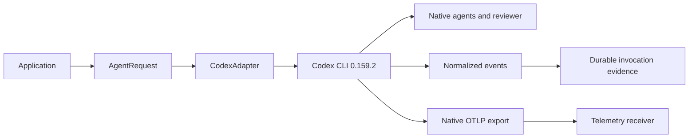
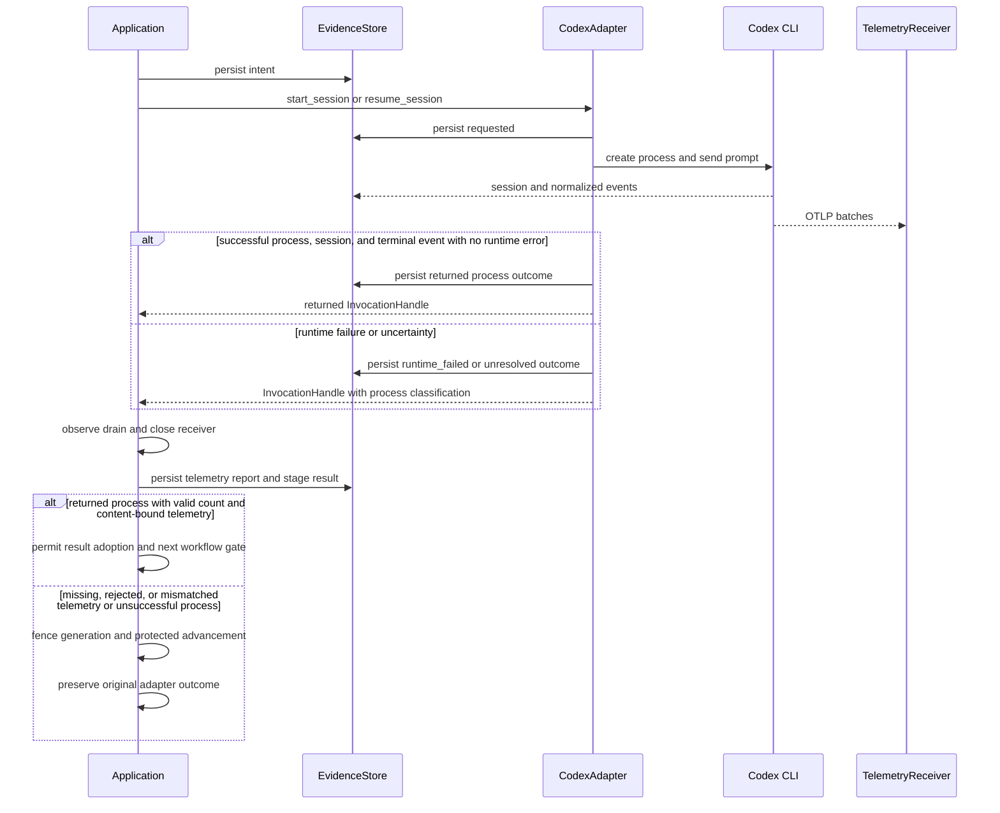

<!--
Copyright (c) 2026 Martin.Bechard@DevConsult.ca
Artifact-ID: 5c512f2c-cffa-430c-9b7e-b1b6781707f2
Created-Local: 2026-09-29T23:35:55.488706-04:00
Creating-Agent: Northstar
Runtime: Codex
-->

# CLI execution and Codex adapter

## Current Understanding

This module converts one immutable `AgentRequest` into one Codex CLI 0.159.2 process and normalized durable observations. Its primary responsibility is the submission boundary, exact-session resume, process containment, and Codex-specific command construction.

Design mode: **EXISTING_IMPLEMENTATION**. The adapter permits CLI-native specialist delegation. It does not provide custom delegation transport or cross-CLI child routing.

## Authoritative Sources

Current behavior comes from [adapter.py](../../../src/backlog_harness/adapters/codex/adapter.py), [runtime.py](../../../src/backlog_harness/runtime.py), [application.py](../../../src/backlog_harness/application.py), [test_execution.py](../../../tests/test_execution.py), and [test_native_evidence.py](../../../tests/test_native_evidence.py). The bounded real exporter observation is in [native-exporter-evidence.json](../../verification/native-exporter-evidence.json).

[The implementation plan](../../../IMPLEMENTATION-PLAN.md), [ARC-002](../../architecture/ARC-002-codex-work-item-dispatch-harness.md), and [HLD-003](../high-level/HLD-003-codex-work-item-dispatch-service.md) constrain intent. Executable source and retained runtime evidence win for current behavior.

## Related Code

- [adapter.py](../../../src/backlog_harness/adapters/codex/adapter.py) owns Codex capability checks, command arguments, process execution, event normalization, resume, reconciliation, and interruption requests.
- [application.py](../../../src/backlog_harness/application.py) owns invocation identities, current configuration reload, telemetry receiver lifetime, result validation, and stage recovery.
- [native_evidence.py](../../../src/backlog_harness/native_evidence.py) verifies CLI-native fresh reviewer evidence and child usage.

## Related Tests

- [test_execution.py](../../../tests/test_execution.py): `test_actual_subprocess_boundaries` covers returned, malformed, timeout, cleanup, and exact resume behavior.
- [test_native_evidence.py](../../../tests/test_native_evidence.py): `test_native_child_freshness_candidate_verdict` covers candidate-bound fresh native review evidence.
- [test_recovery.py](../../../tests/test_recovery.py): `test_submitted_unobserved_invocation_is_not_relaunched`, `test_returned_observations_rebuild_missing_stage`, and bad-telemetry fencing cases cover recovery.

## Related Backlog Items

No separate file-provider Work Item is identified. The authorized scope is [the implementation plan](../../../IMPLEMENTATION-PLAN.md).

## Related Wiki Pages

The project has no wiki. See [ARC-002](../../architecture/ARC-002-codex-work-item-dispatch-harness.md), [HLD-003](../high-level/HLD-003-codex-work-item-dispatch-service.md), and the [requirements matrix](../../verification/requirements-matrix.md).

## Open Questions

No additional paid native probe is required. The observed Codex 0.159.2 exporter did not retry the deliberately rejected first 512-span batch. Complete shutdown flush is not proven. The accepted current response is to preserve the gap and fence the affected next generation boundary.

## Maintenance Notes

Revalidate capability output, JSON event shapes, command options, resume identity, permissions, telemetry behavior, and process-group control when the supported Codex CLI version changes. The last source reconciliation was 2026-09-30.

## Requirements Coverage

| Requirement source and ID | Claim mode | Required outcome | Satisfying contract | Status | Out-of-scope authority, rationale, and owning artifact | Verification |
| --- | --- | --- | --- | --- | --- | --- |
| Plan: configured CLI execution | CURRENT_BEHAVIOR | Launch the configured role through a common adapter, with Codex first. | `CodexAdapter.validate_profile`, `start_session`, and `Application._invoke` | DEFINED | Other production adapters require separate implementation. | `test_actual_subprocess_boundaries`; six-item acceptance |
| Plan: exact-session recovery | CURRENT_BEHAVIOR | Resume only the originating native session and compatible binding. | `CodexAdapter.resume_session` | DEFINED | A different adapter, executable, authentication context, or profile digest is rejected. | `test_actual_subprocess_boundaries[normal-returned]`; binding tests |
| Plan: native delegation | CURRENT_BEHAVIOR | Allow the canonical agent to organize work with CLI-native specialists and prove independent review. | `features.multi_agent=true`, native spawn evidence, `verify_native_review` | DEFINED | Custom delegation transport is not required. | `test_native_child_freshness_candidate_verdict`; six completed real items |
| Telemetry implementation gate | CURRENT_LIMITATION | Preserve missing native exports as unknown and fence subsequent generation. | `validate_invocation_result` requires positive, unrejected, content-bound telemetry. | DEFINED | No retry framework or another paid probe is required by current authority. | Native 0.159.2 probe: first 512 rejected with 503, no retry observed, 1,200 later spans, 11 output tokens, no complete-flush claim. |

## Runtime Path

```text
src/backlog_harness/
├── application.py
├── native_evidence.py
├── runtime.py
└── adapters/
    └── codex/
        └── adapter.py
tests/
├── test_execution.py
├── test_native_evidence.py
└── test_recovery.py
docs/verification/
└── native-exporter-evidence.json
```

Symbol and placement ledger:

| Leaf | Complete public symbol or signature | Responsibility |
| --- | --- | --- |
| `adapter.py` | `CodexAdapter()`; `version = "1"` | Implements the Codex adapter and owns active child processes. |
| `adapter.py` | `validate_profile(self, request)` | Checks exact CLI version and authentication status. |
| `adapter.py` | `async prepare_telemetry(self, request)` | Builds invocation-authenticated OTLP/HTTP JSON overrides. |
| `adapter.py` | `async start_session(self, request)` | Starts a new Codex execution. |
| `adapter.py` | `async resume_session(self, session, request)` | Resumes the exact native session after binding checks. |
| `adapter.py` | `async observe_events(self, invocation)` | Yields normalized in-memory events. |
| `adapter.py` | `async reconcile(self, invocation)` | Reads the durable evidence classification. |
| `adapter.py` | `async request_interrupt(self, invocation)` | Sends `SIGTERM` only to an owned active process group. |
| `application.py` | `async invoke(self, item_id, stage, role, prompt, *, session=None, read_only=True)` | Serializes a logical stage and reserves invocation capacity. |
| `application.py` | `recover_invocation(self, path)` | Reconstructs a returned stage from durable observations without launching a CLI. |
| `native_evidence.py` | `native_records(session_id, sessions_root=None)` | Reads one exact native session file and returns records plus SHA-256. |
| `native_evidence.py` | `verify_native_review(producer, reviewer, candidate, sessions_root=None)` | Proves distinct fresh child context, candidate binding, completion, and ACCEPT verdict. |
| `native_evidence.py` | `child_usage(producer, start, end, sessions_root=None)` | Totals completed child output usage inside one invocation window. |

## Parent Context

The adapter sits between the application-owned durable operation and the CLI-native session. The harness chooses and validates the configured invocation. The agent chooses specialist organization inside the CLI. Provider transitions remain outside the adapter.



## Responsibilities

- Validate the exact supported executable and authenticated context.
- Apply model, effort, native tools, filesystem permissions, native thread limit, and telemetry overrides.
- Mark `requested.json` before subprocess creation.
- Bind new native thread identity to one portable session.
- Require exact native identity and compatible binding on resume.
- Normalize bounded JSON events and discard stderr content while retaining its byte count.
- Terminate the owned process group on timeout or parser failure and preserve uncertainty.

## Callers

- `Application._invoke` resolves and calls the adapter.
- `Application.recover_invocation` reads adapter evidence after restart.
- `Application._run_item` uses the exact acceptance session for implementation and answer continuation.
- Focused tests invoke `CodexAdapter` with a controllable fake executable.

## Dependencies

- [MOD-001](MOD-001-configuration.md) supplies immutable requests and binding identity.
- [MOD-004](MOD-004-evidence.md) supplies durable intent, requested, session, event, outcome, and recovery records.
- [MOD-005](MOD-005-telemetry.md) supplies an invocation-authenticated telemetry destination.
- The external boundary is Codex CLI 0.159.2 and its native session files.

## Public Contracts

`validate_profile(request)` returns binding digest, exact CLI version, authentication state, supported controls, post-invocation gates, native delegation permission, and `production_ready`. Only `codex-cli 0.159.2` with successful `login status` is production-ready.

`prepare_telemetry(request)` requires matching invocation identity and an available destination. It returns the configuration digest and exact OTLP/HTTP JSON overrides.

`start_session(request)` and `resume_session(session, request)` return `InvocationHandle`. Resume requires equal `AgentBinding.origin`, equal profile digest, and a UUID native session ID.

The adapter invokes:

```text
codex exec --json --ignore-user-config -m MODEL
  -c model_reasoning_effort=EFFORT
  -c approval_policy="never"
  -c default_permissions="harness"
  -c permissions.harness.filesystem=FILESYSTEM
  -c features.multi_agent=true
  -c agents.max_threads=N
  -c OTEL_OVERRIDES
  [-C CANDIDATE | resume NATIVE_SESSION_ID -]
```

`request_interrupt(invocation)` returns `{"outcome":"requested","verified_stopped":false}` after `SIGTERM`. It returns unresolved when the adapter does not own an active process. It does not claim verified stop.

## External And Asynchronous Effect Phases

| Effect and phase | Trigger | State already committed | Initiator | Submission owner | Executor or delivery owner | Response visibility and failure outcome | Retry or compensation | Completion evidence | Source and claim mode |
| --- | --- | --- | --- | --- | --- | --- | --- | --- | --- |
| Prepare | Application authorizes one invocation. | `intent.json` and immutable binding exist. | `Application` | `CodexAdapter` | Not applicable | Validation failure launches nothing. | Correct the current configuration. | Capability record | Source, CURRENT_BEHAVIOR |
| Submit | Adapter crosses process creation. | `requested.json` is durable. | `CodexAdapter` | `asyncio.create_subprocess_exec` | Codex process | `OSError` becomes `submission_rejected`; later ambiguity becomes `unresolved`. | Reconcile the same invocation. Do not replace a requested effect. | `process.json`, outcome record | Source, CURRENT_BEHAVIOR |
| Execute and observe | Process receives the effective prompt. | Process identity is durable. | `CodexAdapter` | Codex process | Codex and native children | Events are normalized and fsynced. Parser, timeout, or runtime failures preserve evidence. | Exact-session resume needs new authority after reconciliation. | `session.json`, `events.jsonl`, `outcomes.jsonl` | Source, CURRENT_BEHAVIOR |
| Export traces | Native exporter posts OTLP. | Invocation destination exists. | Codex process | Native exporter | In-process telemetry receiver | A missing or rejected export fences next generation. | Current policy preserves the gap. | Content-bound telemetry report | Probe and source, CURRENT_LIMITATION |

## Trust And Identity Boundaries

| Operation or data flow | Actor and authentication source | Authorization, ownership, tenancy, and data filtering | Selector and mismatch behavior | Validation owner | Success response and disclosure | State owner and transition | Failure timing and side effects | Sensitive data and logging |
| --- | --- | --- | --- | --- | --- | --- | --- | --- | --- |
| New or resumed CLI invocation | Configured role uses its `auth_context`. | Read-only roles receive root read access. Writable Orchestrator receives only candidate and candidate `.git` write access. | Resume selects exact native UUID. Binding-origin or profile mismatch blocks. | `CodexAdapter` and `Application` | Normalized events, portable/native session identity, outcome, and telemetry receipt. | Application owns operation state; provider owns lifecycle. | Failure before process creation is rejected; later uncertainty is retained. | Effective prompt is sent to Codex. Stderr content, exporter token, and credentials are not persisted. |

## Internal Data And State

`CodexAdapter.processes` maps harness invocation IDs to owned active processes. `InvocationHandle.events` holds normalized events during the call. `SessionHandle` retains portable ID, native ID, and originating binding. Durable files, not the in-memory map, support restart reconciliation.

## Processing Rules

1. Validate current capability and telemetry destination.
2. Build the exact Codex command and effective role-plus-skill prompt.
3. Recheck the binding digest immediately before submission.
4. Persist `requested.json`, start a new process group, and record its process identity.
5. Stream bounded normalized JSON events while draining stderr without persisting its content.
6. Classify the call as returned only after a session and successful `turn.completed` with no error event.
7. Terminate on timeout or observation failure and classify the result as unresolved.

## Processing Diagram



## Invariants

- Requested execution is never replaced without reconciliation.
- Resume keeps exact native identity and compatible origin/profile binding.
- Native child delegation does not bypass harness transition and candidate evidence gates.
- Writable execution occurs only in a separate candidate Git checkout.
- Stderr content and telemetry tokens are not persisted.
- The real 0.159.2 probe does not establish a retry guarantee or complete flush.

## Configuration

The adapter consumes configured executable, model, effort, skills, permissions, authentication context, and optional `native_max_threads`. The application supplies a 180-second invocation timeout. The adapter forces ignored user configuration and explicit harness permissions.

## External Interfaces

External interfaces are the Codex CLI process, Codex native session JSONL, process-group signals, and OTLP/HTTP JSON receiver. The adapter exposes only the `AgentCliAdapter` methods.

## UI And Notification Behavior

The adapter does not write UI text directly. The terminal receives structured outcomes and actionable errors through the application. Native agent messages are bounded to 16,000 characters in normalized evidence.

## Error Handling

Process creation errors become `submission_rejected`. Timeout, invalid JSON, invalid native identity, cancellation, and uncertain process completion become `unresolved` after process termination. A nonzero exit, absent session, missing successful turn, or error event becomes `runtime_failed`. Telemetry gaps block the next generation boundary.

## Documentation Acceptance

ACCEPTED for independent review. This artifact records the implemented adapter, focused tests, and bounded native observations. It does not claim final artifact review or release approval.

## Implementation Readiness

READY for bounded maintenance of the implemented Codex 0.159.2 adapter. Current source is independently accepted; the [release receipt](../../verification/release-acceptance.json) binds the rebuilt installation and installed acceptance. Independent documentation review is tracked separately. Current authority accepts fail-closed handling of the native exporter gap.

## Verification

[six-item-acceptance.json](../../verification/six-item-acceptance.json) records six real Completed items, native producer/reviewer identities, and installed replay with no new invocations. Source changed after those runs. [native-exporter-evidence.json](../../verification/native-exporter-evidence.json) records the 503 gap and later evidence without a complete-flush claim. The [requirements matrix](../../verification/requirements-matrix.md) separates historical native receipts from current-source acceptance, rebuilt installation, and deterministic controls checks.
