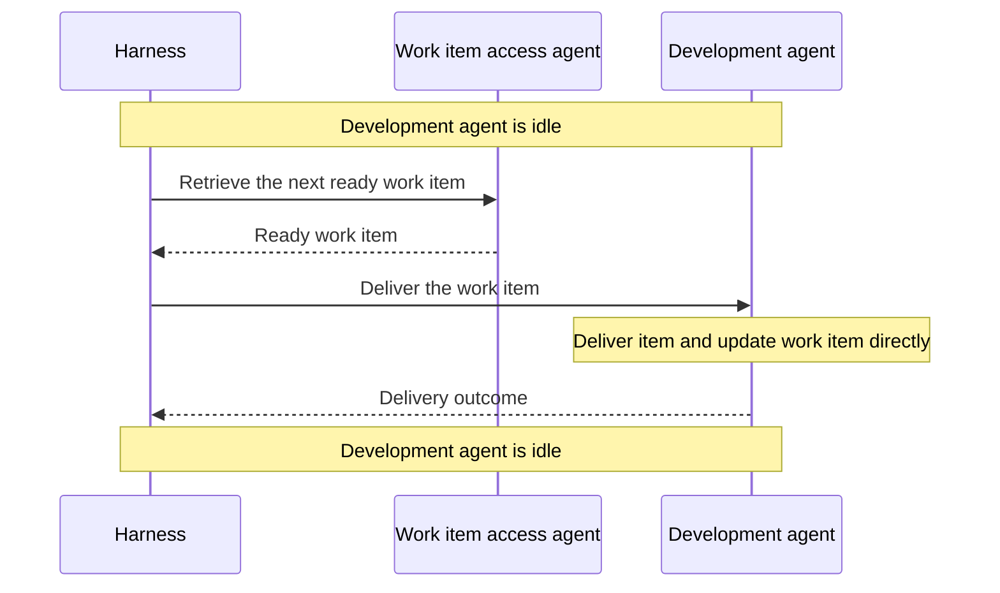
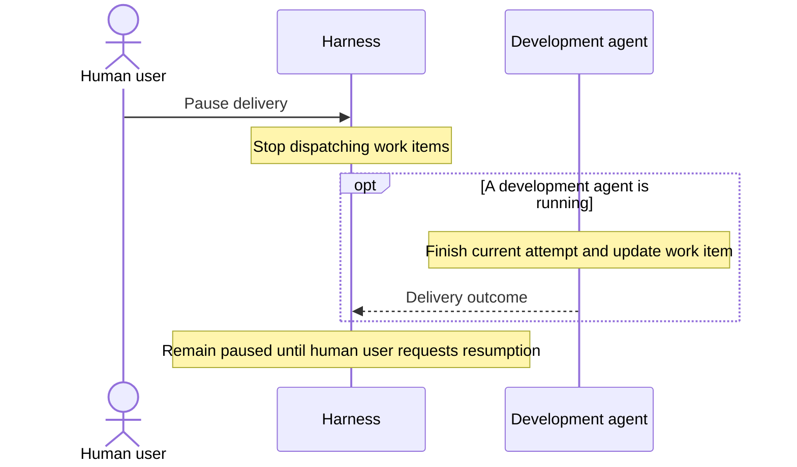
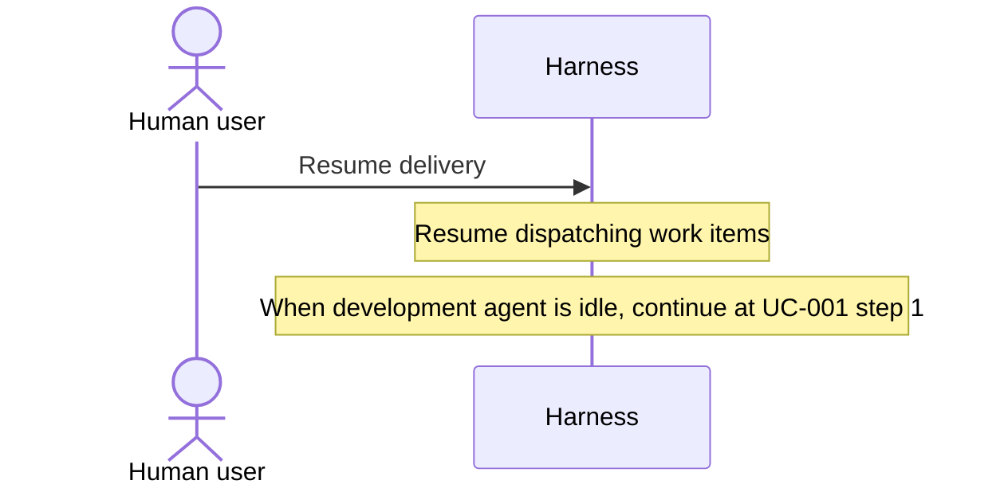
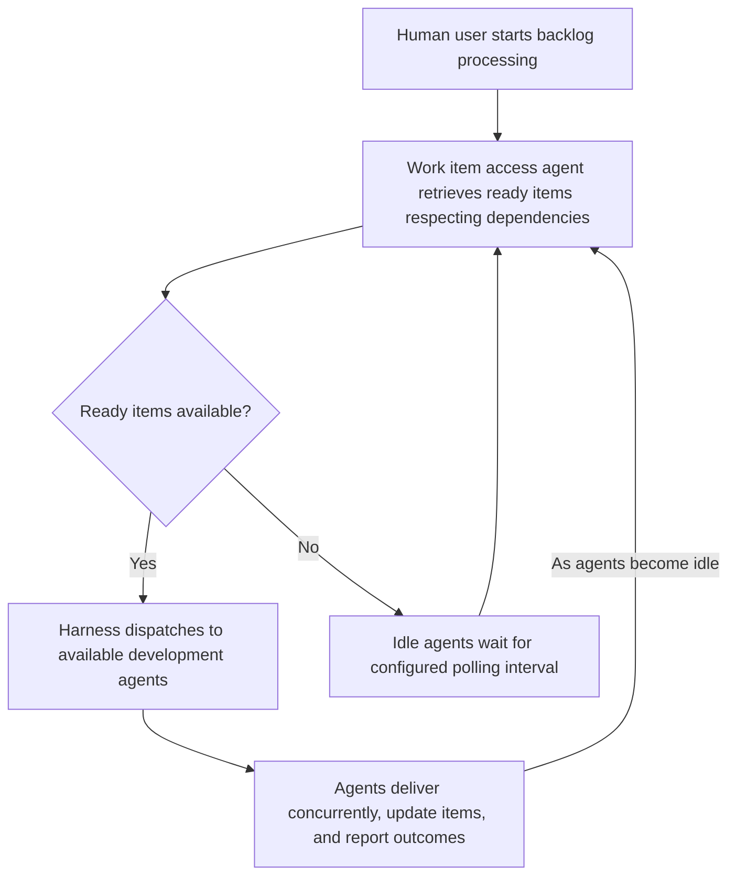
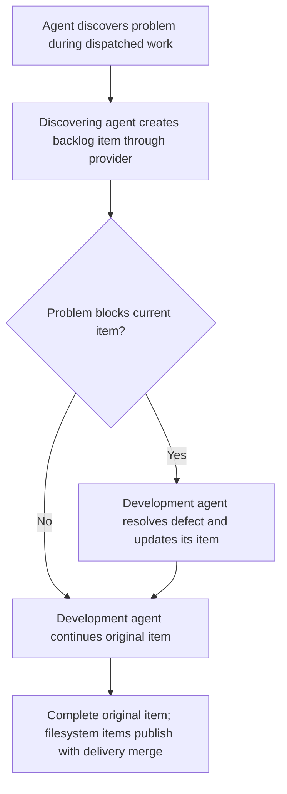
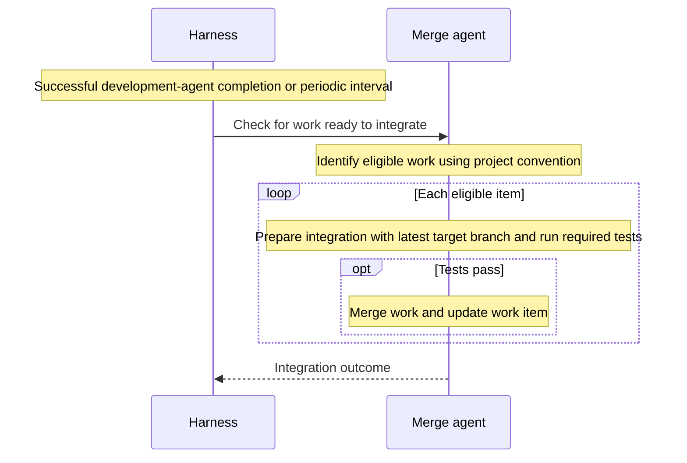

# Agentic Harness Functional Specification

Status: Draft, built item by item with Martin's approval. Only decisions recorded here define the scope of this draft; existing plans are background material.

## Principles

### P-001: Agent-managed work item access

The harness uses an agent to retrieve work items and update their status. The agent knows which work item provider to use. A capable small model, such as Luna with high reasoning effort, can perform this role.

During normal delivery, the development agent updates the work item directly, including delivery information and final status. The harness does not relay these updates. Harness intervention in work item updates is reserved for alternate flows such as an agent crash or timeout.

### P-002: Explicit human interactions

The specification uses **human user** for the person operating the harness. Every interaction with that person explicitly names the human user and states what the harness displays or what input it receives. Agent-to-harness interactions name the agent involved.

### P-003: Activity logging, console output, and telemetry

All activities must be logged, echoed to the console, and emitted as OpenTelemetry (OTEL) entries.

This principle applies to every use case. Routine logging, console progress output, and telemetry emission are not repeated as use case steps.

### P-004: Filesystem work item updates use the current worktree

When using the filesystem work item provider, the provider agent reads and writes work items in the current worktree. Changes to the work item reach the main backlog when the feature branch or worktree is merged.

If the harness has meanwhile retried the item under P-005, the merging agent is responsible for resolving conflicting work item updates appropriately. Git may report a merge conflict; even if Git merges the text cleanly, the merging agent must reconcile incompatible status or delivery information from the separate attempts.

### P-005: Retry policy

Retry transient failures, up to two automatic retries per work item. The development agent handles any effects of previous attempts. If the failure is not retryable or the retry limit is reached, put the item on hold.

### P-006: Separate test project with provider-appropriate work item management

Development of the harness must use a test project separate from agentic-harness. When using GitHub work items, the test project needs its own GitHub repository. When using filesystem work items, it needs a complete filesystem work item management system that works across multiple worktrees.

## Supported use cases

### UC-001: Run the next ready work item

Precondition: The development agent is idle.

1. The harness identifies the next ready work item through the work item access agent.
2. The harness dispatches the item to the development agent for delivery.
3. The development agent delivers the item and updates the work item directly, including delivery information and final status.
4. The development agent reports its delivery outcome to the harness and becomes idle. An agent stopping does not, by itself, mean the item was delivered.



### UC-002: Development agent timeout

Same as UC-001, but replace all steps starting with step 3 with the following:

3. The development agent does not deliver the item before the time limit. Its delivery outcome is unknown.
4. With no outcome reported and the time limit exceeded, the harness kills the development agent if it is still running and asks the work item access agent to record the timeout failure.
5. Once the development agent has stopped, it is considered idle.
6. The harness applies P-005: for a retry, return to step 2 of UC-001; otherwise, ask the work item access agent to put the item on hold.

If the original attempt later produces changes for merge, the merging agent resolves conflicting updates under P-004.

### UC-003: Development agent exception or crash

Same as UC-001, but replace all steps starting with step 3 with the following:

3. The development agent's execution ends with an exception or crash before reporting a delivery outcome, and the harness detects the failure.
4. The harness asks the work item access agent to record the failed attempt.
5. The development agent is considered idle.
6. The harness applies P-005: for a retry, return to step 2 of UC-001; otherwise, ask the work item access agent to put the item on hold.

The merging agent resolves any conflicting updates from separate attempts under P-004.

### UC-004: No work item is ready

Same as UC-001, but replace all steps starting with step 1 with the following:

1. The harness asks the work item access agent for the next ready item; none is available.
2. The development agent remains idle.
3. After a configured polling interval, the harness checks again by returning to step 1 of UC-001.

### UC-005: Pause delivery

1. The human user requests a pause.
2. The harness stops dispatching work items.
3. Any running development agent finishes its current attempt, including updating the work item and reporting its outcome.
4. The harness remains paused until the human user requests resumption.



### UC-006: Resume delivery

Precondition: The harness is paused.

1. The human user requests resumption.
2. The harness resumes dispatching work items.
3. When the development agent is idle, execution continues at step 1 of UC-001.



### UC-007: Request human user input or action

Same as UC-001, but replace step 3 with the following:

3. The development agent needs information or an action from the human user to continue delivery. It records the question or required action in the work item and moves the item to **User Action required**.

Step 4 of UC-001 then applies: the development agent reports the **User Action required** outcome to the harness and becomes idle.

### UC-008: Process ready work items concurrently

1. The human user starts processing the backlog without selecting an epic.
2. The harness asks the work item access agent for ready items across the backlog, taking dependencies into account.
3. The harness dispatches those items to available development agents, allowing independent items to run concurrently.
4. Each development agent delivers its item, updates the work item, and reports its outcome.
5. As agents become idle, the harness repeats steps 2–4 to retrieve and dispatch further ready items across the backlog.
6. When no items are ready, idle agents wait and the harness checks again after the configured polling interval.

Dependency-blocked items wait until their prerequisites are satisfied. The timeout, exception, and user-action variations in UC-002, UC-003, and UC-007 apply to each dispatched item.



### UC-009: Deliver an epic in dependency order

Same as UC-008, but replace steps 1 and 2 with the following:

1. The human user identifies an epic to process, such as a folder in the filesystem provider.
2. The harness asks the work item access agent for ready items within that epic, taking dependencies into account.

Replace step 5 with:

5. As agents become idle, the harness repeats steps 2–4 to retrieve and dispatch further ready items within the epic.

Replace step 6 with:

6. Epic processing completes when all items in the epic are delivered.

### UC-010: Use spare agent capacity for work outside the epic

Same as UC-009, but replace step 3 with the following:

3. The harness dispatches ready epic items to available development agents. If idle agents remain after all currently ready epic items have been dispatched, the harness asks the work item access agent for ready items outside the epic, taking dependencies into account, and dispatches them to the remaining idle agents.

Steps 4 and 5 apply to all dispatched items, including those outside the epic. Each repeat of step 3 prioritizes ready epic items before filling spare capacity with ready items outside the epic. Step 6 concerns completion of the epic; outside items do not become part of the epic.

### UC-011: Record a problem discovered during delivery

Precondition: An agent is working on an item dispatched by the harness.

1. The agent discovers a problem, for example during a test or evaluation.
2. The discovering agent creates a new backlog item through the work item provider, describing the problem and supporting evidence. For the filesystem provider, it creates the item in the current worktree within its sandbox. For GitHub, the created issue is already visible in the shared backlog.
3. If the problem blocks the current item, the development agent resolves the new defect item in the current worktree and updates it before continuing the original item. The test agent records the defect; the development agent performs the fix.
4. The development agent completes the original item. For the filesystem provider, the new item and its updates reach the main backlog with the delivery merge under P-004. Any unresolved new item becomes eligible for normal dispatch when the provider reports it ready.



### UC-012: Integrate completed work

1. On successful development-agent completion or a periodic interval, the harness asks the merge agent to check for work ready to integrate.
2. The merge agent identifies eligible work using the project's convention: approved PRs, a work item status with an associated branch, or another configured convention.
3. For each eligible item, the merge agent prepares integration with the latest target branch and runs the project's required tests on the combined result.
4. If tests pass, the merge agent merges the work and updates its work item.
5. The merge agent reports the outcome to the harness.

The harness runs one merge-agent invocation at a time. The merge agent owns readiness checks, testing, and merge details; development agents can continue working concurrently. Successful development-agent completion triggers a check; it does not guarantee that eligible work is waiting.



### UC-013: Recover an interrupted work item after its agent process stops

Precondition: The harness tracks the processes of agents it has dispatched.

1. The harness detects that a development agent's process has stopped.
2. Through the work item access agent, the harness checks the associated work item and finds that it is still marked as running.
3. The harness assigns the work item to another development agent in the same worktree and branch used by the stopped agent.
4. The harness tells the replacement agent that the work was previously started but interrupted, and instructs it to begin by evaluating the current situation.
5. The replacement agent evaluates the existing work and work item state, then continues delivery from that state and updates the work item.
6. The replacement agent reports its delivery outcome to the harness and becomes idle.

```mermaid
sequenceDiagram
    participant Harness
    participant Access as Work item access agent
    participant Dev as Replacement development agent
    Note over Harness: Tracked agent process has stopped
    Harness->>Access: Check associated work item
    Access-->>Harness: Work item still marked as running
    Harness->>Dev: Continue item in same worktree and branch; interrupted work must be evaluated first
    Note over Dev: Evaluate existing situation, continue delivery, and update work item
    Dev-->>Harness: Delivery outcome
    Note over Harness,Dev: Replacement agent is idle
```

### UC-014: Restart interrupted work that cannot be resumed

Same as UC-013, but replace step 5 with the following:

5. The replacement agent evaluates the existing work and determines that it cannot be resumed. It discards the interrupted attempt's work, preserves unrelated work, and starts the assigned item over in the same worktree and branch. It updates the work item as delivery proceeds.

## Not supported use cases

- Manually selecting a specific work item for execution.
- Managing the human user's response to an item in **User Action required**: collecting answers, tracking completion of the requested action, or deciding when to move the item back to ready. These activities occur outside the harness. Once the provider reports the item ready, UC-001 applies.
- Refining filesystem-provider work item publication and early cherry-pick workflows. These belong to a separate project.
