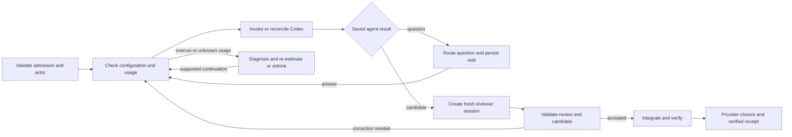

# Replace workflow branching with Python LangGraph and ACP

Proposal, October 1, 2026. This specifies the next bounded integration; it does
not authorize or claim a production migration.

## Decision

Use **one Python LangGraph workflow per work-item execution**, calling Codex as
an agent through the maintained ACP adapter. Replace the current hand-written
workflow continuation branches. Keep the existing evidence validators and
provider operations as functions called by graph nodes.

Deep Agents is not needed around Codex: Codex already owns its tool loop, skills,
specialists, and internal delegation. The graph owns the required workflow and
its protected transitions. A2A is not needed for this local client connection.

| Owner | Responsibility |
| --- | --- |
| LangGraph | Execution position, saved node results, routing, waits, required review step, recovery decision. |
| ACP adapter | Start/load native sessions, send prompts, translate events, cancel and clean up processes. Reuse the maintained adapter and official SDK. |
| Codex agent | Interpret the assignment, use skills/tools, arrange ordinary specialist work, return questions and candidate evidence. |
| Provider agent | Read and mutate backlog through existing management operations, within the harness-authorized operation scope. |
| Existing harness validators | Check actor, candidate, independence, verdict, evidence, usage, permissions and provider receipts before advancement. |

The provider remains authoritative for backlog status. Graph checkpoints alone
own execution position. External-effect receipts record what happened; they do
not form another competing workflow engine.

## First workflow

An **outer dispatch workflow** observes the provider, asks the Coordinator to
select eligible work when a decision is needed, and invokes the selected item's
workflow with its stable execution ID. The item workflow below is the nested
workflow. The outer graph retains selection/wait progress, never a second copy
of the item's execution position. The terminal controller is only the foreground
host for polling, capacity and pause/stop controls; idle polling makes no model
call when the selection premise is unchanged.

The Coordinator requests admission; the accepted canonical worker supplies work
and delivery requests. A reviewer supplies a verdict, not completion authority.
The operator answers questions or supplies authorization where the chosen
workflow requires it; already supplied authorization is retained. The graph
checks these identities at each protected transition.

Store the agent result before entering the question node, following
`lg-report/src/agent_runtime/workflows/quote_request.py`. Route answerable questions
to the appropriate agent and user-only questions to the operator. The wait node
does not invoke a model. The next invocation sends the answer to the recorded
worker session, including after process restart.

For the required review, create a new ACP session before sending the assignment.
Give it requirements, exact candidate identity, artifact paths and necessary
evidence; never load or fork the producer conversation. Validate its result before
integration. This does not prevent the worker arranging other native reviews.

This requires an ACP-specific independence verifier: the current native verifier
expects a child spawned by the producer, which a separate workflow-created ACP
session is not. Retain an immutable `session/new` request/response and its
invocation identity, bind the resulting reviewer session to the assignment and
exact candidate, then bind the completed verdict and supporting evidence to that
same session. On reviewer recovery, reference that original creation record when
loading the session. Never manufacture native-child provenance or accept a claimed
fresh-session flag without the recorded creation evidence.

Treat the 100% overrun threshold as a normal review route: retain the original
estimate and usage, explain the overrun, assess whether the work remains sensible,
and record a justified remaining estimate or revised approach. Missing usage
remains unknown. A new estimate does not repair missing accounting or erase past
usage. Retain the existing distinction between implementation generation and
separately bounded provider administration.

## What gets replaced

| Current source | Proposed treatment |
| --- | --- |
| `application.py: _run_item` | Replace stage-selection branching with graph nodes and edges; extract and reuse candidate/review/transition checks. Do not wrap this entire method inside a graph node. |
| `application.py: answer, resume_answer` | Replace workflow-position selection with checkpointed question/answer nodes; retain exact answer binding and provider mutation receipts. |
| `recovery_flow.py: register_work_continuation, work_continuation, register_proof_continuation, proof_continuation, authorize_retained_delivery` | Stop creating separate continuation control records for migrated executions. Graph state holds the pending assignment, evidence references and authorization. Preserve legacy readers for unmigrated executions; retire them when those executions finish. |
| `application.py: invoke, _invoke` and `adapters/codex/adapter.py` | Reuse configuration/usage/evidence preparation; replace native execution plumbing with the official Python ACP client and maintained codex-acp child. |
| `native_evidence.py: verify_native_review` | Keep the producer-child/spawn verifier unchanged for legacy executions. Add a distinct ACP review verifier using recorded fresh session creation, invocation/session identity, candidate, completed verdict and evidence binding. Select by the execution's recorded adapter/provenance type, not whichever verifier happens to pass. |
| `coordination.py: RunController` | Move observe/select/dispatch/wait sequencing to the outer dispatch graph. Keep a thin foreground host for admission pause, capacity and stop controls. The outer graph selects nested item workflows; neither host nor outer graph duplicates item execution position. |
| `workflow.py, delivery.py, provider.py, evidence.py, telemetry.py, analytics.py` | Retain domain gates, deterministic integration, provider effect verification, append-only evidence, OTEL JSONL and honest usage accounting. |

The simplification criterion is removal of migrated control branches, not merely
adding LangGraph imports while retaining both paths for the same execution.

## Persistence is not exactly-once execution

Replace the prototype's JavaScript MemorySaver with a Python persistent
checkpointer. Use project-local SQLite for the first serial pilot and test its
durability explicitly; choose a stronger store only if later concurrency needs
it. Use the official [Python ACP SDK](https://github.com/agentclientprotocol/python-sdk)
over stdio. Pin and verify compatibility with the maintained adapter before use.

Checkpoint compact references: work-item/execution ID, candidate, worker/reviewer
session IDs, pending question/answer, estimate/usage decision, configuration
digest, current operation ID and evidence digests. Keep large logs in the existing
target-project evidence directory.

Before an external action, persist its stable operation/invocation identity using
the existing evidence store. On node re-entry, reconcile that identity first:

| Interruption | Required behavior |
| --- | --- |
| Agent finished, graph checkpoint not saved | Recover the completed response from the recorded native invocation/session evidence, validate it and save the node result. Never send the assignment again just because the checkpoint is old. |
| Submission may have reached Codex, result unknown | Inspect the recorded session/invocation and process state. Wait or reconcile; if identity/completion cannot be proven, hold that item. ACP does not supply an assumed exactly-once prompt key. |
| Provider update outcome unknown | Reuse existing operation identity and Git/receipt reconciliation. Verify the committed effect before retrying or projecting a new state. |
| Question answered after process restart | Load durable graph state, match question/answer identity, load the same ACP session, and submit only the answer. Reconcile an uncertain answer submission before retry. |

LangGraph persists workflow progress, but interrupted nodes can restart and
external actions require their own reconciliation. See the official
[persistence](https://docs.langchain.com/oss/python/langgraph/persistence) and
[interrupt](https://docs.langchain.com/oss/python/langgraph/interrupts) contracts.

## Preserve the operational controls

Reload configuration before every harness invocation, including an answer or
review. Bind the resulting snapshot and permissions to that invocation. For the
first slice, start a short-lived ACP adapter process with those settings, then
create or load the recorded session; this avoids assuming mutable per-process
settings are refreshed between prompts. Reject incompatible session permission
changes rather than silently replacing its identity. Native child configuration
remains CLI-managed.

Keep artifacts and JSONL telemetry in the target project's existing evidence
root. Reuse the OTLP receiver and attribute run/item/operation/invocation/session
identities; test the maintained adapter's exporter configuration and flush path.
ACP usage summaries alone do not replace complete attributed usage evidence.

Resolve claim applicability from current source-bound provider policy, including
an explicit active claim-free crisis exception where present. SOLO alone does
not imply no claims. Agents use the claim helper when required; the harness
checks applicable workflow evidence. An unused helper's stale discovery cache
must not prevent claim-free work.

## Staged acceptance

1. Port the demonstrated question/session/review boundary to Python ACP; add a
   persistent checkpoint and fault-injected tests, without changing dispatch.
   Start with the demonstrated two-turn question contract. Test negotiated
   native elicitation separately before choosing it for production waits.
2. Implement one selected work-item graph using existing provider and delivery
   functions. Prove question/resume after restart, fresh review before launch,
   invalid/missing review rejection, overrun routing, and all four interruption
   cases above. Prove config reload, output scope and OTEL coverage in that slice.
3. Run one authorized real item through admission, work, review, integration and
   provider closure. Select either the legacy engine or graph for that execution,
   never both. Import retained work only at a verified quiescent boundary with
   an explicit evidence mapping; do not redispatch an existing live owner.
4. Remove the replaced branches for that route, then consider broader rollout.
   Leave other CLI adapters and provider frameworks outside this first slice.

## Preserved current state

The [ACP demonstration](VERIFICATION.md) passed through a retained reviewer
clarification. It did not test native elicitation or crash-safe graph execution.
Production a33 (`c2c87da`) is installed and independently source-reviewed. Its
delivery attempt exited before provider mutation on a stale helper applicability
check. The retained item remains User Action Required, candidate
`3341f0071f1482c5ff5a2ba33590e0aa7a65529a`, with its pending authorization/answer
records intact. This proposal neither marks it delivered nor starts another
execution.
